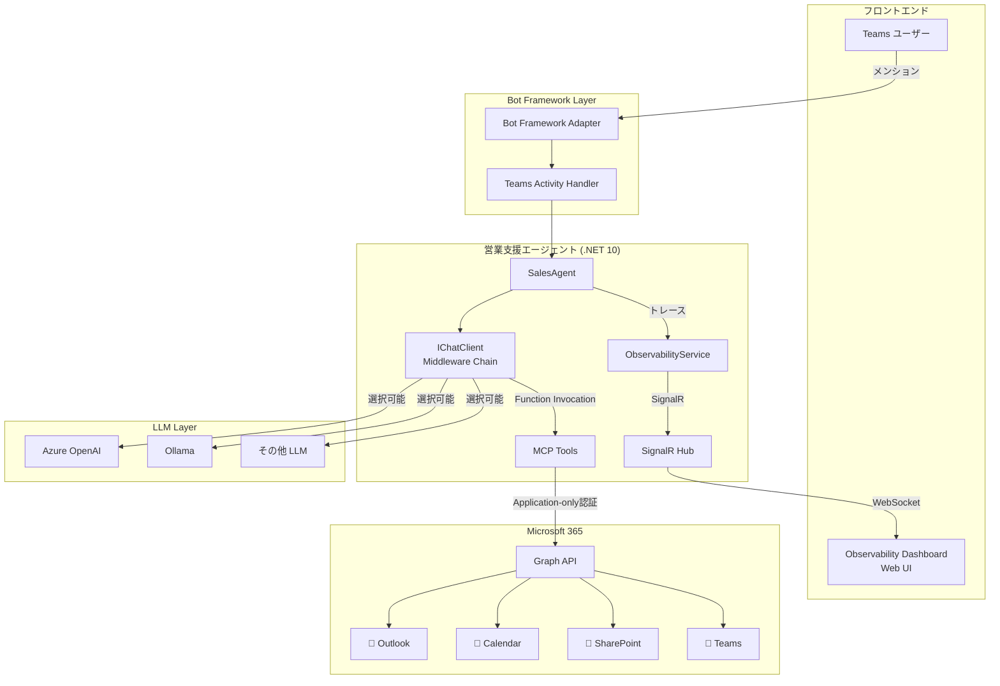
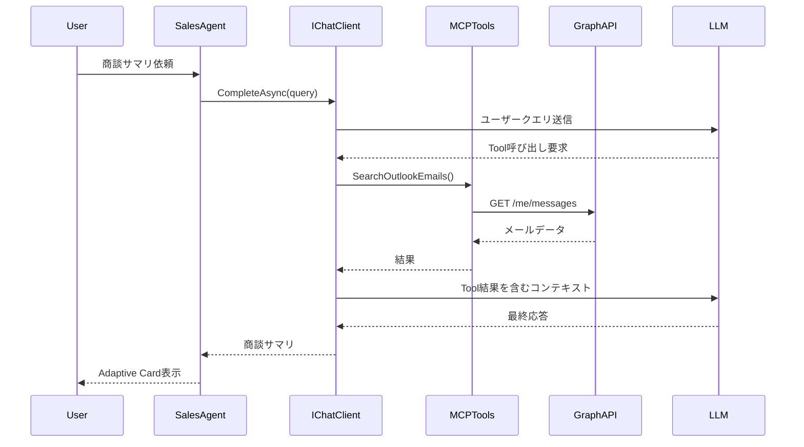
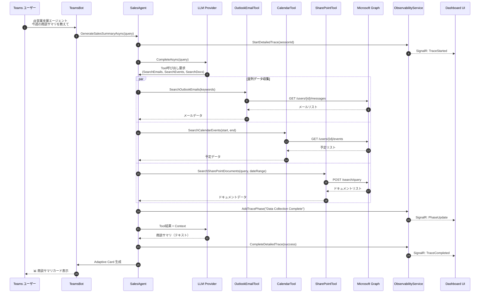
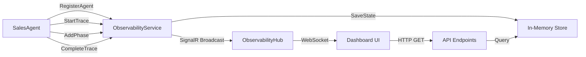
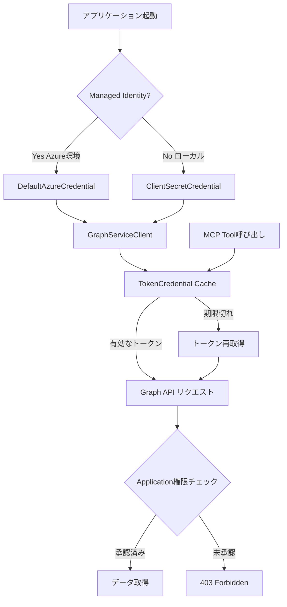

# アーキテクチャドキュメント

[](../ARCHITECTURE.md)
[](en/ARCHITECTURE.md)

## 📋 概要

営業支援エージェントは、**Microsoft Agent 365 SDK**をベースに、Microsoft 365データを活用した AIエージェントを実現する.NET 10アプリケーションです。

このドキュメントでは、システムアーキテクチャ、コンポーネント構成、データフロー、技術スタックを詳細に説明します。

---

## 🏗️ システムアーキテクチャ全体図



---

## 🧩 コンポーネント詳細

### 1. Bot Framework Layer

#### Teams Bot (TeamsBot.cs)

Microsoft Bot Frameworkを使用したTeams統合層。

**主な責務**:
- Teams からのメッセージ受信
- ユーザーコンテキスト管理
- Adaptive Cards レスポンス生成
- エラーハンドリング

**動作フロー**:
```
1. ユーザーが@メンション → Teams がWebhook送信
2. BotController が受信 → TeamsBot.OnMessageActivityAsync 呼び出し
3. SalesAgent に処理委譲
4. Adaptive Card 生成 → Teamsに返信
```

**実装ファイル**:
- `Bot/TeamsBot.cs` - メッセージハンドラー
- `Bot/BotController.cs` - Webhookエンドポイント(/api/messages)
- `Bot/AdapterWithErrorHandler.cs` - エラーハンドリング


### 2. Sales Agent Core

#### SalesAgent (Services/Agent/SalesAgent.cs)

営業支援エージェントの中核実装。

**アーキテクチャパターン**:
```csharp
IChatClient (Agent 365 SDK)
    ↓ UseOpenTelemetry() - OpenTelemetryミドルウェア
    ↓ UseFunctionInvocation() - MCP Tools呼び出し
    ↓ Build()
    → ChatClient (実行可能なクライアント)
```

**処理フロー**:


**主要メソッド**:
- `GenerateSalesSummaryAsync(string query)` - 商談サマリ生成
- `UpdateAgentActivityAsync()` - エージェントアクティビティ更新（Observability）
- 詳細トレース統合（5フェーズ）

### 3. LLM Provider Layer

複数のLLMプロバイダーをサポートする抽象化層。

#### ILLMProvider Interface

```csharp
public interface ILLMProvider
{
    IChatClient GetChatClient();
}
```

#### 実装クラス

| Provider | 実装クラス | 用途 |
|---------|----------|------|
| **Azure OpenAI** | AzureOpenAIProvider | エンタープライズ環境、高性能 |
| **Ollama** | OllamaProvider | ローカルLLM、オフライン、コスト削減 |
| **拡張可能** | - | カスタムプロバイダー追加可能 |

**切り替え方法**:
```json
{
  "LLM": {
    "Provider": "AzureOpenAI"  // または "Ollama"
  }
}
```

### 4. MCP (Model Context Protocol) Tools

Microsoft 365データアクセスを抽象化したツール群。

#### ツール一覧

| Tool | ファイル | Graph API エンドポイント | 機能 |
|------|---------|----------------------|------|
| **OutlookEmailTool** | OutlookEmailTool.cs | `/users/{userId}/messages` | メール検索・フィルタリング |
| **OutlookCalendarTool** | OutlookCalendarTool.cs | `/users/{userId}/events` | カレンダー予定検索 |
| **SharePointTool** | SharePointTool.cs | `/search/query` | Microsoft Search API でドキュメント検索 |
| **TeamsMessageTool** | TeamsMessageTool.cs | `/teams/{teamId}/channels/{channelId}/messages` | Teamsメッセージ検索 |

#### SharePoint Tool の高度な機能

**Microsoft Search API 統合**:
```csharp
// 日付範囲 + キーワード OR検索
var request = new SearchRequest
{
    EntityTypes = new List<EntityType> { EntityType.DriveItem },
    Query = new SearchQuery
    {
        QueryString = "keyword1 OR keyword2"
    },
    From = 0,
    Size = 50,
    Fields = new List<string> 
    { 
        "title", "path", "lastModifiedDateTime", 
        "createdBy", "fileExtension", "size" 
    }
};
```

**フィルタリング**:
- LastModifiedTime による日付範囲フィルタ
- ファイル拡張子フィルタ（.pdf, .docx, .xlsx等）

### 5. Observability Layer

リアルタイム監視とトレース機能。

#### ObservabilityService (Services/Observability/ObservabilityService.cs)

**管理データ**:
```csharp
// エージェント情報
public class AgentInfo
{
    public string AgentId { get; set; }
    public string AgentName { get; set; }
    public string AgentType { get; set; }
    public string Status { get; set; }  // Active, Idle, Busy
    public DateTime RegisteredAt { get; set; }
    public DateTime LastActiveAt { get; set; }
    public string Version { get; set; }
    public int TotalInteractions { get; set; }
    public string LastActivity { get; set; }
    public string? IconUrl { get; set; }  // Fluent UI アイコン
}

// 詳細トレースセッション
public class DetailedTraceSession
{
    public string SessionId { get; set; }
    public string ConversationId { get; set; }
    public string UserId { get; set; }
    public string UserQuery { get; set; }
    public DateTime StartTime { get; set; }
    public DateTime? EndTime { get; set; }
    public string? FinalResponse { get; set; }
    public bool Success { get; set; }
    public List<TracePhase> Phases { get; set; }  // 5フェーズ
    public long DurationMs { get; set; }
}

// トレースフェーズ
public class TracePhase
{
    public string PhaseName { get; set; }
    public string Description { get; set; }
    public DateTime Timestamp { get; set; }
    public object? Data { get; set; }  // フェーズ固有データ
    public string Status { get; set; }  // Pending, Running, Completed, Failed
}
```

**API エンドポイント**:
- `GET /api/observability/agents` - アクティブエージェント一覧
- `GET /api/observability/detailed-traces` - 全詳細トレース
- `GET /api/observability/detailed-trace/{sessionId}` - 特定セッション
- `GET /api/observability/traces-by-conversation/{conversationId}` - 会話別トレース

#### SignalR Hub (Hubs/ObservabilityHub.cs)

**リアルタイム配信**:
```csharp
// サーバー → クライアント イベント
public interface IObservabilityClient
{
    Task ReceiveAgentUpdate(AgentInfo agent);
    Task ReceiveTraceUpdate(DetailedTraceSession trace);
    Task ReceiveMetricsUpdate(ObservabilityMetrics metrics);
    Task ReceiveNotification(NotificationEvent notification);
}

// 接続URL
ws://localhost:5192/hubs/observability
```

**トランスポート**:
1. WebSockets（優先）
2. Server-Sent Events
3. Long Polling（フォールバック）

### 6. OpenTelemetry Integration

#### AgentMetrics (Telemetry/AgentMetrics.cs)

```csharp
public class AgentMetrics
{
    public static readonly ActivitySource ActivitySource = 
        new ActivitySource("SalesSupportAgent");
    
    public static readonly Meter Meter = 
        new Meter("SalesSupportAgent");
    
    // カウンター
    public static readonly Counter<long> RequestCounter;
    public static readonly Counter<long> SuccessCounter;
    public static readonly Counter<long> ErrorCounter;
    
    // ヒストグラム
    public static readonly Histogram<double> RequestDuration;
    public static readonly Histogram<double> LLMResponseTime;
}
```

**トレース例**:
```
Activity: GenerateSalesSummary
├─ Activity: SearchOutlookEmails (850ms)
├─ Activity: SearchCalendarEvents (620ms)
├─ Activity: SearchSharePointDocuments (1250ms)
└─ Activity: LLM_Completion (3200ms)
Total Duration: 6420ms
```

---

## 📊 データフロー

### 典型的な商談サマリ生成フロー



### Observability Dashboard データフロー



---

## 🔐 セキュリティアーキテクチャ

### 認証・認可フロー



### シークレット管理

| 環境 | 方式 | 実装 |
|-----|------|------|
| **ローカル開発** | appsettings.json + 環境変数 | ClientSecretCredential |
| **Azure App Service** | Managed Identity + Key Vault | DefaultAzureCredential |
| **Azure Container Apps** | Managed Identity | DefaultAzureCredential |
| **AKS** | Workload Identity + Key Vault | DefaultAzureCredential |

**ベストプラクティス**:
```csharp
// Program.cs - 環境に応じた自動切り替え
builder.Services.AddSingleton<TokenCredential>(sp =>
{
    if (m365Settings.UseManagedIdentity)
    {
        return new DefaultAzureCredential(new DefaultAzureCredentialOptions
        {
            ManagedIdentityClientId = m365Settings.ClientId,
            Retry = { MaxRetries = 3, Delay = TimeSpan.FromSeconds(2) }
        });
    }
    else
    {
        return new ClientSecretCredential(
            m365Settings.TenantId,
            m365Settings.ClientId,
            m365Settings.ClientSecret
        );
    }
});
```

---

## 🛠️ 技術スタック

### バックエンド

| カテゴリ | 技術 | バージョン | 用途 |
|---------|------|-----------|------|
| **ランタイム** | .NET | 10.0 | アプリケーション実行環境 |
| **フレームワーク** | ASP.NET Core | 10.0 | Webアプリケーション |
| **Bot** | Bot Framework SDK | 4.22.7 | Teams統合 |
| **AI SDK** | Microsoft.Extensions.AI | 1.0.0-preview.1 | Agent 365 SDK基盤 |
| **Agent 365** | Microsoft.Agents.A365.Observability | beta | Observability統合 |
| **Agent 365** | Microsoft.Agents.A365.Tooling | beta | MCP Tools統合 |
| **Agent 365** | Microsoft.Agents.Storage | 1.0 | 会話ステート管理 |
| **Graph API** | Microsoft.Graph | 5.61.0 | M365データアクセス |
| **認証** | Azure.Identity | 1.13.0 | Azure AD認証 |
| **Telemetry** | OpenTelemetry | 1.10.0 | 分散トレース・メトリクス |
| **リアルタイム** | SignalR | 10.0 | WebSocket通信 |

### LLM Providers

| Provider | SDK | モデル例 |
|----------|-----|---------|
| **Azure OpenAI** | Azure.AI.OpenAI | GPT-4o, GPT-4o-mini |
| **Ollama** | HTTP Client | Qwen2.5, Llama3.2, Mistral |

### フロントエンド (Dashboard)

| 技術 | 用途 |
|------|------|
| **Vanilla JavaScript** | Observability Dashboard UI |
| **SignalR Client** | リアルタイム通信 |
| **Fluent UI System Icons** | Microsoft デザイン言語統一 |
| **Adaptive Cards** | Teams レスポンス表示 |

---

## 📦 プロジェクト構成

```
SalesSupportAgent/
├── Program.cs                          # アプリケーションエントリポイント
├── appsettings.json                    # 設定ファイル
├── SalesSupportAgent.csproj            # プロジェクトファイル
│
├── Bot/                                # Bot Framework Layer
│   ├── TeamsBot.cs                     # Teams メッセージハンドラー
│   ├── BotController.cs                # Webhook エンドポイント
│   ├── AdapterWithErrorHandler.cs      # エラーハンドリング
│   └── AdaptiveCardHelper.cs           # Adaptive Cards 生成
│
├── Services/
│   ├── Agent/
│   │   └── SalesAgent.cs               # 営業支援エージェント本体
│   │
│   ├── LLM/                            # LLM Provider Layer
│   │   ├── ILLMProvider.cs             # Provider インターフェース
│   │   ├── AzureOpenAIProvider.cs      # Azure OpenAI 実装
│   │   ├── GitHubModelsProvider.cs     # GitHub Models 実装
│   │   └── OllamaProvider.cs           # Ollama 実装
│   │
│   ├── MCP/McpTools/                   # MCP Tools
│   │   ├── OutlookEmailTool.cs         # メール検索
│   │   ├── OutlookCalendarTool.cs      # カレンダー検索
│   │   ├── SharePointTool.cs           # SharePoint/Search API
│   │   └── TeamsMessageTool.cs         # Teams メッセージ検索
│   │
│   ├── Observability/
│   │   └── ObservabilityService.cs     # リアルタイム監視サービス
│   │
│   ├── Notifications/
│   │   └── NotificationService.cs      # Agent 365 通知（beta）
│   │
│   ├── Transcript/
│   │   └── TranscriptService.cs        # 会話ログ記録
│   │
│   └── TestData/
│       └── TestDataGenerator.cs        # サンプルデータ生成
│
├── Configuration/                      # 設定クラス
│   ├── LLMSettings.cs
│   ├── M365Settings.cs
│   ├── BotSettings.cs
│   └── TestDataSettings.cs
│
├── Models/
│   └── SalesSummaryModels.cs           # リクエスト/レスポンスモデル
│
├── Resources/
│   └── LocalizedStrings.cs             # 多言語対応リソース
│
├── Telemetry/
│   └── AgentMetrics.cs                 # OpenTelemetry メトリクス定義
│
├── Hubs/
│   └── ObservabilityHub.cs             # SignalR Hub
│
└── wwwroot/                            # 静的ファイル
    ├── observability.html              # Observability Dashboard
    └── images/
        └── agent365-logo.png           # ロゴ画像
```

---

## 🔄 拡張性とカスタマイズ

### 新しいMCP Toolの追加

```csharp
// 1. Tool実装
public class CustomTool
{
    private readonly GraphServiceClient _graphClient;
    
    [Description("カスタムツールの説明")]
    public async Task<string> ExecuteAsync(string param)
    {
        // Graph API呼び出しロジック
        var result = await _graphClient.Users["userId"]
            .CustomEndpoint.GetAsync();
        
        return JsonSerializer.Serialize(result);
    }
}

// 2. DI登録 (Program.cs)
builder.Services.AddSingleton<CustomTool>();

// 3. SalesAgentに統合
private readonly CustomTool _customTool;
```

### 新しいLLMプロバイダーの追加

```csharp
// 1. ILLMProvider実装
public class CustomLLMProvider : ILLMProvider
{
    public IChatClient GetChatClient()
    {
        var chatClient = new CustomChatClient();
        return chatClient
            .AsBuilder()
            .UseFunctionInvocation()
            .UseOpenTelemetry()
            .Build();
    }
}

// 2. appsettings.json
{
  "LLM": {
    "Provider": "CustomLLM",
    "CustomLLM": {
      "Endpoint": "https://custom-llm.com"
    }
  }
}

// 3. Program.cs - 登録
"customllm" => new CustomLLMProvider(llmSettings.CustomLLM)
```

---

## 📚 関連ドキュメント

- [Getting Started](GETTING-STARTED.md) - セットアップ手順
- [認証設定](AUTHENTICATION.md) - Graph API認証詳細
- [エージェント開発](AGENT-DEVELOPMENT.md) - カスタムエージェント実装
- [Observability Dashboard](OBSERVABILITY-DASHBOARD.md) - 監視機能詳細
- [Azure デプロイ](DEPLOYMENT-AZURE.md) - 本番環境構築

---

アーキテクチャの詳細について質問がある場合は、[トラブルシューティングガイド](TROUBLESHOOTING.md)または Issue を参照してください。
