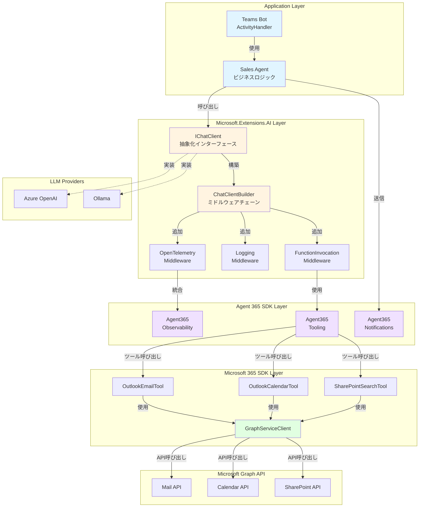
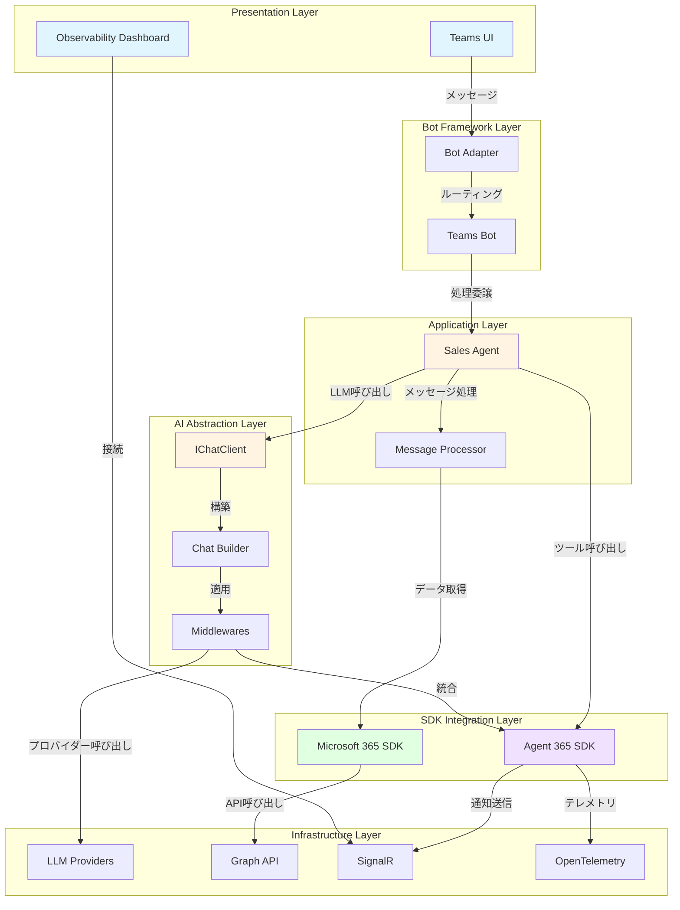

# SDK Overview - Sales Support Agent開発者ガイド

> **Language**: 🇯🇵 日本語 | [🇬🇧 English](../en/developer/01-SDK-OVERVIEW.md)

## 📋 目次

- [概要](#概要)
- [Microsoft 365 SDK](#microsoft-365-sdk)
- [Agent 365 SDK](#agent-365-sdk)
- [Microsoft.Extensions.AI](#microsoftextensionsai)
- [SDK間の関係性](#sdk間の関係性)
- [アーキテクチャ全体像](#アーキテクチャ全体像)
- [開発フロー](#開発フロー)

---

## 概要

Sales Support Agentは、複数の最新Microsoft SDKを組み合わせて構築されています。このドキュメントでは、各SDKの役割と統合方法を詳しく解説します。

### 使用している主要SDK

| SDK | バージョン | 役割 |
|-----|----------|------|
| **Microsoft 365 SDK** | 6.x | Microsoft Graph API統合（メール、予定表、SharePoint） |
| **Agent 365 SDK** | 1.x | Microsoftエージェントフレームワーク（観測性、通知） |
| **Microsoft.Extensions.AI** | 9.x | AI統合抽象化レイヤー（IChatClient） |
| **Bot Framework** | 4.x | Teams統合、Adaptive Cards |
| **OpenTelemetry** | 1.x | 分散トレーシング、メトリクス |

---

## Microsoft 365 SDK

### 概要

Microsoft 365 SDKは、Microsoft Graph APIとの統合を提供します。

### 主要コンポーネント

#### 1. GraphServiceClient

**役割**: Graph APIへのエントリーポイント

```csharp
// Program.cs での設定例
builder.Services.AddSingleton<GraphServiceClient>(sp =>
{
    var credential = new ClientSecretCredential(
        tenantId: m365Settings.TenantId,
        clientId: m365Settings.ClientId,
        clientSecret: m365Settings.ClientSecret
    );
    
    return new GraphServiceClient(credential);
});
```

**主要機能**:
- **認証管理**: `TokenCredential`ベースの認証
- **リクエスト構築**: Fluent APIによる型安全なクエリ構築
- **エラーハンドリング**: `ServiceException`による詳細なエラー情報
- **バッチ処理**: 複数リクエストの効率的な実行

#### 2. Graph API統合パターン

**メール検索の例** (`Services/MCP/McpTools/OutlookEmailTool.cs`):

```csharp
public async Task<string> SearchEmailsAsync(string query, int maxResults = 10)
{
    try
    {
        var messages = await _graphClient.Me.Messages
            .GetAsync(requestConfiguration =>
            {
                requestConfiguration.QueryParameters.Search = $"\"{query}\"";
                requestConfiguration.QueryParameters.Top = maxResults;
                requestConfiguration.QueryParameters.Select = new[]
                {
                    "subject", "from", "receivedDateTime", "bodyPreview"
                };
                requestConfiguration.QueryParameters.Orderby = new[]
                {
                    "receivedDateTime DESC"
                };
            });

        return JsonSerializer.Serialize(messages?.Value);
    }
    catch (ServiceException ex)
    {
        _logger.LogError(ex, "Graph API error: {Code}", ex.ResponseStatusCode);
        throw;
    }
}
```

**ポイント**:
- `requestConfiguration`ラムダで詳細なクエリ構成
- `Select`でフィールド最適化（パフォーマンス向上）
- `ServiceException`による適切なエラーハンドリング

#### 3. SharePoint検索統合

**Microsoft Search API** (`Services/MCP/McpTools/SharePointSearchTool.cs`):

```csharp
var searchRequest = new SearchRequestObject
{
    EntityTypes = new List<EntityType> { EntityType.ListItem, EntityType.DriveItem },
    Query = new SearchQuery
    {
        QueryString = query
    },
    From = 0,
    Size = maxResults
};

var response = await _graphClient.Search.Query
    .PostAsSearchPostResponseAsync(new SearchPostRequestBody
    {
        Requests = new List<SearchRequestObject> { searchRequest }
    });
```

**特徴**:
- **統合検索**: SharePoint、OneDrive、Teamsを横断検索
- **エンティティタイプ**: ListItem、DriveItem、Message、Event
- **ランキング**: 関連性スコアによる自動ソート

### Microsoft 365 SDK ベストプラクティス

#### ✅ DO

```csharp
// 1. Select で必要なフィールドのみ取得
var messages = await _graphClient.Me.Messages
    .GetAsync(config => config.QueryParameters.Select = new[] { "subject", "from" });

// 2. バッチ処理で複数リクエストを効率化
var batchRequestContent = new BatchRequestContentCollection(_graphClient);
var messageRequest = _graphClient.Me.Messages.ToGetRequestInformation();
var calendarRequest = _graphClient.Me.Calendar.ToGetRequestInformation();
batchRequestContent.AddBatchRequestStep(messageRequest);
batchRequestContent.AddBatchRequestStep(calendarRequest);

var batchResponse = await _graphClient.Batch.PostAsync(batchRequestContent);

// 3. リトライポリシー実装
var retryPolicy = Policy
    .Handle<ServiceException>(ex => ex.ResponseStatusCode == (int)HttpStatusCode.TooManyRequests)
    .WaitAndRetryAsync(3, retryAttempt => TimeSpan.FromSeconds(Math.Pow(2, retryAttempt)));

await retryPolicy.ExecuteAsync(async () =>
{
    return await _graphClient.Me.Messages.GetAsync();
});
```

#### ❌ DON'T

```csharp
// 1. 全フィールド取得（パフォーマンス悪化）
var messages = await _graphClient.Me.Messages.GetAsync(); // Select無し

// 2. ループ内で個別リクエスト（N+1問題）
foreach (var userId in userIds)
{
    var user = await _graphClient.Users[userId].GetAsync(); // BAD
}

// 3. エラーハンドリング無し
var messages = await _graphClient.Me.Messages.GetAsync(); // 例外処理無し
```

---

## Agent 365 SDK

### 概要

Agent 365 SDKは、Microsoftが提供する公式エージェントフレームワークです。観測性、ツール呼び出し、通知機能を提供します。

### 主要コンポーネント

#### 1. Agent 365 Observability

**役割**: エージェント動作の完全な観測性

```csharp
// Program.cs での設定
builder.Services.AddAgent365Observability(options =>
{
    options.ActivitySourceName = "SalesSupportAgent";
    options.MeterName = "SalesSupportAgent.Metrics";
    options.EnableDetailedSpans = true;
    options.CaptureRequestBody = true;
    options.CaptureResponseBody = true;
});
```

**提供機能**:

| 機能 | 説明 | 使用例 |
|------|------|--------|
| **ActivitySource** | 分散トレーシング | LLM呼び出しのスパン |
| **Meter** | メトリクス収集 | リクエスト数、レイテンシ |
| **スパンエンリッチメント** | コンテキスト情報追加 | ユーザーID、会話ID |
| **エラートラッキング** | 例外の自動記録 | スタックトレース、エラーコード |

**実装例** (`Telemetry/AgentMetrics.cs`):

```csharp
public class AgentMetrics
{
    private readonly ActivitySource _activitySource;
    private readonly Meter _meter;
    private readonly Counter<long> _requestCounter;
    private readonly Histogram<double> _latencyHistogram;

    public AgentMetrics()
    {
        _activitySource = new ActivitySource("SalesSupportAgent");
        _meter = new Meter("SalesSupportAgent.Metrics");
        
        _requestCounter = _meter.CreateCounter<long>(
            "agent.requests",
            description: "Total agent requests"
        );
        
        _latencyHistogram = _meter.CreateHistogram<double>(
            "agent.latency",
            unit: "ms",
            description: "Agent request latency"
        );
    }

    public Activity? StartActivity(string operationName)
    {
        return _activitySource.StartActivity(operationName, ActivityKind.Internal);
    }

    public void RecordRequest(string operation, double latencyMs, bool success)
    {
        _requestCounter.Add(1, new KeyValuePair<string, object?>("operation", operation));
        _latencyHistogram.Record(latencyMs, 
            new KeyValuePair<string, object?>("operation", operation),
            new KeyValuePair<string, object?>("success", success)
        );
    }
}
```

#### 2. Agent 365 Tooling

**役割**: LLMツール呼び出しの統一インターフェース

**ツール定義例**:

```csharp
[Agent365Tool("search_emails")]
[Description("Searches user's emails by keyword")]
public async Task<string> SearchEmails(
    [Description("Search keyword")] string query,
    [Description("Maximum results")] int maxResults = 10)
{
    using var activity = _metrics.StartActivity("SearchEmails");
    activity?.SetTag("query", query);
    
    var sw = Stopwatch.StartNew();
    try
    {
        var result = await _emailTool.SearchEmailsAsync(query, maxResults);
        _metrics.RecordRequest("search_emails", sw.ElapsedMilliseconds, true);
        return result;
    }
    catch (Exception ex)
    {
        activity?.SetStatus(ActivityStatusCode.Error, ex.Message);
        _metrics.RecordRequest("search_emails", sw.ElapsedMilliseconds, false);
        throw;
    }
}
```

**特徴**:
- **属性ベース定義**: `[Agent365Tool]`でツールを宣言的に定義
- **自動パラメータ検証**: `[Description]`から自動的にJSONスキーマ生成
- **テレメトリ統合**: ツール呼び出しが自動的にトレースされる

#### 3. Agent 365 Notifications

**役割**: リアルタイム通知、会話履歴、Transcript機能

**実装例** (`Bot/TeamsBot.cs`):

```csharp
using Agent365.Notifications;

public class TeamsBot : ActivityHandler
{
    private readonly INotificationService _notificationService;

    protected override async Task OnMessageActivityAsync(
        ITurnContext<IMessageActivity> turnContext,
        CancellationToken cancellationToken)
    {
        // Transcript記録開始
        await _notificationService.StartTranscriptAsync(
            conversationId: turnContext.Activity.Conversation.Id,
            userId: turnContext.Activity.From.Id
        );

        // ユーザーメッセージ記録
        await _notificationService.AddTranscriptMessageAsync(
            role: "user",
            content: turnContext.Activity.Text
        );

        // エージェント処理...
        var response = await _salesAgent.ProcessAsync(turnContext.Activity.Text);

        // エージェント応答記録
        await _notificationService.AddTranscriptMessageAsync(
            role: "assistant",
            content: response
        );

        // リアルタイム通知送信
        await _notificationService.SendNotificationAsync(
            new AgentNotification
            {
                Type = NotificationType.Message,
                Content = response,
                Timestamp = DateTimeOffset.UtcNow
            }
        );
    }
}
```

**提供機能**:
- **Transcript記録**: 会話履歴の永続化
- **リアルタイム通知**: SignalR経由でダッシュボードへ配信
- **会話コンテキスト**: 複数ターンの会話を追跡

### Agent 365 SDK ベストプラクティス

#### ✅ DO

```csharp
// 1. スパンにビジネスコンテキスト追加
using var activity = _activitySource.StartActivity("ProcessUserRequest");
activity?.SetTag("user.id", userId);
activity?.SetTag("conversation.id", conversationId);
activity?.SetTag("intent", detectedIntent);

// 2. メトリクスでビジネスKPI追跡
_requestCounter.Add(1, 
    new("operation", "sales_summary"),
    new("customer_tier", "enterprise")
);

// 3. エラー時も必ずメトリクス記録
catch (Exception ex)
{
    activity?.SetStatus(ActivityStatusCode.Error, ex.Message);
    _errorCounter.Add(1, new("error_type", ex.GetType().Name));
    throw;
}
```

#### ❌ DON'T

```csharp
// 1. スパンを開始したが dispose しない
var activity = _activitySource.StartActivity("Operation");
// using ステートメント無し - メモリリーク

// 2. 過剰なメトリクス収集
_histogram.Record(value, 
    new("tag1", val1), new("tag2", val2), /* ... 20個のタグ ... */
); // カーディナリティ爆発

// 3. センシティブ情報のログ記録
activity?.SetTag("password", userPassword); // セキュリティ違反
```

---

## Microsoft.Extensions.AI

### 概要

Microsoft.Extensions.AIは、LLMプロバイダーに依存しない統一的なAI統合APIを提供します。

### 主要コンポーネント

#### 1. IChatClient インターフェース

**役割**: LLM呼び出しの抽象化

```csharp
public interface IChatClient
{
    Task<ChatCompletion> CompleteAsync(
        IList<ChatMessage> chatMessages,
        ChatOptions? options = null,
        CancellationToken cancellationToken = default);
        
    IAsyncEnumerable<StreamingChatCompletionUpdate> CompleteStreamingAsync(
        IList<ChatMessage> chatMessages,
        ChatOptions? options = null,
        CancellationToken cancellationToken = default);
}
```

**実装プロバイダー**:

```csharp
// Azure OpenAI
builder.Services.AddSingleton<IChatClient>(sp =>
{
    var settings = sp.GetRequiredService<LLMSettings>();
    return new AzureOpenAIClient(
        new Uri(settings.AzureOpenAI.Endpoint),
        new AzureKeyCredential(settings.AzureOpenAI.ApiKey)
    ).AsChatClient(settings.AzureOpenAI.DeploymentName);
});

// Ollama (ローカル)
builder.Services.AddSingleton<IChatClient>(sp =>
{
    return new OllamaClient(new Uri("http://localhost:11434"))
        .AsChatClient("llama2");
});
```

#### 2. Builder Pattern

**役割**: ミドルウェアチェーンによる機能拡張

```csharp
var chatClient = new ChatClientBuilder()
    .Use(new AzureOpenAIClient(endpoint, credential).AsChatClient(deploymentName))
    // テレメトリミドルウェア
    .UseOpenTelemetry(sourceName: "SalesSupportAgent", configure: options =>
    {
        options.EnableSensitiveData = false;
    })
    // ロギングミドルウェア
    .UseLogging()
    // 関数呼び出しミドルウェア
    .UseFunctionInvocation()
    .Build();

builder.Services.AddSingleton(chatClient);
```

**ミドルウェアの実行順序**:

```
Request Flow:
  User Input
    ↓
  [Logging] ← リクエストログ
    ↓
  [OpenTelemetry] ← スパン開始
    ↓
  [FunctionInvocation] ← ツール呼び出し判定
    ↓
  [AzureOpenAI] ← LLM API呼び出し
    ↓
  [FunctionInvocation] ← ツール実行
    ↓
  [OpenTelemetry] ← スパン終了
    ↓
  [Logging] ← レスポンスログ
    ↓
  Response to User
```

#### 3. ChatOptions による詳細制御

```csharp
var options = new ChatOptions
{
    // モデルパラメータ
    Temperature = 0.7f,
    TopP = 0.95f,
    MaxTokens = 1000,
    FrequencyPenalty = 0.0f,
    PresencePenalty = 0.0f,
    
    // ツール定義
    Tools = new List<AITool>
    {
        AIFunctionFactory.Create(SearchEmailsAsync, "search_emails"),
        AIFunctionFactory.Create(GetCalendarEventsAsync, "get_calendar_events"),
        AIFunctionFactory.Create(SearchSharePointAsync, "search_sharepoint")
    },
    
    // レスポンスフォーマット
    ResponseFormat = ChatResponseFormat.Json,
    
    // 停止シーケンス
    StopSequences = new[] { "###", "END" }
};

var response = await chatClient.CompleteAsync(messages, options);
```

#### 4. ストリーミング応答

```csharp
await foreach (var update in chatClient.CompleteStreamingAsync(messages, options))
{
    if (update.Text != null)
    {
        await turnContext.SendActivityAsync(update.Text);
    }
    
    if (update.FinishReason == ChatFinishReason.ToolCalls)
    {
        // ツール呼び出し処理
        foreach (var toolCall in update.ToolCalls)
        {
            var result = await ExecuteToolAsync(toolCall);
            messages.Add(new ChatMessage(ChatRole.Tool, result));
        }
        
        // ツール結果でLLMを再呼び出し
        await foreach (var finalUpdate in chatClient.CompleteStreamingAsync(messages, options))
        {
            await turnContext.SendActivityAsync(finalUpdate.Text);
        }
    }
}
```

### Microsoft.Extensions.AI ベストプラクティス

#### ✅ DO

```csharp
// 1. Builder パターンで機能を構成
var client = new ChatClientBuilder()
    .Use(baseClient)
    .UseOpenTelemetry()
    .UseLogging()
    .Build();

// 2. CancellationToken を渡す
var response = await chatClient.CompleteAsync(messages, options, cancellationToken);

// 3. プロバイダー切り替え可能な設計
builder.Services.AddSingleton<IChatClient>(sp =>
{
    var provider = configuration["LLM:Provider"];
    return provider switch
    {
        "AzureOpenAI" => CreateAzureOpenAIClient(sp),
        "Ollama" => CreateOllamaClient(sp),
        _ => throw new NotSupportedException($"Provider {provider} not supported")
    };
});
```

#### ❌ DON'T

```csharp
// 1. 具象クラスに直接依存
public class SalesAgent
{
    private readonly AzureOpenAIClient _client; // BAD - IChatClient を使うべき
}

// 2. CancellationToken を無視
var response = await chatClient.CompleteAsync(messages); // タイムアウト制御不可

// 3. ストリーミング中の例外を無視
await foreach (var update in client.CompleteStreamingAsync(messages))
{
    // 例外処理無し - 接続切れ時にクラッシュ
}
```

---

## SDK間の関係性

### アーキテクチャ図



### データフローの例

**ユーザーがメール検索を依頼した場合**:

1. **Teams Bot** (`TeamsBot.cs`): ユーザーメッセージ受信
2. **Sales Agent** (`SalesAgent.cs`): メッセージ処理を開始
3. **Agent 365 Observability**: スパン開始、メトリクス記録開始
4. **IChatClient**: LLMにメッセージ送信
5. **OpenTelemetry Middleware**: LLM呼び出しをトレース
6. **FunctionInvocation Middleware**: ツール呼び出し検出
7. **Agent 365 Tooling**: `search_emails`ツール実行
8. **OutlookEmailTool**: Graph APIでメール検索
9. **GraphServiceClient**: Microsoft Graph API呼び出し
10. **Graph Mail API**: メールデータ取得
11. **結果の逆流**: Graph → Tool → LLM → Agent → Bot → ユーザー
12. **Agent 365 Notifications**: リアルタイム通知送信
13. **Agent 365 Observability**: スパン終了、メトリクス記録

---

## アーキテクチャ全体像

### レイヤー構造



---

## 開発フロー

### 典型的な開発タスクとSDK使用

| タスク | 使用SDK | 主要コンポーネント |
|--------|---------|-------------------|
| **新しいツール追加** | Agent 365 Tooling, M365 | `[Agent365Tool]`属性、GraphServiceClient |
| **LLMプロバイダー追加** | Microsoft.Extensions.AI | `IChatClient`実装、Builder更新 |
| **認証方式変更** | M365 | `TokenCredential`実装、DI設定 |
| **テレメトリ強化** | Agent 365 Observability | ActivitySource、Meter |
| **通知機能追加** | Agent 365 Notifications | INotificationService |
| **Adaptive Card作成** | Bot Framework | AdaptiveCardHelper |

### 開発環境セットアップ

```bash
# 1. NuGet パッケージ復元
dotnet restore

# 2. 必要な SDK バージョン確認
dotnet list package

# 主要パッケージ:
# - Microsoft.Graph: 5.x
# - Agent365.Observability: 1.x
# - Microsoft.Extensions.AI: 9.x
# - Bot.Builder: 4.x
# - OpenTelemetry: 1.x

# 3. ローカル開発用 LLM (Ollama)
brew install ollama
ollama pull llama2

# 4. Dev Tunnel セットアップ
devtunnel create --allow-anonymous
devtunnel port create -p 5000
devtunnel host
```

### 次のステップ

各SDKの詳細な統合方法については、以下のドキュメントを参照してください:

- **[03-AUTHENTICATION-FLOW.md](03-AUTHENTICATION-FLOW.md)**: 認証フローの詳細解説
- **[04-DATA-FLOW.md](04-DATA-FLOW.md)**: データフローとGraph API呼び出し
- **[06-SDK-INTEGRATION-PATTERNS.md](06-SDK-INTEGRATION-PATTERNS.md)**: SDK統合パターンとベストプラクティス
- **[13-CODE-WALKTHROUGHS/](13-CODE-WALKTHROUGHS/)**: 実際のコードウォークスルー

---

## まとめ

Sales Support Agentは、以下のSDKを組み合わせて構築されています:

1. **Microsoft 365 SDK**: Microsoft Graph API統合
2. **Agent 365 SDK**: エージェントフレームワーク（観測性、ツール、通知）
3. **Microsoft.Extensions.AI**: LLM抽象化レイヤー
4. **Bot Framework**: Teams統合

各SDKが明確な役割を持ち、疎結合で統合されているため、個別に拡張・置換が可能です。
