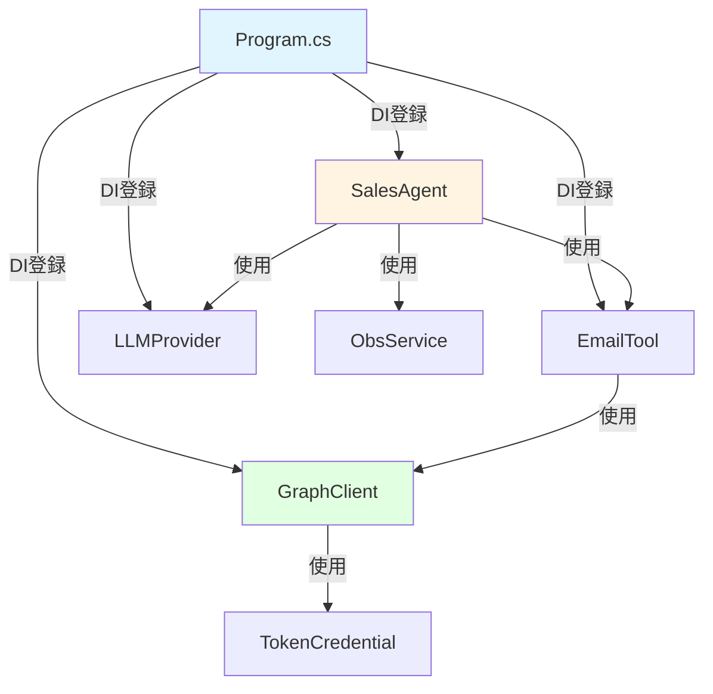

# Project Structure - ディレクトリとファイル構成

> **Language**: 🇯🇵 日本語 | [🇬🇧 English](../en/developer/02-PROJECT-STRUCTURE.md)

## 📋 プロジェクト構造

```
SalesSupportAgent/
├── Program.cs                          # エントリーポイント、DI設定
├── appsettings.json                    # 設定ファイル
├── appsettings.Development.json        # 開発環境設定
├── SalesSupportAgent.csproj            # プロジェクトファイル
│
├── Bot/                                # Teams Bot関連
│   ├── AdapterWithErrorHandler.cs      # Bot Framework アダプター
│   ├── AdaptiveCardHelper.cs           # Adaptive Card生成
│   ├── BotController.cs                # Bot メッセージエンドポイント
│   └── TeamsBot.cs                     # Bot ロジック
│
├── Configuration/                      # 設定クラス
│   ├── BotSettings.cs                  # Bot設定
│   ├── LLMSettings.cs                  # LLM設定
│   └── M365Settings.cs                 # Microsoft 365設定
│
├── Models/                             # データモデル
│   └── SalesSummaryModels.cs           # リクエスト/レスポンスモデル
│
├── Services/                           # ビジネスロジック
│   ├── Agent/
│   │   └── SalesAgent.cs               # 営業支援エージェント（コア）
│   │
│   ├── LLM/                            # LLMプロバイダー
│   │   ├── ILLMProvider.cs             # インターフェース
│   │   ├── AzureOpenAIProvider.cs      # Azure OpenAI実装
│   │   ├── GitHubModelsProvider.cs     # GitHub Models実装
│   │   └── OllamaProvider.cs           # Ollama実装
│   │
│   ├── MCP/McpTools/                   # Microsoft 365ツール
│   │   ├── OutlookEmailTool.cs         # メール検索
│   │   ├── OutlookCalendarTool.cs      # カレンダー検索
│   │   ├── SharePointTool.cs           # SharePoint検索
│   │   └── TeamsMessageTool.cs         # Teamsメッセージ検索
│   │
│   ├── Observability/
│   │   └── ObservabilityService.cs     # 観測性サービス
│   │
│   ├── Notifications/
│   │   └── NotificationService.cs      # 通知サービス
│   │
│   └── Transcript/
│       └── TranscriptService.cs        # 会話履歴サービス
│
├── Telemetry/                          # テレメトリ
│   └── AgentMetrics.cs                 # メトリクス記録
│
├── Hubs/                               # SignalR Hub
│   └── ObservabilityHub.cs             # リアルタイム配信
│
└── wwwroot/                            # 静的ファイル
    └── index.html                      # ダッシュボードUI
```

## 主要ファイル解説

### Program.cs
- **役割**: アプリケーションエントリーポイント
- **責務**:
  - DI コンテナ設定
  - ミドルウェア構成
  - エンドポイント定義
  - OpenTelemetry 設定

### SalesAgent.cs
- **役割**: 営業支援エージェントのコアロジック
- **責務**:
  - AI Agent作成
  - ツール統合
  - LLM推論実行
  - 観測性記録

### OutlookEmailTool.cs
- **役割**: Outlookメール検索ツール
- **責務**:
  - Graph API呼び出し
  - メールフィルタリング
  - サマリ生成

### ObservabilityService.cs
- **役割**: 観測性データ管理
- **責務**:
  - トレース記録
  - メトリクス収集
  - SignalR配信

## 依存関係図



## 次のステップ

- **[05-DEPENDENCY-INJECTION.md](05-DEPENDENCY-INJECTION.md)**: DI詳細
- **[13-CODE-WALKTHROUGHS/](13-CODE-WALKTHROUGHS/)**: コードウォークスルー
