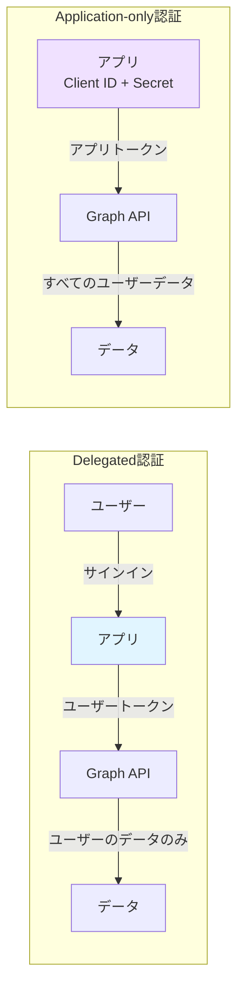
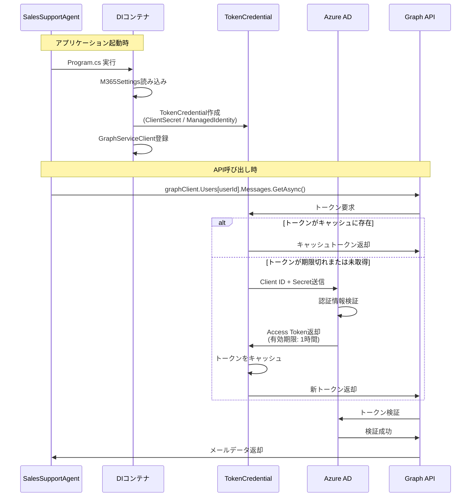
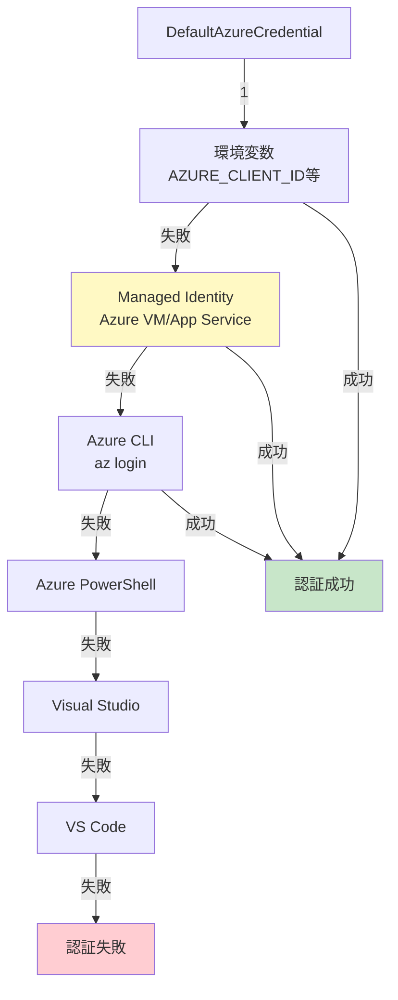
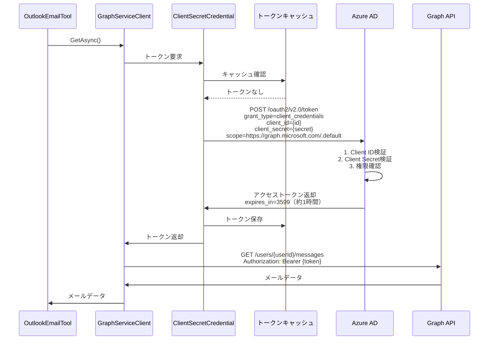
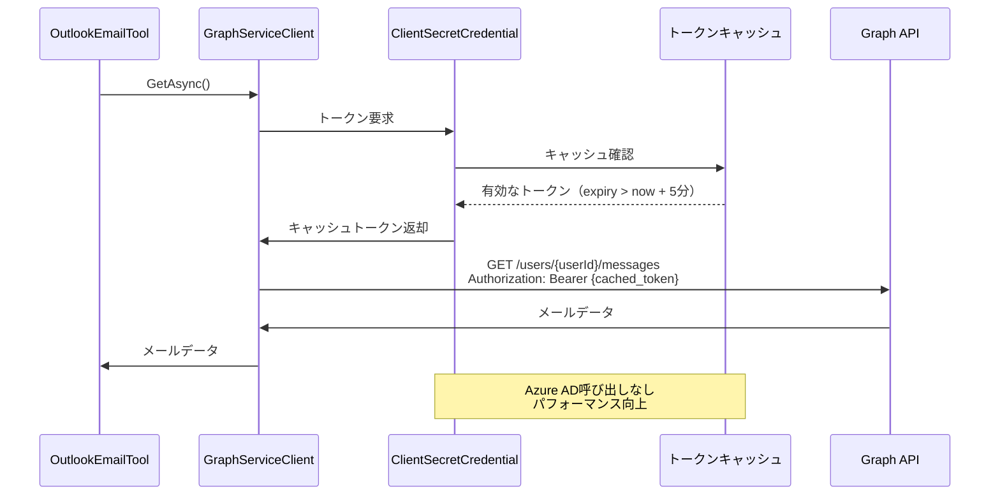
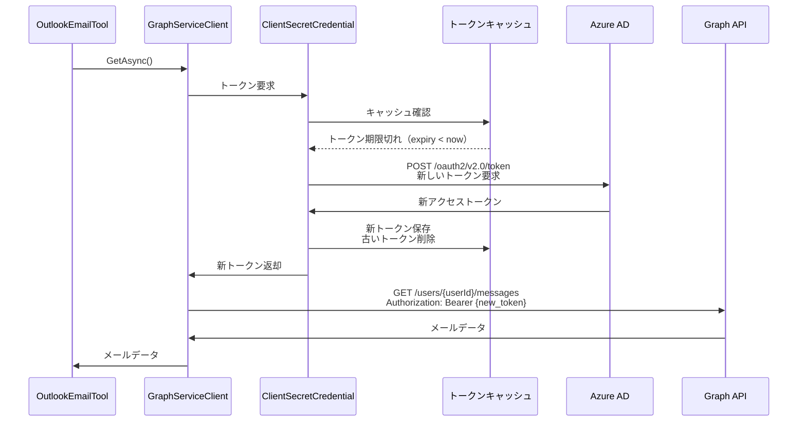

# Authentication Flow - Application-only認証の詳細解説

## 📋 目次

- [概要](#概要)
- [認証アーキテクチャ](#認証アーキテクチャ)
- [TokenCredentialの実装](#tokencredentialの実装)
- [Program.cs コードウォークスルー](#programcs-コードウォークスルー)
- [認証フロー詳細](#認証フロー詳細)
- [トークンライフサイクル](#トークンライフサイクル)
- [エラーハンドリング](#エラーハンドリング)
- [ベストプラクティス](#ベストプラクティス)

---

## 概要

Sales Support Agentは、**Application-only認証**（アプリケーション専用権限）を使用してMicrosoft Graph APIにアクセスします。

### Application-only認証とは

| 認証タイプ | 説明 | ユースケース |
|-----------|------|-------------|
| **Delegated** | ユーザーの代理としてアクセス | ユーザーがサインインするアプリ |
| **Application-only** | アプリ自体の権限でアクセス | バックグラウンドサービス、Bot |

**Sales Support Agentの選択理由**:
- ✅ ユーザー操作なしで24/7稼働可能
- ✅ 複数ユーザーのデータに一貫してアクセス
- ✅ Teamsボットとして非インタラクティブに動作
- ✅ スケーラブル（ユーザー数に依存しない）

### 認証方式の比較



---

## 認証アーキテクチャ

### 全体フロー



---

## TokenCredentialの実装

### 1. ClientSecretCredential（開発環境）

**Program.cs での実装**:

```csharp
builder.Services.AddSingleton<TokenCredential>(sp =>
{
    var logger = sp.GetRequiredService<ILogger<Program>>();
    
    if (!m365Settings.IsConfigured)
    {
        logger.LogWarning("⚠️ Microsoft 365 が設定されていません。Graph API 機能は無効です。");
        // ダミー実装を返す（認証情報なしでも起動できるように）
        return new ClientSecretCredential("dummy-tenant", "dummy-client", "dummy-secret");
    }

    if (m365Settings.UseManagedIdentity)
    {
        // Managed Identity使用（後述）
    }
    else
    {
        logger.LogInformation("🔐 ClientSecretCredential を使用して Graph API に接続します");
        return new ClientSecretCredential(
            m365Settings.TenantId,
            m365Settings.ClientId,
            m365Settings.ClientSecret,
            new ClientSecretCredentialOptions
            {
                AuthorityHost = AzureAuthorityHosts.AzurePublicCloud,
                Retry =
                {
                    MaxRetries = 3,
                    Delay = TimeSpan.FromSeconds(2),
                    NetworkTimeout = TimeSpan.FromSeconds(30)
                }
            });
    }
});
```

**ポイント解説**:

| 要素 | 説明 |
|------|------|
| **TenantId** | Azure ADテナントID（組織の識別子） |
| **ClientId** | アプリ登録のクライアントID |
| **ClientSecret** | クライアントシークレット（パスワード） |
| **AuthorityHost** | 認証エンドポイント（AzurePublicCloud = https://login.microsoftonline.com） |
| **Retry.MaxRetries** | ネットワークエラー時の再試行回数 |
| **Retry.Delay** | 再試行間隔（指数バックオフ） |
| **NetworkTimeout** | HTTP接続タイムアウト |

**設定ファイル（appsettings.json）**:

```json
{
  "M365": {
    "TenantId": "your-tenant-id",
    "ClientId": "your-client-id",
    "ClientSecret": "your-client-secret",
    "UserId": "user@company.com",
    "UseManagedIdentity": false,
    "Scopes": [
      "https://graph.microsoft.com/.default"
    ]
  }
}
```

**スコープの指定**:
- Application-only認証では `.default` スコープを使用
- 実際の権限はAzure ADアプリ登録で設定（例: `Mail.Read`, `Calendars.Read`）

### 2. DefaultAzureCredential（本番環境 - Managed Identity）

**Program.cs での実装**:

```csharp
if (m365Settings.UseManagedIdentity)
{
    logger.LogInformation("🔐 Managed Identity を使用して Graph API に接続します");
    return new DefaultAzureCredential(new DefaultAzureCredentialOptions
    {
        ManagedIdentityClientId = m365Settings.ClientId,
        ExcludeVisualStudioCredential = true,
        ExcludeVisualStudioCodeCredential = true,
        ExcludeAzurePowerShellCredential = true,
        Retry =
        {
            MaxRetries = 3,
            Delay = TimeSpan.FromSeconds(2),
            NetworkTimeout = TimeSpan.FromSeconds(30)
        }
    });
}
```

**DefaultAzureCredential 認証チェーン**:



**Managed Identity使用時の設定**:

```json
{
  "M365": {
    "TenantId": "your-tenant-id",
    "ClientId": "managed-identity-client-id",
    "UseManagedIdentity": true,
    "UserId": "user@company.com",
    "Scopes": [
      "https://graph.microsoft.com/.default"
    ]
  }
}
```

**本番環境での有効化（Azure App Service）**:

```bash
# System Assigned Managed Identity
az webapp identity assign \
  --name <app-name> \
  --resource-group <resource-group>

# User Assigned Managed Identity
az webapp identity assign \
  --name <app-name> \
  --resource-group <resource-group> \
  --identities /subscriptions/<sub-id>/resourceGroups/<rg>/providers/Microsoft.ManagedIdentity/userAssignedIdentities/<identity-name>
```

**Managed Identityのメリット**:
- ✅ シークレット管理不要（Azure ADが自動管理）
- ✅ シークレットローテーション不要
- ✅ Key Vault不要（認証情報をコードに埋め込まない）
- ✅ セキュリティ向上（認証情報漏洩リスクゼロ）

---

## Program.cs コードウォークスルー

### ステップ1: 設定読み込み

```csharp
// ========================================
// 設定の読み込み
// ========================================
builder.Services.Configure<LLMSettings>(builder.Configuration.GetSection("LLM"));
builder.Services.Configure<M365Settings>(builder.Configuration.GetSection("M365"));
builder.Services.Configure<BotSettings>(builder.Configuration.GetSection("Bot"));

var m365Settings = builder.Configuration.GetSection("M365").Get<M365Settings>() ?? new M365Settings();
```

**設定クラス（Configuration/M365Settings.cs）**:

```csharp
public class M365Settings
{
    public string TenantId { get; set; } = string.Empty;
    public string ClientId { get; set; } = string.Empty;
    public string ClientSecret { get; set; } = string.Empty;
    public string UserId { get; set; } = string.Empty;
    public bool UseManagedIdentity { get; set; } = false;
    public string[] Scopes { get; set; } = new[] { "https://graph.microsoft.com/.default" };

    public bool IsConfigured =>
        !string.IsNullOrWhiteSpace(TenantId) &&
        !string.IsNullOrWhiteSpace(ClientId) &&
        (UseManagedIdentity || !string.IsNullOrWhiteSpace(ClientSecret));
}
```

### ステップ2: TokenCredential登録

```csharp
// TokenCredential の作成（Managed Identity または ClientSecretCredential）
builder.Services.AddSingleton<TokenCredential>(sp =>
{
    var logger = sp.GetRequiredService<ILogger<Program>>();
    
    if (!m365Settings.IsConfigured)
    {
        logger.LogWarning("⚠️ Microsoft 365 が設定されていません。Graph API 機能は無効です。");
        return new ClientSecretCredential("dummy-tenant", "dummy-client", "dummy-secret");
    }

    if (m365Settings.UseManagedIdentity)
    {
        logger.LogInformation("🔐 Managed Identity を使用して Graph API に接続します");
        return new DefaultAzureCredential(/* オプション */);
    }
    else
    {
        logger.LogInformation("🔐 ClientSecretCredential を使用して Graph API に接続します");
        return new ClientSecretCredential(
            m365Settings.TenantId,
            m365Settings.ClientId,
            m365Settings.ClientSecret,
            new ClientSecretCredentialOptions { /* オプション */ }
        );
    }
});
```

**DIコンテナでのシングルトン登録**:
- `AddSingleton`: アプリケーション全体で1つのインスタンスを共有
- トークンキャッシュが有効に機能（メモリ効率向上）
- スレッドセーフ（内部でロック機構を持つ）

### ステップ3: GraphServiceClient登録

```csharp
// GraphServiceClient をシングルトンで登録（トークンキャッシュ最適化）
builder.Services.AddSingleton<GraphServiceClient>(sp =>
{
    var credential = sp.GetRequiredService<TokenCredential>();
    var logger = sp.GetRequiredService<ILogger<Program>>();
    
    logger.LogInformation("📊 GraphServiceClient を初期化しています...");
    
    return new GraphServiceClient(credential, m365Settings.Scopes);
});
```

**GraphServiceClientの責務**:
- Graph APIエンドポイントへのHTTPリクエスト構築
- `TokenCredential`を使用した自動トークン取得・リフレッシュ
- レスポンスのデシリアライズ
- エラーハンドリング（`ServiceException`）

### ステップ4: ツールクラスでの使用

```csharp
// MCP ツールの登録（Agent365 パターン）
builder.Services.AddSingleton<OutlookEmailTool>();
builder.Services.AddSingleton<OutlookCalendarTool>();
builder.Services.AddSingleton<SharePointTool>();
```

**ツールクラスでのDI注入例（OutlookEmailTool.cs）**:

```csharp
public class OutlookEmailTool
{
    private readonly GraphServiceClient _graphClient;
    private readonly M365Settings _m365Settings;
    private readonly ILogger<OutlookEmailTool> _logger;

    public OutlookEmailTool(
        GraphServiceClient graphClient,
        M365Settings m365Settings,
        ILogger<OutlookEmailTool> logger)
    {
        _graphClient = graphClient;
        _m365Settings = m365Settings;
        _logger = logger;
    }

    public async Task<string> SearchSalesEmails(
        string startDate,
        string endDate,
        string keywords)
    {
        // GraphServiceClientが内部でTokenCredentialを使用
        var messages = await _graphClient.Users[_m365Settings.UserId].Messages
            .GetAsync(config => { /* クエリ設定 */ });
        
        return JsonSerializer.Serialize(messages?.Value);
    }
}
```

---

## 認証フロー詳細

### 初回トークン取得フロー



### トークンキャッシュヒット時のフロー



### トークンリフレッシュフロー



---

## トークンライフサイクル

### トークンの有効期限

```
トークン取得時刻: 2026-02-08 10:00:00 UTC
有効期限: 3599秒（約1時間）
期限切れ時刻: 2026-02-08 11:00:00 UTC

10:00:00 ━━━━━━━━━━━━━━━━━━━━━━━━━━━━━━━━━━━━━━━━━━━━━━━ 11:00:00
   ↑                                                      ↑
取得時刻                                              期限切れ
   
   ┃←────────── 有効期間（3599秒） ──────────→┃
   ┃                                          ┃
   ┃←── キャッシュヒット ──→┃←─ リフレッシュ ─→┃
   0分                    55分             60分
```

### トークンキャッシュ戦略

**ClientSecretCredentialの内部実装**（概念図）:

```csharp
public class ClientSecretCredential : TokenCredential
{
    private AccessToken? _cachedToken;
    private readonly SemaphoreSlim _lock = new SemaphoreSlim(1, 1);
    
    public override async ValueTask<AccessToken> GetTokenAsync(
        TokenRequestContext requestContext,
        CancellationToken cancellationToken)
    {
        await _lock.WaitAsync(cancellationToken);
        try
        {
            // キャッシュチェック（5分のバッファを持つ）
            if (_cachedToken.HasValue && 
                _cachedToken.Value.ExpiresOn > DateTimeOffset.UtcNow.AddMinutes(5))
            {
                return _cachedToken.Value;
            }
            
            // Azure ADからトークン取得
            var newToken = await AcquireTokenFromAzureADAsync(requestContext, cancellationToken);
            _cachedToken = newToken;
            return newToken;
        }
        finally
        {
            _lock.Release();
        }
    }
}
```

**ポイント**:
- **5分のバッファ**: 期限切れの5分前にリフレッシュ開始
- **スレッドセーフ**: `SemaphoreSlim`で同時リクエストを制御
- **自動リフレッシュ**: アプリケーションコードで明示的なリフレッシュ不要

---

## エラーハンドリング

### 認証エラーの種類

| エラーコード | 原因 | 対処法 |
|-------------|------|--------|
| **401 Unauthorized** | トークン無効/期限切れ | 自動リフレッシュで解決（通常は発生しない） |
| **403 Forbidden** | 権限不足 | Azure ADアプリ登録で権限追加→管理者同意 |
| **AADSTS7000215** | Client Secret無効 | Azure Portalで新しいSecretを生成 |
| **AADSTS700016** | Client ID不正 | Azure ADアプリ登録のClient IDを確認 |
| **AADSTS90002** | Tenant ID不正 | Azure ADテナントIDを確認 |

### リトライポリシー実装

**Program.cs のリトライ設定**:

```csharp
new ClientSecretCredentialOptions
{
    Retry =
    {
        MaxRetries = 3,
        Delay = TimeSpan.FromSeconds(2),
        NetworkTimeout = TimeSpan.FromSeconds(30)
    }
}
```

**リトライ動作**:

```
1回目の試行
   ↓ 失敗（ネットワークエラー）
   ↓ 2秒待機
2回目の試行
   ↓ 失敗
   ↓ 4秒待機（指数バックオフ）
3回目の試行
   ↓ 失敗
   ↓ 8秒待機
4回目の試行（最終）
   ↓ 失敗 → 例外をスロー
```

### カスタムエラーハンドリング例

```csharp
public async Task<string> SearchEmailsWithRetry(string query)
{
    const int maxRetries = 3;
    for (int attempt = 1; attempt <= maxRetries; attempt++)
    {
        try
        {
            var messages = await _graphClient.Users[_userId].Messages
                .GetAsync(config => config.QueryParameters.Search = query);
            
            return JsonSerializer.Serialize(messages?.Value);
        }
        catch (ServiceException ex) when (ex.ResponseStatusCode == 401)
        {
            _logger.LogWarning("認証エラー（試行 {Attempt}/{Max}）: {Message}", 
                attempt, maxRetries, ex.Message);
            
            if (attempt == maxRetries)
                throw;
            
            await Task.Delay(TimeSpan.FromSeconds(Math.Pow(2, attempt)));
        }
        catch (ServiceException ex) when (ex.ResponseStatusCode == 403)
        {
            _logger.LogError("権限不足: {Message}。Azure ADで権限を確認してください。", ex.Message);
            throw;
        }
        catch (ServiceException ex) when (ex.ResponseStatusCode == 429)
        {
            var retryAfter = ex.ResponseHeaders?.RetryAfter?.Delta ?? TimeSpan.FromSeconds(60);
            _logger.LogWarning("レート制限（試行 {Attempt}/{Max}）: {Seconds}秒後に再試行", 
                attempt, maxRetries, retryAfter.TotalSeconds);
            
            if (attempt == maxRetries)
                throw;
            
            await Task.Delay(retryAfter);
        }
    }
    
    throw new InvalidOperationException("予期しないエラー");
}
```

---

## ベストプラクティス

### ✅ DO

#### 1. TokenCredentialをシングルトンで登録

```csharp
builder.Services.AddSingleton<TokenCredential>(/* 実装 */);
builder.Services.AddSingleton<GraphServiceClient>(/* 実装 */);
```

**理由**:
- トークンキャッシュが効率的に機能
- TokenCredentialの内部HTTPクライアントを再利用
- メモリ使用量削減

#### 2. 設定検証を実装

```csharp
public bool IsConfigured =>
    !string.IsNullOrWhiteSpace(TenantId) &&
    !string.IsNullOrWhiteSpace(ClientId) &&
    (UseManagedIdentity || !string.IsNullOrWhiteSpace(ClientSecret));
```

**起動時チェック**:

```csharp
if (!m365Settings.IsConfigured)
{
    logger.LogWarning("⚠️ Microsoft 365 が設定されていません。Graph API 機能は無効です。");
    return new ClientSecretCredential("dummy-tenant", "dummy-client", "dummy-secret");
}
```

#### 3. 本番環境でManaged Identityを使用

```json
{
  "M365": {
    "UseManagedIdentity": true,
    "ClientId": "managed-identity-client-id"
  }
}
```

#### 4. リトライポリシーを設定

```csharp
Retry = {
    MaxRetries = 3,
    Delay = TimeSpan.FromSeconds(2),
    NetworkTimeout = TimeSpan.FromSeconds(30)
}
```

#### 5. ログでトラブルシューティング情報を記録

```csharp
logger.LogInformation("🔐 ClientSecretCredential を使用して Graph API に接続します");
logger.LogInformation("📊 GraphServiceClient を初期化しています...");
```

### ❌ DON'T

#### 1. TokenCredentialを毎回新規作成しない

```csharp
// BAD - 毎回新しいトークン取得（パフォーマンス悪化）
public async Task<string> SearchEmails()
{
    var credential = new ClientSecretCredential(tenantId, clientId, clientSecret);
    var graphClient = new GraphServiceClient(credential);
    // ...
}
```

#### 2. Client Secretをコードに埋め込まない

```csharp
// BAD - ハードコーディング
var credential = new ClientSecretCredential(
    "tenant-id",
    "client-id",
    "hardcoded-secret" // セキュリティ違反
);
```

**正しい方法**:
- appsettings.json（開発環境）
- Azure Key Vault（本番環境）
- 環境変数
- Managed Identity（最推奨）

#### 3. Delegated認証をApplication-only認証と混同しない

```csharp
// BAD - Delegated認証用のスコープをApplication-only認証で使用
var scopes = new[] { "User.Read", "Mail.Read" };
// Application-only では ".default" を使用
```

**正しいスコープ**:

```csharp
// Application-only認証
var scopes = new[] { "https://graph.microsoft.com/.default" };
// 実際の権限はAzure ADアプリ登録で設定
```

#### 4. エラーを無視しない

```csharp
// BAD - 例外を握りつぶす
try
{
    var messages = await _graphClient.Users[userId].Messages.GetAsync();
}
catch
{
    // エラー無視 - トラブルシューティング不可
}
```

---

## デバッグとトラブルシューティング

### 認証状態の確認

**テストエンドポイント（Program.cs）**:

```csharp
app.MapGet("/api/test/graph/profile", async (GraphServiceClient graphClient, M365Settings m365Settings) =>
{
    try
    {
        var user = await graphClient.Users[m365Settings.UserId].GetAsync();
        return Results.Ok(new { 
            Success = true,
            DisplayName = user?.DisplayName,
            Email = user?.Mail ?? user?.UserPrincipalName,
            Id = user?.Id
        });
    }
    catch (Exception ex)
    {
        return Results.Problem($"Graph API エラー: {ex.Message}");
    }
});
```

**実行結果例**:

```bash
# 成功時
curl http://localhost:5000/api/test/graph/profile
{
  "success": true,
  "displayName": "田中 太郎",
  "email": "tanaka@company.com",
  "id": "abc123..."
}

# 失敗時（認証エラー）
{
  "success": false,
  "error": "Graph API エラー: Unauthorized - 401"
}
```

### ログ出力例

```
info: Program[0]
      ========================================
info: Program[0]
      営業支援エージェント起動
info: Program[0]
      LLM Provider: AzureOpenAI
info: Program[0]
      🔐 ClientSecretCredential を使用して Graph API に接続します
info: Program[0]
      📊 GraphServiceClient を初期化しています...
info: Program[0]
      M365 設定: ✅ 有効
info: Program[0]
      ========================================
```

---

## まとめ

### Application-only認証の実装チェックリスト

- ✅ Azure ADアプリ登録完了（Application権限設定済み）
- ✅ appsettings.jsonに認証情報設定（TenantId, ClientId, ClientSecret）
- ✅ TokenCredentialをシングルトンで登録
- ✅ GraphServiceClientをシングルトンで登録
- ✅ リトライポリシー設定
- ✅ エラーハンドリング実装
- ✅ ログ出力実装
- ✅ テストエンドポイントで疎通確認
- ✅ 本番環境でManaged Identity使用

### 次のステップ

認証フローを理解したら、次のドキュメントでデータフローとGraph API呼び出しパターンを学習してください:

- **[04-DATA-FLOW.md](04-DATA-FLOW.md)**: データフローとGraph API呼び出し
- **[06-SDK-INTEGRATION-PATTERNS.md](06-SDK-INTEGRATION-PATTERNS.md)**: SDK統合パターン
- **[11-SECURITY-BEST-PRACTICES.md](11-SECURITY-BEST-PRACTICES.md)**: セキュリティベストプラクティス
