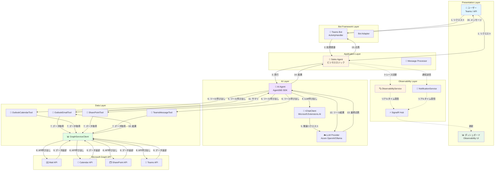
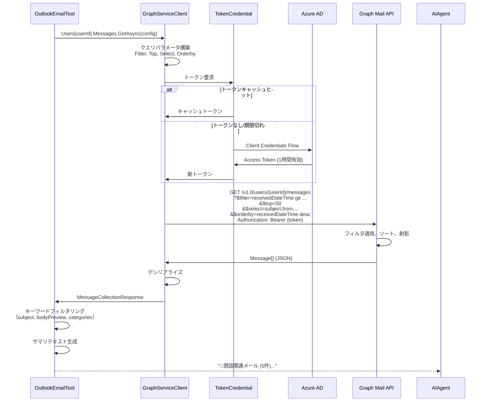
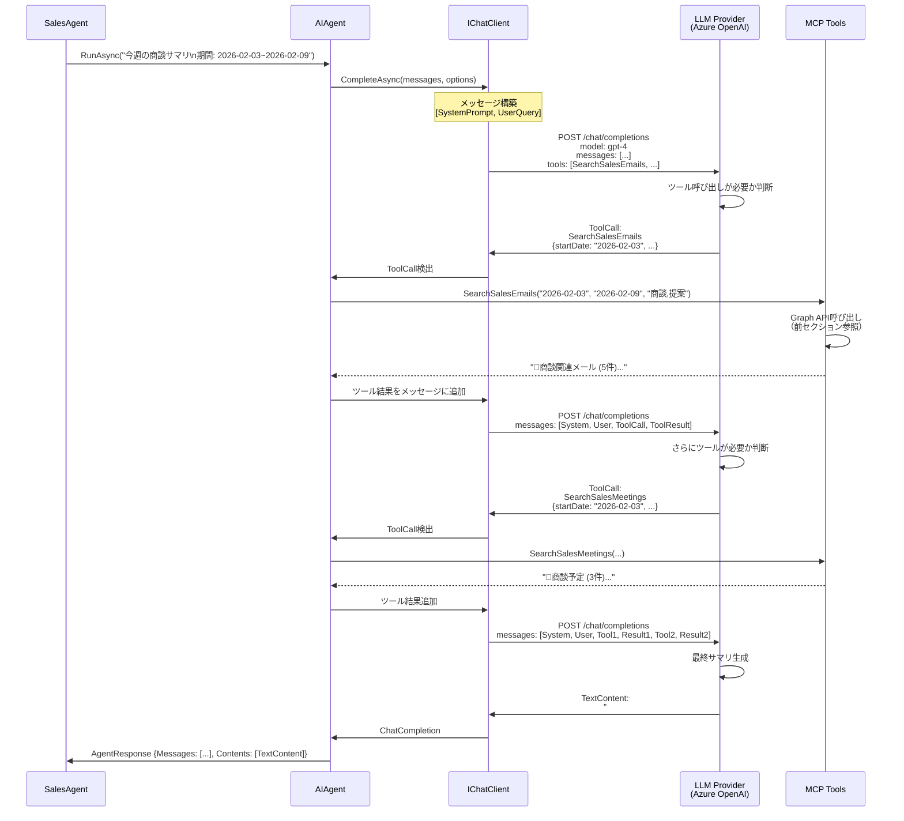
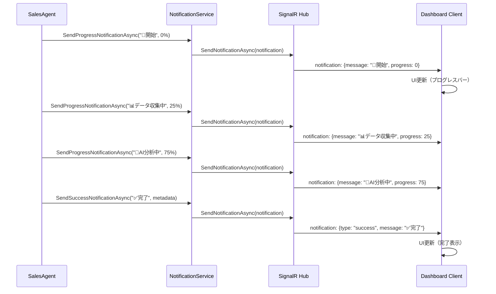
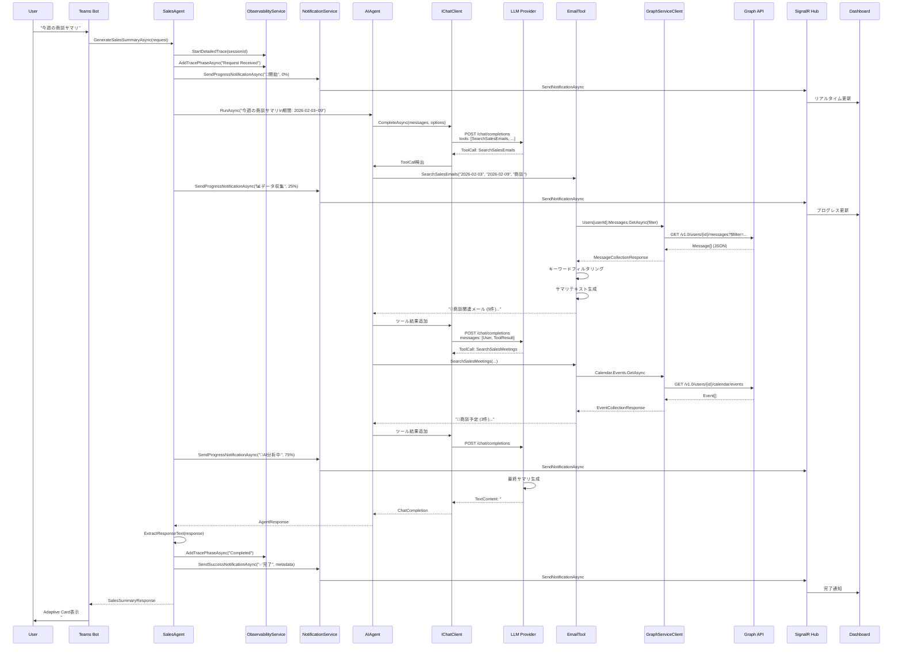

# Data Flow - Graph API → LLM → Response 詳細解説

## 📋 目次

- [概要](#概要)
- [エンドツーエンドデータフロー](#エンドツーエンドデータフロー)
- [Phase 1: ユーザーリクエスト受信](#phase-1-ユーザーリクエスト受信)
- [Phase 2: Graph APIデータ収集](#phase-2-graph-apiデータ収集)
- [Phase 3: LLM推論と応答生成](#phase-3-llm推論と応答生成)
- [Phase 4: 応答返却とリアルタイム通知](#phase-4-応答返却とリアルタイム通知)
- [詳細シーケンス図](#詳細シーケンス図)
- [コードウォークスルー](#コードウォークスルー)
- [パフォーマンス最適化](#パフォーマンス最適化)

---

## 概要

Sales Support Agentのデータフローは、以下の4つのフェーズで構成されます:

```
User Request → Graph API Data Collection → LLM Inference → Response Delivery
     ↓                    ↓                      ↓                  ↓
  Teams Bot          MCP Tools              AI Agent          SignalR Hub
                   (Email/Calendar)    (Microsoft.Extensions.AI)  (Dashboard)
```

---

## エンドツーエンドデータフロー

### 全体アーキテクチャ



---

## Phase 1: ユーザーリクエスト受信

### 1.1 Teams Botエントリーポイント

**Bot/TeamsBot.cs**:

```csharp
protected override async Task OnMessageActivityAsync(
    ITurnContext<IMessageActivity> turnContext,
    CancellationToken cancellationToken)
{
    var userMessage = turnContext.Activity.Text;
    
    // Sales Agent に処理を委譲
    var request = new SalesSummaryRequest
    {
        Query = userMessage,
       StartDate = DateTime.Now.AddDays(-7),
        EndDate = DateTime.Now
    };
    
    var response = await _salesAgent.GenerateSalesSummaryAsync(request);
    
    // ユーザーに応答を返却
    await turnContext.SendActivityAsync(
        MessageFactory.Text(response.Response),
        cancellationToken);
}
```

### 1.2 APIエンドポイント（直接呼び出し）

**Program.cs**:

```csharp
app.MapPost("/api/sales-summary", async (
    SalesSummaryRequest request,
    SalesAgent salesAgent) =>
{
    return await AgentMetrics.InvokeObservedHttpOperation("agent.sales_summary", async () =>
    {
        var response = await salesAgent.GenerateSalesSummaryAsync(request);
        return Results.Ok(response);
    });
});
```

**リクエスト例**:

```bash
curl -X POST http://localhost:5000/api/sales-summary \
  -H "Content-Type: application/json" \
  -d '{
    "query": "今週の商談サマリを教えてください",
    "startDate": "2026-02-03",
    "endDate": "2026-02-09"
  }'
```

---

## Phase 2: Graph APIデータ収集

### 2.1 Sales Agent実行開始

**Services/Agent/SalesAgent.cs - GenerateSalesSummaryAsync**:

```csharp
public async Task<SalesSummaryResponse> GenerateSalesSummaryAsync(SalesSummaryRequest request)
{
    var stopwatch = Stopwatch.StartNew();
    var operationId = Guid.NewGuid().ToString();
    
    // 詳細トレースセッション開始
    var sessionId = _observabilityService.StartDetailedTrace(
        conversationId: operationId,
        userId: "API-User",
        userQuery: request.Query
    );

    try
    {
        // Phase 1: リクエスト受信
        await _observabilityService.AddTracePhaseAsync(
            sessionId,
            "Request Received",
            "商談サマリ生成リクエストを受信しました",
            new { Query = request.Query, StartDate = request.StartDate, EndDate = request.EndDate }
        );
        
        // 通知: 開始通知
        await _notificationService.SendProgressNotificationAsync(
            operationId, 
            "🚀 商談サマリ生成を開始しています...", 
            0);
        
        // デフォルトの日付範囲を設定
        var startDate = request.StartDate ?? GetMondayOfCurrentWeek();
        var endDate = request.EndDate ?? GetSundayOfCurrentWeek();

        // クエリに日付範囲を追加
        var enhancedQuery = $"{request.Query}\n\n期間: {startDate:yyyy-MM-dd} ~ {endDate:yyyy-MM-dd}";
        
        // Phase 2: クエリ準備
        await _observabilityService.AddTracePhaseAsync(
            sessionId,
            "Query Preparation",
            "日付範囲を含むクエリを準備しました",
            new { EnhancedQuery = enhancedQuery, StartDate = startDate, EndDate = endDate }
        );
        
        // エージェント実行（次セクションで詳述）
        var agentResponse = await _agent.RunAsync(enhancedQuery);
        // ...
    }
    catch (Exception ex)
    {
        // エラーハンドリング（後述）
    }
}
```

### 2.2 AI Agent ツール呼び出し

**エージェント構成（CreateAgent メソッド）**:

```csharp
private AIAgent CreateAgent()
{
    var chatClient = _llmProvider.GetChatClient();

    // ツールを登録
    var tools = new List<AITool>
    {
        AIFunctionFactory.Create(_emailTool.SearchSalesEmails),
        AIFunctionFactory.Create(_calendarTool.SearchSalesMeetings),
        AIFunctionFactory.Create(_sharePointTool.SearchSalesDocuments),
        AIFunctionFactory.Create(_teamsTool.SearchSalesMessages)
    };

    return chatClient.AsAIAgent(
        SystemPrompt,  // 営業支援エージェントのシステムプロンプト
        "営業支援エージェント",
        tools: tools
    );
}
```

**System Prompt（重要）**:

```csharp
private const string SystemPrompt = @"あなたは営業支援エージェントです。
以下のツールを使用して、Microsoft 365 から商談関連情報を収集し、わかりやすくサマリを作成します。

【利用可能なツール】
1. SearchSalesEmails - Outlook メールから商談関連メールを検索
2. SearchSalesMeetings - Outlook カレンダーから商談予定を検索
3. SearchSalesDocuments - SharePoint から提案書・見積書などを検索
4. SearchSalesMessages - Teams チャネルから商談関連メッセージを検索

【重要な指示】
- ユーザーからの質問に基づいて、適切なツールを選択して情報を収集してください
- 複数のツールを組み合わせて、包括的な商談サマリを作成してください
- 日本語で丁寧に回答してください

【出力フォーマット】
## 📊 サマリー
- 全体概要

## 📧 商談メール
- 重要なメール

## 📅 商談予定
- 今後の予定

## 📁 関連ドキュメント
- 提案書、見積書

## 💡 推奨アクション
- 次のアクション";
```

### 2.3 MCP Tools によるGraph APIデータ取得

#### OutlookEmailTool の実装

**Services/MCP/McpTools/OutlookEmailTool.cs**:

```csharp
public class OutlookEmailTool
{
    private readonly GraphServiceClient _graphClient;
    private readonly string _userId;

    [Description("商談関連のメールを検索して取得します")]
    public async Task<string> SearchSalesEmails(
        [Description("検索開始日 (yyyy-MM-dd)")] string startDate,
        [Description("検索終了日 (yyyy-MM-dd)")] string endDate,
        [Description("検索キーワード（例: 商談,提案,見積）")] string keywords = "商談,提案,見積,契約")
    {
        try
        {
            var start = DateTime.Parse(startDate);
            var end = DateTime.Parse(endDate).AddDays(1); // 終了日を含める

            // Agent Identity を使用して特定ユーザーのメールボックスにアクセス
            var messages = await _graphClient.Users[_userId].Messages
                .GetAsync(config =>
                {
                    config.QueryParameters.Filter = 
                        $"receivedDateTime ge {start:yyyy-MM-ddTHH:mm:ssZ} " +
                        $"and receivedDateTime le {end:yyyy-MM-ddTHH:mm:ssZ}";
                    config.QueryParameters.Top = 50;
                    config.QueryParameters.Select = new[] 
                    { 
                        "subject", "from", "receivedDateTime", 
                        "bodyPreview", "hasAttachments", "categories" 
                    };
                    config.QueryParameters.Orderby = new[] { "receivedDateTime desc" };
                });

            if (messages?.Value == null || messages.Value.Count == 0)
            {
                return $"📧 期間 {startDate} ~ {endDate} の商談関連メールは見つかりませんでした。";
            }

            // キーワードでフィルタリング
            var keywordList = keywords.Split(',').Select(k => k.Trim()).ToList();
            var filteredMessages = messages.Value
                .Where(m => keywordList.Any(k => 
                    m.Subject?.Contains(k, StringComparison.OrdinalIgnoreCase) == true ||
                    m.BodyPreview?.Contains(k, StringComparison.OrdinalIgnoreCase) == true ||
                    m.Categories?.Any(c => c.Contains(k, StringComparison.OrdinalIgnoreCase)) == true))
                .ToList();

            // サマリ生成
            var summary = $"📧 **商談関連メール ({filteredMessages.Count}件)**\n\n";
            foreach (var msg in filteredMessages.Take(10))
            {
                summary += $"- **{msg.Subject}**\n";
                summary += $"  送信者: {msg.From?.EmailAddress?.Name ?? "不明"}\n";
                summary += $"  受信日時: {msg.ReceivedDateTime:yyyy/MM/dd HH:mm}\n";
                summary += $"  添付ファイル: {(msg.HasAttachments == true ? "あり" : "なし")}\n";
                summary += $"  概要: {msg.BodyPreview?.Substring(0, Math.Min(100, msg.BodyPreview.Length))}...\n\n";
            }

            return summary;
        }
        catch (Exception ex)
        {
            return $"❌ メール取得エラー: {ex.Message}";
        }
    }
}
```

**Graph API呼び出しの内部フロー**:



#### OutlookCalendarTool の実装

**同様のパターン**:

```csharp
public async Task<string> SearchSalesMeetings(
    string startDate,
    string endDate,
    string keywords = "商談,提案,ミーティング")
{
    var events = await _graphClient.Users[_userId].Calendar.Events
        .GetAsync(config =>
        {
            config.QueryParameters.Filter = 
                $"start/dateTime ge '{start:yyyy-MM-ddTHH:mm:ss}' " +
                $"and end/dateTime le '{end:yyyy-MM-ddTHH:mm:ss}'";
            config.QueryParameters.Select = new[] 
            { 
                "subject", "start", "end", "attendees", "location", "bodyPreview" 
            };
            config.QueryParameters.Orderby = new[] { "start/dateTime" };
        });
    
    // フィルタリング、サマリ生成（メールと同パターン）
}
```

---

## Phase 3: LLM推論と応答生成

### 3.1 AI Agentの実行フロー



### 3.2 LLM Tool Calling 詳細

**IChatClient Options 設定**:

```csharp
var options = new ChatOptions
{
    Temperature = 0.7f,
    MaxTokens = 2000,
    Tools = new List<AITool>
    {
        AIFunctionFactory.Create(_emailTool.SearchSalesEmails),
        AIFunctionFactory.Create(_calendarTool.SearchSalesMeetings),
        // ...
    }
};
```

**AIFunctionFactory による自動スキーマ生成**:

```csharp
// メソッド定義
[Description("商談関連のメールを検索して取得します")]
public async Task<string> SearchSalesEmails(
    [Description("検索開始日 (yyyy-MM-dd)")] string startDate,
    [Description("検索終了日 (yyyy-MM-dd)")] string endDate,
    [Description("検索キーワード（例: 商談,提案,見積）")] string keywords = "商談,提案,見積,契約")

// ↓ AIFunctionFactory.Create が自動生成 ↓

{
  "type": "function",
  "function": {
    "name": "SearchSalesEmails",
    "description": "商談関連のメールを検索して取得します",
    "parameters": {
      "type": "object",
      "properties": {
        "startDate": {
          "type": "string",
          "description": "検索開始日 (yyyy-MM-dd)"
        },
        "endDate": {
          "type": "string",
          "description": "検索終了日 (yyyy-MM-dd)"
        },
        "keywords": {
          "type": "string",
          "description": "検索キーワード（例: 商談,提案,見積）",
          "default": "商談,提案,見積,契約"
        }
      },
      "required": ["startDate", "endDate"]
    }
  }
}
```

### 3.3 応答テキスト抽出

**SalesAgent.cs - ExtractResponseText メソッド**:

```csharp
private string ExtractResponseText(object agentResponse)
{
    try
    {
        dynamic response = agentResponse;
        
        // Agent 365 SDKの応答構造
        if (agentResponse.GetType().GetProperty("Messages") != null)
        {
            var messages = response.Messages as IEnumerable<object>;
            if (messages != null && messages.Any())
            {
                var lastMessage = messages.LastOrDefault();
                if (lastMessage != null)
                {
                    dynamic message = lastMessage;
                    
                    // Contentsプロパティ確認
                    if (lastMessage.GetType().GetProperty("Contents") != null)
                    {
                        var contents = message.Contents as IEnumerable<object>;
                        if (contents != null)
                        {
                            var textContents = contents
                                .Where(c => c.GetType().Name.Contains("TextContent"))
                                .ToList();
                            
                            if (textContents.Any())
                            {
                                var texts = textContents.Select(tc => 
                                {
                                    dynamic textContent = tc;
                                    return textContent.Text as string ?? "";
                                }).Where(t => !string.IsNullOrWhiteSpace(t));
                                
                                return string.Join("\n\n", texts).Trim();
                            }
                        }
                    }
                }
            }
        }

        return "応答がありませんでした。";
    }
    catch (Exception ex)
    {
        _logger.LogError(ex, "応答テキスト抽出エラー");
        return $"応答の処理中にエラーが発生しました: {ex.Message}";
    }
}
```

---

## Phase 4: 応答返却とリアルタイム通知

### 4.1 Observability トレース記録

```csharp
// Phase 5: 完了
await _observabilityService.AddTracePhaseAsync(
    sessionId,
    "Summary Generation Completed",
    "商談サマリの生成が完了しました",
    new 
    { 
        TotalDurationMs = stopwatch.ElapsedMilliseconds,
        DataSources = dataSources,
        ResponseLength = responseText?.Length ?? 0
    }
);
```

### 4.2 SignalR リアルタイム通知

```csharp
// 通知: 完了通知（データソース情報を含む）
await _notificationService.SendSuccessNotificationAsync(
    operationId, 
    $"✅ 商談サマリ生成完了！（処理時間: {stopwatch.ElapsedMilliseconds:N0}ms）",
    new 
    { 
        ProcessingTimeMs = stopwatch.ElapsedMilliseconds, 
        DataSourceCount = dataSources.Count,
        DataSources = string.Join(", ", dataSources),
        ResponseLength = responseText?.Length ?? 0
    }
);
```

**SignalR Hub 配信フロー**:



### 4.3 最終応答返却

```csharp
return new SalesSummaryResponse
{
    Response = responseText ?? "応答がありませんでした。",
    DataSources = dataSources,  // ["Outlook", "Calendar", "SharePoint"]
    ProcessingTimeMs = stopwatch.ElapsedMilliseconds,
    LLMProvider = _llmProvider.ProviderName  // "AzureOpenAI"
};
```

---

## 詳細シーケンス図

### 完全なエンドツーエンドシーケンス



---

## コードウォークスルー

### 典型的な実行トレース

```
[00:00.000] ℹ️ 商談サマリ生成開始: 今週の商談サマリを教えてください
[00:00.050] 📝 詳細トレースセッション開始: session-abc123
[00:00.100] 📊 Phase: Request Received
[00:00.150] 📢 通知送信: 🚀 商談サマリ生成を開始しています... (0%)
[00:00.200] 📝 クエリ拡張: 今週の商談サマリ\n期間: 2026-02-03 ~ 2026-02-09

[00:00.300] 📊 Phase: Query Preparation
[00:00.350] 🤖 AIエージェント実行開始
[00:00.400] 📊 Phase: AI Agent Execution Started

[00:00.500] 🔧 LLM: ツール呼び出し - SearchSalesEmails
[00:00.550] 📢 通知送信: 📊 データ収集中（メール、カレンダー）... (25%)
[00:00.600] 🔐 TokenCredential: キャッシュトークン使用
[00:00.650] 📊 Graph API: GET /users/{id}/messages?$filter=...
[00:01.200] ✅ Graph API: 50件のメッセージ取得
[00:01.250] 🔍 キーワードフィルタリング: 5件マッチ
[00:01.300] 📧 サマリ生成: 商談関連メール (5件)

[00:01.400] 🔧 LLM: ツール呼び出し - SearchSalesMeetings
[00:01.450] 📊 Graph API: GET /users/{id}/calendar/events?$filter=...
[00:01.900] ✅ Graph API: 10件のイベント取得
[00:01.950] 🔍 キーワードフィルタリング: 3件マッチ
[00:02.000] 📅 サマリ生成: 商談予定 (3件)

[00:02.100] 📢 通知送信: 🤖 AI分析中（サマリ生成処理）... (75%)
[00:02.200] 🤖 LLM: 最終サマリ生成開始
[00:03.500] ✅ LLM: サマリ生成完了 (1200文字)

[00:03.600] 📊 Phase: AI Response Received (3000ms)
[00:03.650] 📝 応答テキスト抽出: 1200文字
[00:03.700] 📊 Phase: Summary Generation Completed

[00:03.750] 📢 通知送信: ✅ 商談サマリ生成完了！（処理時間: 3,700ms）
[00:03.800] ✅ 商談サマリ生成完了: 3700ms
[00:03.850] 📊 メトリクス記録: success=true, latency=3700ms
```

---

## パフォーマンス最適化

### データ収集の並列化

**現在の実装**（シーケンシャル）:

```
LLM → SearchSalesEmails → Graph API (1s)
       ↓
     LLM → SearchSalesMeetings → Graph API (0.5s)
       ↓
     LLM → 最終サマリ生成 (1.3s)
       
総処理時間: 2.8秒
```

**最適化案**（並列実行）:

```csharp
// ツールを並列実行するカスタムエージェント実装
public async Task<string> ParallelDataCollection(string startDate, string endDate)
{
    var tasks = new[]
    {
        _emailTool.SearchSalesEmails(startDate, endDate, "商談"),
        _calendarTool.SearchSalesMeetings(startDate, endDate, "商談"),
        _sharePointTool.SearchSalesDocuments(startDate, endDate, "提案書"),
        _teamsTool.SearchSalesMessages(startDate, endDate, "商談")
    };
    
    var results = await Task.WhenAll(tasks);
    
    // LLMに全データを一度に渡す
    var combinedData = string.Join("\n\n", results);
    var summary = await _llmProvider.GenerateSummaryAsync(combinedData);
    
    return summary;
}
```

**期待効果**:

```
並列実行:
  SearchSalesEmails     → Graph API (1s)    ┐
  SearchSalesMeetings   → Graph API (0.5s)  ├ 同時実行
  SearchSalesDocuments  → Graph API (0.7s)  │
  SearchSalesMessages   → Graph API (0.6s)  ┘
    ↓ 最大1秒待機
  LLM → 最終サマリ生成 (1.3s)
    
総処理時間: 2.3秒（18%高速化）
```

### Graph API クエリ最適化

**Select フィールド最小化**:

```csharp
// BAD - 全フィールド取得（レスポンスサイズ大）
var messages = await _graphClient.Users[userId].Messages.GetAsync();

// GOOD - 必要フィールドのみ取得
var messages = await _graphClient.Users[userId].Messages
    .GetAsync(config =>
    {
        config.QueryParameters.Select = new[] 
        { 
            "subject", "from", "receivedDateTime", "bodyPreview" 
        };
    });
```

**Top パラメータ調整**:

```csharp
// 最初の10件のみ取得（99%のケースで十分）
config.QueryParameters.Top = 10;
```

### トークンキャッシュ効果

```
1回目のGraph API呼び出し:
  TokenCredential → Azure AD (認証: 200ms) → Graph API (クエリ: 500ms)
  総時間: 700ms

2回目以降（キャッシュヒット）:
  TokenCredential → キャッシュ (0ms) → Graph API (クエリ: 500ms)
  総時間: 500ms（28%高速化）
```

---

## まとめ

Sales Support Agentのデータフローは以下の4フェーズで構成されます:

1. **Phase 1**: ユーザーリクエスト受信（Teams Bot / API）
2. **Phase 2**: Graph APIデータ収集（MCP Tools）
3. **Phase 3**: LLM推論と応答生成（AI Agent + IChatClient）
4. **Phase 4**: 応答返却とリアルタイム通知（SignalR Hub）

各フェーズで適切な観測性（Observability）とエラーハンドリングが実装されており、ユーザーはリアルタイムで処理状況を確認できます。

### 次のステップ

データフローを理解したら、次のドキュメントでSDK統合パターンとコードウォークスルーを学習してください:

- **[06-SDK-INTEGRATION-PATTERNS.md](06-SDK-INTEGRATION-PATTERNS.md)**: SDK統合パターン
- **[13-CODE-WALKTHROUGHS/CONVERSATION-FLOW.md](13-CODE-WALKTHROUGHS/CONVERSATION-FLOW.md)**: 会話フロー詳細
- **[10-PERFORMANCE-OPTIMIZATION.md](10-PERFORMANCE-OPTIMIZATION.md)**: パフォーマンス最適化
