# Architecture Documentation

[](../ARCHITECTURE.md)
[](ARCHITECTURE.md)

## 📋 Overview

The Sales Support Agent is a .NET 10 application based on the **Microsoft Agent 365 SDK** that implements an AI agent leveraging Microsoft 365 data.

This document provides detailed explanations of the system architecture, component configuration, data flow, and technology stack.

---

## 🏗️ System Architecture Overview

```mermaid
graph TB
    subgraph "Frontend"
        A[Teams User]
        B[Observability Dashboard<br/>Web UI]
    end
    subgraph "Bot Framework Layer"
        C[Bot Framework Adapter]
        D[Teams Activity Handler]
    end
    subgraph "Sales Support Agent (.NET 10)"
        E[SalesAgent]
        F[IChatClient<br/>Middleware Chain]
        G[MCP Tools]
        H[ObservabilityService]
        I[SignalR Hub]
    end
    subgraph "LLM Layer"
        J[Azure OpenAI]
        K[Ollama]
        L[Other LLMs]
    end
    subgraph "Microsoft 365"
        M[Graph API]
        N[📧 Outlook]
        O[📅 Calendar]
        P[📁 SharePoint]
        Q[💬 Teams]
    end
    A -->|@mention| C
    C --> D
    D --> E
    E --> F
    F -->|Function Invocation| G
    F -->|Selectable| J
    F -->|Selectable| K
    F -->|Selectable| L
    G -->|Application-only auth| M
    M --> N
    M --> O
    M --> P
    M --> Q
    E -->|Trace| H
    H -->|SignalR| I
    I -->|WebSocket| B
```

---

## 🧩 Component Details

### 1. Bot Framework Layer

#### Teams Bot (TeamsBot.cs)

Teams integration layer using Microsoft Bot Framework.

**Primary Responsibilities**:
- Receive messages from Teams
- Manage user context
- Generate Adaptive Cards responses
- Error handling

**Operation Flow**:
```
1. User @mentions → Teams sends webhook
2. BotController receives → Calls TeamsBot.OnMessageActivityAsync
3. Delegates processing to SalesAgent
4. Generate Adaptive Card → Reply to Teams
```

**Implementation Files**:
- `Bot/TeamsBot.cs` - Message handler
- `Bot/BotController.cs` - Webhook endpoint (/api/messages)
- `Bot/AdapterWithErrorHandler.cs` - Error handling


### 2. Sales Agent Core

#### SalesAgent (Services/Agent/SalesAgent.cs)

Core implementation of the Sales Support Agent.

**Architecture Pattern**:
```csharp
IChatClient (Agent 365 SDK)
    ↓ UseOpenTelemetry() - OpenTelemetry middleware
    ↓ UseFunctionInvocation() - MCP Tools invocation
    ↓ Build()
    → ChatClient (executable client)
```

**Processing Flow**:


**Key Methods**:
- `GenerateSalesSummaryAsync(string query)` - Generate sales summary
- `UpdateAgentActivityAsync()` - Update agent activity (Observability)
- Detailed trace integration (5 phases)

### 3. LLM Provider Layer

Abstraction layer supporting multiple LLM providers.

#### ILLMProvider Interface

```csharp
public interface ILLMProvider
{
    IChatClient GetChatClient();
}
```

#### Implementation Classes

| Provider | Implementation Class | Use Case |
|----------|---------------------|----------|
| **Azure OpenAI** | AzureOpenAIProvider | Enterprise environments, high performance |
| **Ollama** | OllamaProvider | Local LLM, offline, cost reduction |
| **Extensible** | - | Custom providers can be added |

**How to Switch**:
```json
{
  "LLM": {
    "Provider": "AzureOpenAI"  // or "Ollama"
  }
}
```

### 4. MCP (Model Context Protocol) Tools

Tool suite abstracting Microsoft 365 data access.

#### Tool List

| Tool | File | Graph API Endpoint | Functionality |
|------|------|-------------------|--------------|
| **OutlookEmailTool** | OutlookEmailTool.cs | `/users/{userId}/messages` | Email search & filtering |
| **OutlookCalendarTool** | OutlookCalendarTool.cs | `/users/{userId}/events` | Calendar event search |
| **SharePointTool** | SharePointTool.cs | `/search/query` | Document search via Microsoft Search API |
| **TeamsMessageTool** | TeamsMessageTool.cs | `/teams/{teamId}/channels/{channelId}/messages` | Teams message search |

#### SharePoint Tool Advanced Features

**Microsoft Search API Integration**:
```csharp
// Date range + keyword OR search
var request = new SearchRequest
{
    EntityTypes = new List<EntityType> { EntityType.DriveItem },
    Query = new SearchQuery
    {
        QueryString = "keyword1 OR keyword2"
    },
    From = 0,
    Size = 50,
    Fields = new List<string> 
    { 
        "title", "path", "lastModifiedDateTime", 
        "createdBy", "fileExtension", "size" 
    }
};
```

**Filtering**:
- Date range filter by LastModifiedTime
- File extension filter (.pdf, .docx, .xlsx, etc.)

### 5. Observability Layer

Real-time monitoring and trace functionality.

#### ObservabilityService (Services/Observability/ObservabilityService.cs)

**Managed Data**:
```csharp
// Agent information
public class AgentInfo
{
    public string AgentId { get; set; }
    public string AgentName { get; set; }
    public string AgentType { get; set; }
    public string Status { get; set; }  // Active, Idle, Busy
    public DateTime RegisteredAt { get; set; }
    public DateTime LastActiveAt { get; set; }
    public string Version { get; set; }
    public int TotalInteractions { get; set; }
    public string LastActivity { get; set; }
    public string? IconUrl { get; set; }  // Fluent UI icon
}

// Detailed trace session
public class DetailedTraceSession
{
    public string SessionId { get; set; }
    public string ConversationId { get; set; }
    public string UserId { get; set; }
    public string UserQuery { get; set; }
    public DateTime StartTime { get; set; }
    public DateTime? EndTime { get; set; }
    public string? FinalResponse { get; set; }
    public bool Success { get; set; }
    public List<TracePhase> Phases { get; set; }  // 5 phases
    public long DurationMs { get; set; }
}

// Trace phase
public class TracePhase
{
    public string PhaseName { get; set; }
    public string Description { get; set; }
    public DateTime Timestamp { get; set; }
    public object? Data { get; set; }  // Phase-specific data
    public string Status { get; set; }  // Pending, Running, Completed, Failed
}
```

**API Endpoints**:
- `GET /api/observability/agents` - Active agents list
- `GET /api/observability/detailed-traces` - All detailed traces
- `GET /api/observability/detailed-trace/{sessionId}` - Specific session
- `GET /api/observability/traces-by-conversation/{conversationId}` - Traces by conversation

#### SignalR Hub (Hubs/ObservabilityHub.cs)

**Real-time Delivery**:
```csharp
// Server → Client events
public interface IObservabilityClient
{
    Task ReceiveAgentUpdate(AgentInfo agent);
    Task ReceiveTraceUpdate(DetailedTraceSession trace);
    Task ReceiveMetricsUpdate(ObservabilityMetrics metrics);
    Task ReceiveNotification(NotificationEvent notification);
}

// Connection URL
ws://localhost:5192/hubs/observability
```

**Transport**:
1. WebSockets (preferred)
2. Server-Sent Events
3. Long Polling (fallback)

### 6. OpenTelemetry Integration

#### AgentMetrics (Telemetry/AgentMetrics.cs)

```csharp
public class AgentMetrics
{
    public static readonly ActivitySource ActivitySource = 
        new ActivitySource("SalesSupportAgent");
    
    public static readonly Meter Meter = 
        new Meter("SalesSupportAgent");
    
    // Counters
    public static readonly Counter<long> RequestCounter;
    public static readonly Counter<long> SuccessCounter;
    public static readonly Counter<long> ErrorCounter;
    
    // Histograms
    public static readonly Histogram<double> RequestDuration;
    public static readonly Histogram<double> LLMResponseTime;
}
```

**Trace Example**:
```
Activity: GenerateSalesSummary
├─ Activity: SearchOutlookEmails (850ms)
├─ Activity: SearchCalendarEvents (620ms)
├─ Activity: SearchSharePointDocuments (1250ms)
└─ Activity: LLM_Completion (3200ms)
Total Duration: 6420ms
```

---

## 📊 Data Flow

### Typical Sales Summary Generation Flow

```mermaid
sequenceDiagram
    autonumber
    participant User as Teams User
    participant Bot as TeamsBot
    participant Agent as SalesAgent
    participant LLM as LLM Provider
    participant Email as OutlookEmailTool
    participant Cal as CalendarTool
    participant SP as SharePointTool
    participant Graph as Microsoft Graph
    participant Obs as ObservabilityService
    participant UI as Dashboard UI
    
    User->>Bot: @SalesSupportAgent<br/>Show this week's sales summary
    Bot->>Agent: GenerateSalesSummaryAsync(query)
    Agent->>Obs: StartDetailedTrace(sessionId)
    Obs-->>UI: SignalR: TraceStarted
    
    Agent->>LLM: CompleteAsync(query)
    LLM->>Agent: Request tool invocation<br/>(SearchEmails, SearchEvents, SearchDocs)
    
    par Parallel Data Collection
        Agent->>Email: SearchOutlookEmails(keywords)
        Email->>Graph: GET /users/{id}/messages
        Graph-->>Email: Email list
        Email-->>Agent: Email data
    and
        Agent->>Cal: SearchCalendarEvents(start, end)
        Cal->>Graph: GET /users/{id}/events
        Graph-->>Cal: Event list
        Cal-->>Agent: Event data
    and
        Agent->>SP: SearchSharePointDocuments(query, dateRange)
        SP->>Graph: POST /search/query
        Graph-->>SP: Document list
        SP-->>Agent: Document data
    end
    
    Agent->>Obs: AddTracePhase("Data Collection Complete")
    Obs-->>UI: SignalR: PhaseUpdate
    
    Agent->>LLM: Tool results + Context
    LLM-->>Agent: Sales summary (text)
    
    Agent->>Obs: CompleteDetailedTrace(success)
    Obs-->>UI: SignalR: TraceCompleted
    
    Agent->>Bot: Generate Adaptive Card
    Bot-->>User: 📊 Display sales summary card
```



### Observability Dashboard Data Flow


---

## 🔐 Security Architecture

### Authentication & Authorization Flow


### Secret Management

| Environment | Method | Implementation |
|------------|--------|---------------|
| **Local Development** | appsettings.json + environment variables | ClientSecretCredential |
| **Azure App Service** | Managed Identity + Key Vault | DefaultAzureCredential |
| **Azure Container Apps** | Managed Identity | DefaultAzureCredential |
| **AKS** | Workload Identity + Key Vault | DefaultAzureCredential |

**Best Practice**:
```csharp
// Program.cs - Automatic switching based on environment
builder.Services.AddSingleton<TokenCredential>(sp =>
{
    if (m365Settings.UseManagedIdentity)
    {
        return new DefaultAzureCredential(new DefaultAzureCredentialOptions
        {
            ManagedIdentityClientId = m365Settings.ClientId,
            Retry = { MaxRetries = 3, Delay = TimeSpan.FromSeconds(2) }
        });
    }
    else
    {
        return new ClientSecretCredential(
            m365Settings.TenantId,
            m365Settings.ClientId,
            m365Settings.ClientSecret
        );
    }
});
```

---

## 🛠️ Technology Stack

### Backend

| Category | Technology | Version | Purpose |
|----------|-----------|---------|---------|
| **Runtime** | .NET | 10.0 | Application execution environment |
| **Framework** | ASP.NET Core | 10.0 | Web application |
| **Bot** | Bot Framework SDK | 4.22.7 | Teams integration |
| **AI SDK** | Microsoft.Extensions.AI | 1.0.0-preview.1 | Agent 365 SDK foundation |
| **Agent 365** | Microsoft.Agents.A365.Observability | beta | Observability integration |
| **Agent 365** | Microsoft.Agents.A365.Tooling | beta | MCP Tools integration |
| **Agent 365** | Microsoft.Agents.Storage | 1.0 | Conversation state management |
| **Graph API** | Microsoft.Graph | 5.61.0 | M365 data access |
| **Authentication** | Azure.Identity | 1.13.0 | Azure AD authentication |
| **Telemetry** | OpenTelemetry | 1.10.0 | Distributed tracing & metrics |
| **Real-time** | SignalR | 10.0 | WebSocket communication |

### LLM Providers

| Provider | SDK | Example Models |
|----------|-----|---------------|
| **Azure OpenAI** | Azure.AI.OpenAI | GPT-4o, GPT-4o-mini |
| **Ollama** | HTTP Client | Qwen2.5, Llama3.2, Mistral |

### Frontend (Dashboard)

| Technology | Purpose |
|-----------|---------|
| **Vanilla JavaScript** | Observability Dashboard UI |
| **SignalR Client** | Real-time communication |
| **Fluent UI System Icons** | Microsoft design language consistency |
| **Adaptive Cards** | Teams response display |

---

## 📦 Project Structure

```
SalesSupportAgent/
├── Program.cs                          # Application entry point
├── appsettings.json                    # Configuration file
├── SalesSupportAgent.csproj            # Project file
│
├── Bot/                                # Bot Framework Layer
│   ├── TeamsBot.cs                     # Teams message handler
│   ├── BotController.cs                # Webhook endpoint
│   ├── AdapterWithErrorHandler.cs      # Error handling
│   └── AdaptiveCardHelper.cs           # Adaptive Cards generation
│
├── Services/
│   ├── Agent/
│   │   └── SalesAgent.cs               # Sales Support Agent main
│   │
│   ├── LLM/                            # LLM Provider Layer
│   │   ├── ILLMProvider.cs             # Provider interface
│   │   ├── AzureOpenAIProvider.cs      # Azure OpenAI implementation
│   │   ├── GitHubModelsProvider.cs     # GitHub Models implementation
│   │   └── OllamaProvider.cs           # Ollama implementation
│   │
│   ├── MCP/McpTools/                   # MCP Tools
│   │   ├── OutlookEmailTool.cs         # Email search
│   │   ├── OutlookCalendarTool.cs      # Calendar search
│   │   ├── SharePointTool.cs           # SharePoint/Search API
│   │   └── TeamsMessageTool.cs         # Teams message search
│   │
│   ├── Observability/
│   │   └── ObservabilityService.cs     # Real-time monitoring service
│   │
│   ├── Notifications/
│   │   └── NotificationService.cs      # Agent 365 notifications (beta)
│   │
│   ├── Transcript/
│   │   └── TranscriptService.cs        # Conversation log recording
│   │
│   └── TestData/
│       └── TestDataGenerator.cs        # Sample data generation
│
├── Configuration/                      # Configuration classes
│   ├── LLMSettings.cs
│   ├── M365Settings.cs
│   ├── BotSettings.cs
│   └── TestDataSettings.cs
│
├── Models/
│   └── SalesSummaryModels.cs           # Request/Response models
│
├── Resources/
│   └── LocalizedStrings.cs             # Localization resources
│
├── Telemetry/
│   └── AgentMetrics.cs                 # OpenTelemetry metrics definition
│
├── Hubs/
│   └── ObservabilityHub.cs             # SignalR Hub
│
└── wwwroot/                            # Static files
    ├── observability.html              # Observability Dashboard
    └── images/
        └── agent365-logo.png           # Logo image
```

---

## 🔄 Extensibility and Customization

### Adding New MCP Tools

```csharp
// 1. Tool implementation
public class CustomTool
{
    private readonly GraphServiceClient _graphClient;
    
    [Description("Custom tool description")]
    public async Task<string> ExecuteAsync(string param)
    {
        // Graph API invocation logic
        var result = await _graphClient.Users["userId"]
            .CustomEndpoint.GetAsync();
        
        return JsonSerializer.Serialize(result);
    }
}

// 2. DI registration (Program.cs)
builder.Services.AddSingleton<CustomTool>();

// 3. Integrate into SalesAgent
private readonly CustomTool _customTool;
```

### Adding New LLM Providers

```csharp
// 1. ILLMProvider implementation
public class CustomLLMProvider : ILLMProvider
{
    public IChatClient GetChatClient()
    {
        var chatClient = new CustomChatClient();
        return chatClient
            .AsBuilder()
            .UseFunctionInvocation()
            .UseOpenTelemetry()
            .Build();
    }
}

// 2. appsettings.json
{
  "LLM": {
    "Provider": "CustomLLM",
    "CustomLLM": {
      "Endpoint": "https://custom-llm.com"
    }
  }
}

// 3. Program.cs - Registration
"customllm" => new CustomLLMProvider(llmSettings.CustomLLM)
```

---

## 📚 Related Documentation

- [Getting Started](GETTING-STARTED.md) - Setup instructions
- [Authentication](AUTHENTICATION.md) - Graph API authentication details
- [Agent Development](AGENT-DEVELOPMENT.md) - Custom agent implementation
- [Observability Dashboard](OBSERVABILITY-DASHBOARD.md) - Monitoring features details
- [Azure Deployment](DEPLOYMENT-AZURE.md) - Production environment setup

---

If you have questions about architecture details, please refer to the [Troubleshooting Guide](TROUBLESHOOTING.md) or issues.
