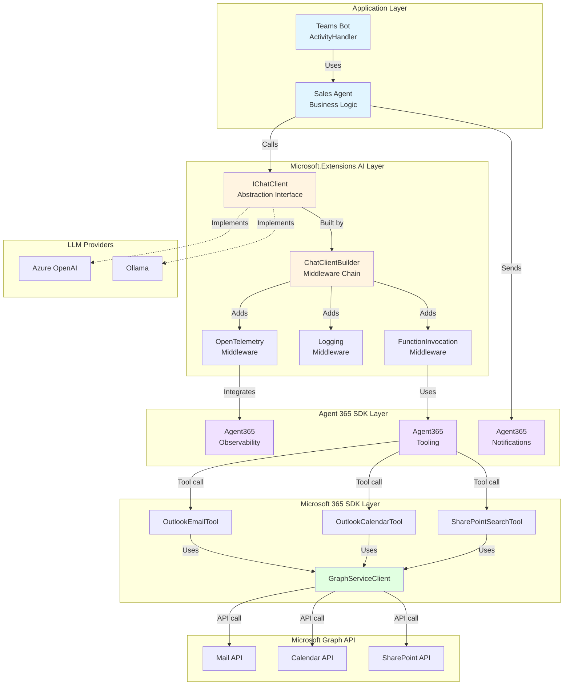
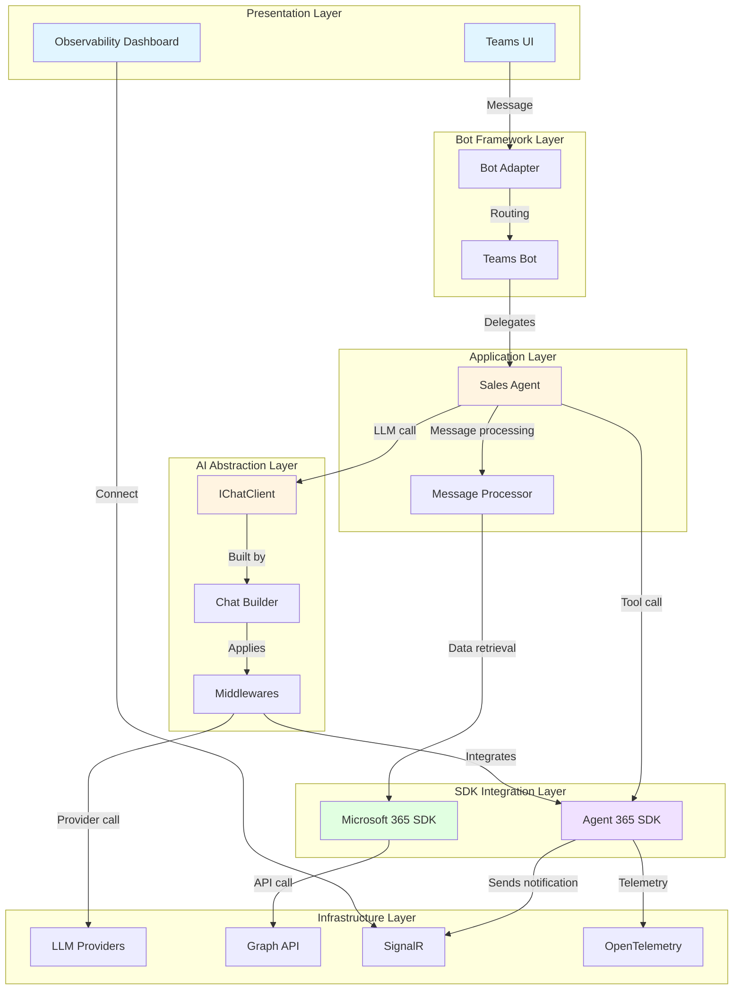

# SDK Overview - Sales Support Agent Developer Guide

[](../../developer/01-SDK-OVERVIEW.md)
[](01-SDK-OVERVIEW.md)

## 📋 Table of Contents

- [Overview](#overview)
- [Microsoft 365 SDK](#microsoft-365-sdk)
- [Agent 365 SDK](#agent-365-sdk)
- [Microsoft.Extensions.AI](#microsoftextensionsai)
- [Relationship Between SDKs](#relationship-between-sdks)
- [Overall Architecture](#overall-architecture)
- [Development Flow](#development-flow)

---

## Overview

Sales Support Agent is built by combining multiple latest Microsoft SDKs. This document provides a detailed explanation of each SDK's role and integration methods.

### Key SDKs Used

| SDK | Version | Role |
|-----|---------|------|
| **Microsoft 365 SDK** | 6.x | Microsoft Graph API integration (mail, calendar, SharePoint) |
| **Agent 365 SDK** | 1.x | Microsoft agent framework (observability, notifications) |
| **Microsoft.Extensions.AI** | 9.x | AI integration abstraction layer (IChatClient) |
| **Bot Framework** | 4.x | Teams integration, Adaptive Cards |
| **OpenTelemetry** | 1.x | Distributed tracing, metrics |

---

## Microsoft 365 SDK

### Overview

Microsoft 365 SDK provides integration with the Microsoft Graph API.

### Key Components

#### 1. GraphServiceClient

**Role**: Entry point for Graph API

```csharp
// Configuration example in Program.cs
builder.Services.AddSingleton<GraphServiceClient>(sp =>
{
    var credential = new ClientSecretCredential(
        tenantId: m365Settings.TenantId,
        clientId: m365Settings.ClientId,
        clientSecret: m365Settings.ClientSecret
    );
    
    return new GraphServiceClient(credential);
});
```

**Key Features**:
- **Authentication management**: `TokenCredential`-based authentication
- **Request building**: Type-safe query construction via Fluent API
- **Error handling**: Detailed error information through `ServiceException`
- **Batch processing**: Efficient execution of multiple requests

#### 2. Graph API Integration Patterns

**Email Search Example** (`Services/MCP/McpTools/OutlookEmailTool.cs`):

```csharp
public async Task<string> SearchEmailsAsync(string query, int maxResults = 10)
{
    try
    {
        var messages = await _graphClient.Me.Messages
            .GetAsync(requestConfiguration =>
            {
                requestConfiguration.QueryParameters.Search = $"\"{query}\"";
                requestConfiguration.QueryParameters.Top = maxResults;
                requestConfiguration.QueryParameters.Select = new[]
                {
                    "subject", "from", "receivedDateTime", "bodyPreview"
                };
                requestConfiguration.QueryParameters.Orderby = new[]
                {
                    "receivedDateTime DESC"
                };
            });

        return JsonSerializer.Serialize(messages?.Value);
    }
    catch (ServiceException ex)
    {
        _logger.LogError(ex, "Graph API error: {Code}", ex.ResponseStatusCode);
        throw;
    }
}
```

**Key Points**:
- Detailed query configuration via `requestConfiguration` lambda
- Field optimization with `Select` (improves performance)
- Proper error handling with `ServiceException`

#### 3. SharePoint Search Integration

**Microsoft Search API** (`Services/MCP/McpTools/SharePointSearchTool.cs`):

```csharp
var searchRequest = new SearchRequestObject
{
    EntityTypes = new List<EntityType> { EntityType.ListItem, EntityType.DriveItem },
    Query = new SearchQuery
    {
        QueryString = query
    },
    From = 0,
    Size = maxResults
};

var response = await _graphClient.Search.Query
    .PostAsSearchPostResponseAsync(new SearchPostRequestBody
    {
        Requests = new List<SearchRequestObject> { searchRequest }
    });
```

**Features**:
- **Unified search**: Cross-search across SharePoint, OneDrive, and Teams
- **Entity types**: ListItem, DriveItem, Message, Event
- **Ranking**: Automatic sorting by relevance score

### Microsoft 365 SDK Best Practices

#### ✅ DO

```csharp
// 1. Retrieve only necessary fields with Select
var messages = await _graphClient.Me.Messages
    .GetAsync(config => config.QueryParameters.Select = new[] { "subject", "from" });

// 2. Use batch processing to optimize multiple requests
var batchRequestContent = new BatchRequestContentCollection(_graphClient);
var messageRequest = _graphClient.Me.Messages.ToGetRequestInformation();
var calendarRequest = _graphClient.Me.Calendar.ToGetRequestInformation();
batchRequestContent.AddBatchRequestStep(messageRequest);
batchRequestContent.AddBatchRequestStep(calendarRequest);

var batchResponse = await _graphClient.Batch.PostAsync(batchRequestContent);

// 3. Implement retry policy
var retryPolicy = Policy
    .Handle<ServiceException>(ex => ex.ResponseStatusCode == (int)HttpStatusCode.TooManyRequests)
    .WaitAndRetryAsync(3, retryAttempt => TimeSpan.FromSeconds(Math.Pow(2, retryAttempt)));

await retryPolicy.ExecuteAsync(async () =>
{
    return await _graphClient.Me.Messages.GetAsync();
});
```

#### ❌ DON'T

```csharp
// 1. Retrieving all fields (degrades performance)
var messages = await _graphClient.Me.Messages.GetAsync(); // No Select

// 2. Individual requests in a loop (N+1 problem)
foreach (var userId in userIds)
{
    var user = await _graphClient.Users[userId].GetAsync(); // BAD
}

// 3. No error handling
var messages = await _graphClient.Me.Messages.GetAsync(); // No exception handling
```

---

## Agent 365 SDK

### Overview

Agent 365 SDK is an official agent framework provided by Microsoft. It provides observability, tool invocation, and notification capabilities.

### Key Components

#### 1. Agent 365 Observability

**Role**: Full observability of agent behavior

```csharp
// Configuration in Program.cs
builder.Services.AddAgent365Observability(options =>
{
    options.ActivitySourceName = "SalesSupportAgent";
    options.MeterName = "SalesSupportAgent.Metrics";
    options.EnableDetailedSpans = true;
    options.CaptureRequestBody = true;
    options.CaptureResponseBody = true;
});
```

**Provided Features**:

| Feature | Description | Use Case |
|---------|-------------|----------|
| **ActivitySource** | Distributed tracing | Spans for LLM calls |
| **Meter** | Metrics collection | Request count, latency |
| **Span enrichment** | Adding context information | User ID, conversation ID |
| **Error tracking** | Automatic exception recording | Stack traces, error codes |

**Implementation Example** (`Telemetry/AgentMetrics.cs`):

```csharp
public class AgentMetrics
{
    private readonly ActivitySource _activitySource;
    private readonly Meter _meter;
    private readonly Counter<long> _requestCounter;
    private readonly Histogram<double> _latencyHistogram;

    public AgentMetrics()
    {
        _activitySource = new ActivitySource("SalesSupportAgent");
        _meter = new Meter("SalesSupportAgent.Metrics");
        
        _requestCounter = _meter.CreateCounter<long>(
            "agent.requests",
            description: "Total agent requests"
        );
        
        _latencyHistogram = _meter.CreateHistogram<double>(
            "agent.latency",
            unit: "ms",
            description: "Agent request latency"
        );
    }

    public Activity? StartActivity(string operationName)
    {
        return _activitySource.StartActivity(operationName, ActivityKind.Internal);
    }

    public void RecordRequest(string operation, double latencyMs, bool success)
    {
        _requestCounter.Add(1, new KeyValuePair<string, object?>("operation", operation));
        _latencyHistogram.Record(latencyMs, 
            new KeyValuePair<string, object?>("operation", operation),
            new KeyValuePair<string, object?>("success", success)
        );
    }
}
```

#### 2. Agent 365 Tooling

**Role**: Unified interface for LLM tool invocation

**Tool Definition Example**:

```csharp
[Agent365Tool("search_emails")]
[Description("Searches user's emails by keyword")]
public async Task<string> SearchEmails(
    [Description("Search keyword")] string query,
    [Description("Maximum results")] int maxResults = 10)
{
    using var activity = _metrics.StartActivity("SearchEmails");
    activity?.SetTag("query", query);
    
    var sw = Stopwatch.StartNew();
    try
    {
        var result = await _emailTool.SearchEmailsAsync(query, maxResults);
        _metrics.RecordRequest("search_emails", sw.ElapsedMilliseconds, true);
        return result;
    }
    catch (Exception ex)
    {
        activity?.SetStatus(ActivityStatusCode.Error, ex.Message);
        _metrics.RecordRequest("search_emails", sw.ElapsedMilliseconds, false);
        throw;
    }
}
```

**Features**:
- **Attribute-based definition**: Declarative tool definition with `[Agent365Tool]`
- **Automatic parameter validation**: Auto-generates JSON schema from `[Description]`
- **Telemetry integration**: Tool invocations are automatically traced

#### 3. Agent 365 Notifications

**Role**: Real-time notifications, conversation history, and Transcript functionality

**Implementation Example** (`Bot/TeamsBot.cs`):

```csharp
using Agent365.Notifications;

public class TeamsBot : ActivityHandler
{
    private readonly INotificationService _notificationService;

    protected override async Task OnMessageActivityAsync(
        ITurnContext<IMessageActivity> turnContext,
        CancellationToken cancellationToken)
    {
        // Start transcript recording
        await _notificationService.StartTranscriptAsync(
            conversationId: turnContext.Activity.Conversation.Id,
            userId: turnContext.Activity.From.Id
        );

        // Record user message
        await _notificationService.AddTranscriptMessageAsync(
            role: "user",
            content: turnContext.Activity.Text
        );

        // Agent processing...
        var response = await _salesAgent.ProcessAsync(turnContext.Activity.Text);

        // Record agent response
        await _notificationService.AddTranscriptMessageAsync(
            role: "assistant",
            content: response
        );

        // Send real-time notification
        await _notificationService.SendNotificationAsync(
            new AgentNotification
            {
                Type = NotificationType.Message,
                Content = response,
                Timestamp = DateTimeOffset.UtcNow
            }
        );
    }
}
```

**Provided Features**:
- **Transcript recording**: Persistence of conversation history
- **Real-time notifications**: Delivery to dashboard via SignalR
- **Conversation context**: Tracking multi-turn conversations

### Agent 365 SDK Best Practices

#### ✅ DO

```csharp
// 1. Add business context to spans
using var activity = _activitySource.StartActivity("ProcessUserRequest");
activity?.SetTag("user.id", userId);
activity?.SetTag("conversation.id", conversationId);
activity?.SetTag("intent", detectedIntent);

// 2. Track business KPIs with metrics
_requestCounter.Add(1, 
    new("operation", "sales_summary"),
    new("customer_tier", "enterprise")
);

// 3. Always record metrics even on errors
catch (Exception ex)
{
    activity?.SetStatus(ActivityStatusCode.Error, ex.Message);
    _errorCounter.Add(1, new("error_type", ex.GetType().Name));
    throw;
}
```

#### ❌ DON'T

```csharp
// 1. Start a span but don't dispose it
var activity = _activitySource.StartActivity("Operation");
// No using statement - memory leak

// 2. Excessive metrics collection
_histogram.Record(value, 
    new("tag1", val1), new("tag2", val2), /* ... 20 tags ... */
); // Cardinality explosion

// 3. Logging sensitive information
activity?.SetTag("password", userPassword); // Security violation
```

---

## Microsoft.Extensions.AI

### Overview

Microsoft.Extensions.AI provides a unified AI integration API that is independent of LLM providers.

### Key Components

#### 1. IChatClient Interface

**Role**: Abstraction for LLM invocations

```csharp
public interface IChatClient
{
    Task<ChatCompletion> CompleteAsync(
        IList<ChatMessage> chatMessages,
        ChatOptions? options = null,
        CancellationToken cancellationToken = default);
        
    IAsyncEnumerable<StreamingChatCompletionUpdate> CompleteStreamingAsync(
        IList<ChatMessage> chatMessages,
        ChatOptions? options = null,
        CancellationToken cancellationToken = default);
}
```

**Implementation Providers**:

```csharp
// Azure OpenAI
builder.Services.AddSingleton<IChatClient>(sp =>
{
    var settings = sp.GetRequiredService<LLMSettings>();
    return new AzureOpenAIClient(
        new Uri(settings.AzureOpenAI.Endpoint),
        new AzureKeyCredential(settings.AzureOpenAI.ApiKey)
    ).AsChatClient(settings.AzureOpenAI.DeploymentName);
});

// Ollama (local)
builder.Services.AddSingleton<IChatClient>(sp =>
{
    return new OllamaClient(new Uri("http://localhost:11434"))
        .AsChatClient("llama2");
});
```

#### 2. Builder Pattern

**Role**: Feature extension through middleware chains

```csharp
var chatClient = new ChatClientBuilder()
    .Use(new AzureOpenAIClient(endpoint, credential).AsChatClient(deploymentName))
    // Telemetry middleware
    .UseOpenTelemetry(sourceName: "SalesSupportAgent", configure: options =>
    {
        options.EnableSensitiveData = false;
    })
    // Logging middleware
    .UseLogging()
    // Function invocation middleware
    .UseFunctionInvocation()
    .Build();

builder.Services.AddSingleton(chatClient);
```

**Middleware Execution Order**:

```
Request Flow:
  User Input
    ↓
  [Logging] ← Request log
    ↓
  [OpenTelemetry] ← Span start
    ↓
  [FunctionInvocation] ← Tool call decision
    ↓
  [AzureOpenAI] ← LLM API call
    ↓
  [FunctionInvocation] ← Tool execution
    ↓
  [OpenTelemetry] ← Span end
    ↓
  [Logging] ← Response log
    ↓
  Response to User
```

#### 3. Fine-Grained Control with ChatOptions

```csharp
var options = new ChatOptions
{
    // Model parameters
    Temperature = 0.7f,
    TopP = 0.95f,
    MaxTokens = 1000,
    FrequencyPenalty = 0.0f,
    PresencePenalty = 0.0f,
    
    // Tool definitions
    Tools = new List<AITool>
    {
        AIFunctionFactory.Create(SearchEmailsAsync, "search_emails"),
        AIFunctionFactory.Create(GetCalendarEventsAsync, "get_calendar_events"),
        AIFunctionFactory.Create(SearchSharePointAsync, "search_sharepoint")
    },
    
    // Response format
    ResponseFormat = ChatResponseFormat.Json,
    
    // Stop sequences
    StopSequences = new[] { "###", "END" }
};

var response = await chatClient.CompleteAsync(messages, options);
```

#### 4. Streaming Responses

```csharp
await foreach (var update in chatClient.CompleteStreamingAsync(messages, options))
{
    if (update.Text != null)
    {
        await turnContext.SendActivityAsync(update.Text);
    }
    
    if (update.FinishReason == ChatFinishReason.ToolCalls)
    {
        // Handle tool calls
        foreach (var toolCall in update.ToolCalls)
        {
            var result = await ExecuteToolAsync(toolCall);
            messages.Add(new ChatMessage(ChatRole.Tool, result));
        }
        
        // Re-invoke LLM with tool results
        await foreach (var finalUpdate in chatClient.CompleteStreamingAsync(messages, options))
        {
            await turnContext.SendActivityAsync(finalUpdate.Text);
        }
    }
}
```

### Microsoft.Extensions.AI Best Practices

#### ✅ DO

```csharp
// 1. Compose features with the Builder pattern
var client = new ChatClientBuilder()
    .Use(baseClient)
    .UseOpenTelemetry()
    .UseLogging()
    .Build();

// 2. Pass CancellationToken
var response = await chatClient.CompleteAsync(messages, options, cancellationToken);

// 3. Design for provider switchability
builder.Services.AddSingleton<IChatClient>(sp =>
{
    var provider = configuration["LLM:Provider"];
    return provider switch
    {
        "AzureOpenAI" => CreateAzureOpenAIClient(sp),
        "Ollama" => CreateOllamaClient(sp),
        _ => throw new NotSupportedException($"Provider {provider} not supported")
    };
});
```

#### ❌ DON'T

```csharp
// 1. Depending directly on concrete classes
public class SalesAgent
{
    private readonly AzureOpenAIClient _client; // BAD - should use IChatClient
}

// 2. Ignoring CancellationToken
var response = await chatClient.CompleteAsync(messages); // No timeout control

// 3. Ignoring exceptions during streaming
await foreach (var update in client.CompleteStreamingAsync(messages))
{
    // No exception handling - crashes on connection loss
}
```

---

## Relationship Between SDKs

### Architecture Diagram



### Data Flow Example

**When a user requests an email search**:

1. **Teams Bot** (`TeamsBot.cs`): Receives user message
2. **Sales Agent** (`SalesAgent.cs`): Starts message processing
3. **Agent 365 Observability**: Starts span, begins recording metrics
4. **IChatClient**: Sends message to LLM
5. **OpenTelemetry Middleware**: Traces the LLM call
6. **FunctionInvocation Middleware**: Detects tool call
7. **Agent 365 Tooling**: Executes `search_emails` tool
8. **OutlookEmailTool**: Searches emails via Graph API
9. **GraphServiceClient**: Calls Microsoft Graph API
10. **Graph Mail API**: Retrieves email data
11. **Result flows back**: Graph → Tool → LLM → Agent → Bot → User
12. **Agent 365 Notifications**: Sends real-time notification
13. **Agent 365 Observability**: Ends span, records metrics

---

## Overall Architecture

### Layer Structure



---

## Development Flow

### Typical Development Tasks and SDK Usage

| Task | SDK Used | Key Components |
|------|----------|----------------|
| **Add a new tool** | Agent 365 Tooling, M365 | `[Agent365Tool]` attribute, GraphServiceClient |
| **Add an LLM provider** | Microsoft.Extensions.AI | `IChatClient` implementation, Builder update |
| **Change authentication method** | M365 | `TokenCredential` implementation, DI configuration |
| **Enhance telemetry** | Agent 365 Observability | ActivitySource, Meter |
| **Add notification features** | Agent 365 Notifications | INotificationService |
| **Create Adaptive Cards** | Bot Framework | AdaptiveCardHelper |

### Development Environment Setup

```bash
# 1. Restore NuGet packages
dotnet restore

# 2. Check required SDK versions
dotnet list package

# Key packages:
# - Microsoft.Graph: 5.x
# - Agent365.Observability: 1.x
# - Microsoft.Extensions.AI: 9.x
# - Bot.Builder: 4.x
# - OpenTelemetry: 1.x

# 3. Local development LLM (Ollama)
brew install ollama
ollama pull llama2

# 4. Dev Tunnel setup
devtunnel create --allow-anonymous
devtunnel port create -p 5000
devtunnel host
```

### Next Steps

For detailed integration methods of each SDK, refer to the following documents:

- **[03-AUTHENTICATION-FLOW.md](03-AUTHENTICATION-FLOW.md)**: Detailed explanation of authentication flows
- **[04-DATA-FLOW.md](04-DATA-FLOW.md)**: Data flows and Graph API calls
- **[06-SDK-INTEGRATION-PATTERNS.md](06-SDK-INTEGRATION-PATTERNS.md)**: SDK integration patterns and best practices
- **[13-CODE-WALKTHROUGHS/](13-CODE-WALKTHROUGHS/)**: Actual code walkthroughs

---

## Summary

Sales Support Agent is built by combining the following SDKs:

1. **Microsoft 365 SDK**: Microsoft Graph API integration
2. **Agent 365 SDK**: Agent framework (observability, tooling, notifications)
3. **Microsoft.Extensions.AI**: LLM abstraction layer
4. **Bot Framework**: Teams integration

Each SDK has a clear role and is integrated in a loosely coupled manner, making it possible to extend or replace them individually.
