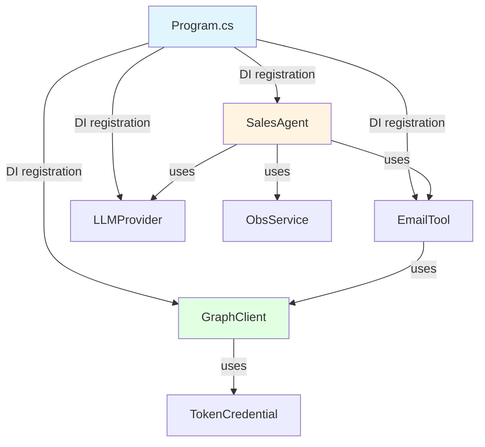

# Project Structure - Directory and File Organization

> **Language**: [🇯🇵 日本語](../../developer/02-PROJECT-STRUCTURE.md) | 🇬🇧 English

## 📋 Project Structure

```
SalesSupportAgent/
├── Program.cs                          # Entry point, DI configuration
├── appsettings.json                    # Configuration file
├── appsettings.Development.json        # Development environment config
├── SalesSupportAgent.csproj            # Project file
│
├── Bot/                                # Teams Bot related
│   ├── AdapterWithErrorHandler.cs      # Bot Framework adapter
│   ├── AdaptiveCardHelper.cs           # Adaptive Card generation
│   ├── BotController.cs                # Bot message endpoint
│   └── TeamsBot.cs                     # Bot logic
│
├── Configuration/                      # Configuration classes
│   ├── BotSettings.cs                  # Bot settings
│   ├── LLMSettings.cs                  # LLM settings
│   └── M365Settings.cs                 # Microsoft 365 settings
│
├── Models/                             # Data models
│   └── SalesSummaryModels.cs           # Request/response models
│
├── Services/                           # Business logic
│   ├── Agent/
│   │   └── SalesAgent.cs               # Sales support agent (core)
│   │
│   ├── LLM/                            # LLM providers
│   │   ├── ILLMProvider.cs             # Interface
│   │   ├── AzureOpenAIProvider.cs      # Azure OpenAI implementation
│   │   ├── GitHubModelsProvider.cs     # GitHub Models implementation
│   │   └── OllamaProvider.cs           # Ollama implementation
│   │
│   ├── MCP/McpTools/                   # Microsoft 365 tools
│   │   ├── OutlookEmailTool.cs         # Email search
│   │   ├── OutlookCalendarTool.cs      # Calendar search
│   │   ├── SharePointTool.cs           # SharePoint search
│   │   └── TeamsMessageTool.cs         # Teams message search
│   │
│   ├── Observability/
│   │   └── ObservabilityService.cs     # Observability service
│   │
│   ├── Notifications/
│   │   └── NotificationService.cs      # Notification service
│   │
│   └── Transcript/
│       └── TranscriptService.cs        # Conversation history service
│
├── Telemetry/                          # Telemetry
│   └── AgentMetrics.cs                 # Metrics recording
│
├── Hubs/                               # SignalR Hub
│   └── ObservabilityHub.cs             # Real-time delivery
│
└── wwwroot/                            # Static files
    └── index.html                      # Dashboard UI
```

## Key File Explanations

### Program.cs
- **Role**: Application entry point
- **Responsibilities**:
  - DI container configuration
  - Middleware composition
  - Endpoint definition
  - OpenTelemetry configuration

### SalesAgent.cs
- **Role**: Sales support agent core logic
- **Responsibilities**:
  - AI Agent creation
  - Tool integration
  - LLM inference execution
  - Observability recording

### OutlookEmailTool.cs
- **Role**: Outlook email search tool
- **Responsibilities**:
  - Graph API calls
  - Email filtering
  - Summary generation

### ObservabilityService.cs
- **Role**: Observability data management
- **Responsibilities**:
  - Trace recording
  - Metrics collection
  - SignalR delivery

## Dependency Diagram



## Next Steps

- **[05-DEPENDENCY-INJECTION.md](05-DEPENDENCY-INJECTION.md)**: DI details
- **[13-CODE-WALKTHROUGHS/](13-CODE-WALKTHROUGHS/)**: Code walkthroughs

---

For the complete detailed documentation including file-by-file analysis and code samples, please refer to the Japanese version at [../developer/02-PROJECT-STRUCTURE.md](../../developer/02-PROJECT-STRUCTURE.md).
