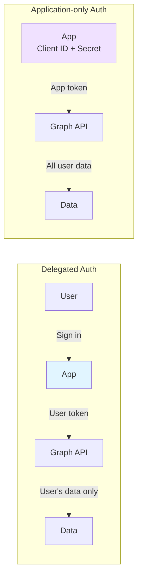
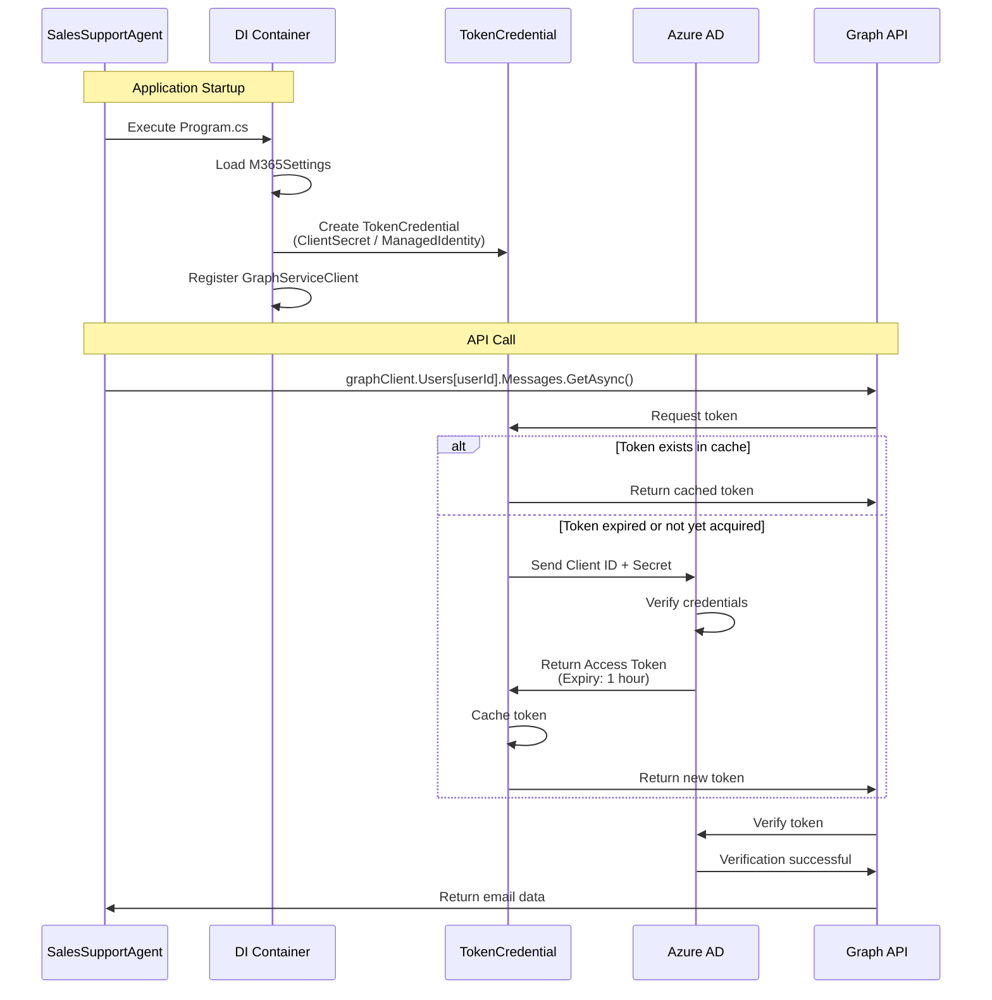
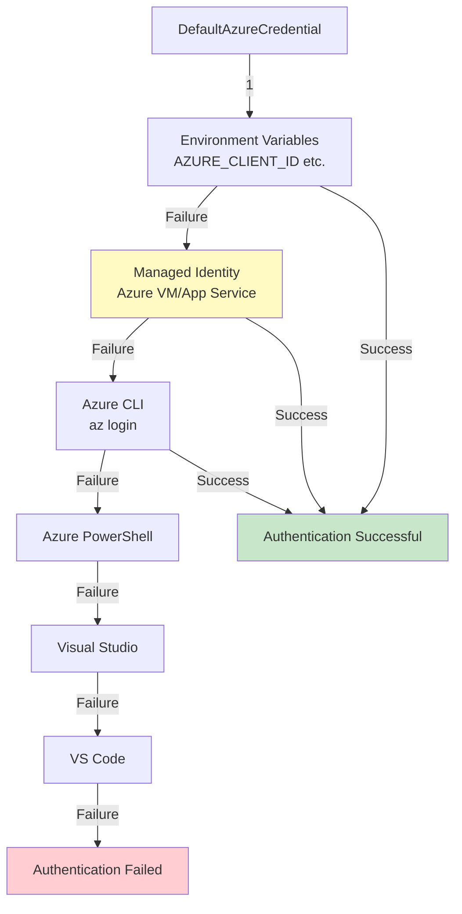
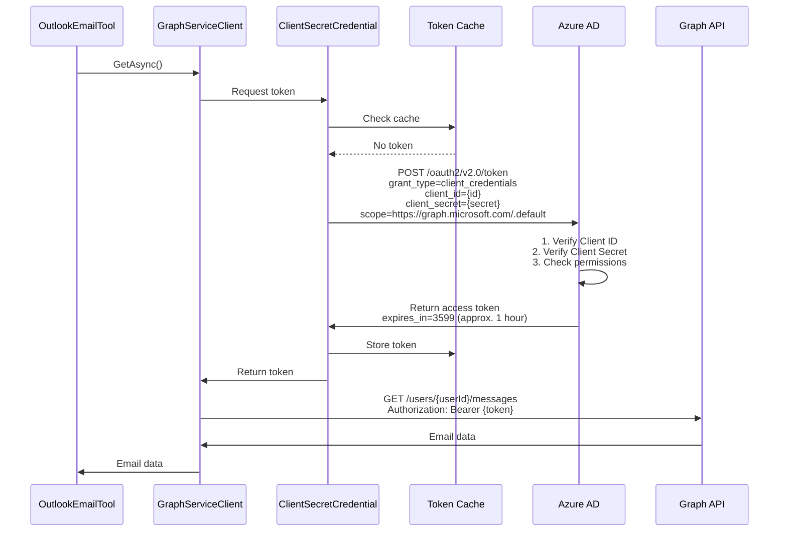
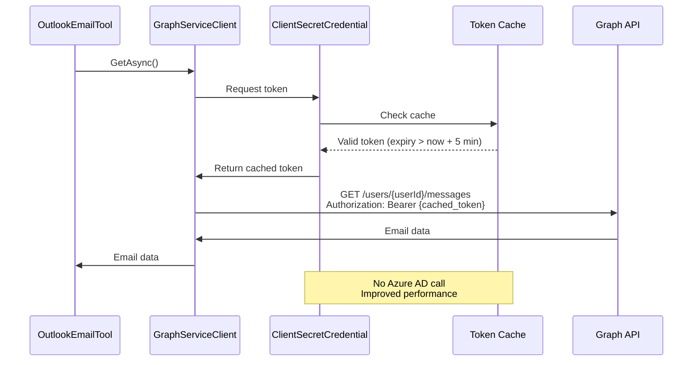
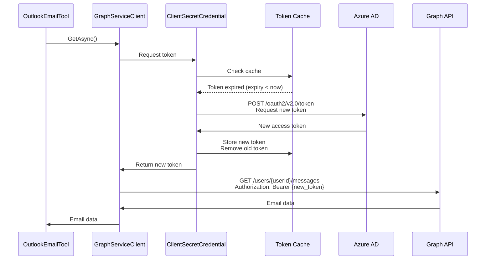

# Authentication Flow - Application-only Authentication Deep Dive

[](../../developer/03-AUTHENTICATION-FLOW.md)
[](03-AUTHENTICATION-FLOW.md)

## 📋 Table of Contents

- [Overview](#overview)
- [Authentication Architecture](#authentication-architecture)
- [TokenCredential Implementation](#tokencredential-implementation)
- [Program.cs Code Walkthrough](#programcs-code-walkthrough)
- [Authentication Flow Details](#authentication-flow-details)
- [Token Lifecycle](#token-lifecycle)
- [Error Handling](#error-handling)
- [Best Practices](#best-practices)

---

## Overview

Sales Support Agent uses **Application-only authentication** (application permissions) to access Microsoft Graph API.

### What is Application-only Authentication

| Auth Type | Description | Use Case |
|-----------|-------------|----------|
| **Delegated** | Access on behalf of a user | Apps where users sign in |
| **Application-only** | Access with app's own permissions | Background services, Bots |

**Why Sales Support Agent Chose This**:
- ✅ Can operate 24/7 without user interaction
- ✅ Consistent access to multiple users' data
- ✅ Operates non-interactively as a Teams bot
- ✅ Scalable (not dependent on number of users)

### Authentication Method Comparison



---

## Authentication Architecture

### Overall Flow



---

## TokenCredential Implementation

### 1. ClientSecretCredential (Development Environment)

**Implementation in Program.cs**:

```csharp
builder.Services.AddSingleton<TokenCredential>(sp =>
{
    var logger = sp.GetRequiredService<ILogger<Program>>();
    
    if (!m365Settings.IsConfigured)
    {
        logger.LogWarning("⚠️ Microsoft 365 が設定されていません。Graph API 機能は無効です。");
        // Return dummy implementation (allows startup without credentials)
        return new ClientSecretCredential("dummy-tenant", "dummy-client", "dummy-secret");
    }

    if (m365Settings.UseManagedIdentity)
    {
        // Use Managed Identity (described later)
    }
    else
    {
        logger.LogInformation("🔐 ClientSecretCredential を使用して Graph API に接続します");
        return new ClientSecretCredential(
            m365Settings.TenantId,
            m365Settings.ClientId,
            m365Settings.ClientSecret,
            new ClientSecretCredentialOptions
            {
                AuthorityHost = AzureAuthorityHosts.AzurePublicCloud,
                Retry =
                {
                    MaxRetries = 3,
                    Delay = TimeSpan.FromSeconds(2),
                    NetworkTimeout = TimeSpan.FromSeconds(30)
                }
            });
    }
});
```

**Element Descriptions**:

| Element | Description |
|---------|-------------|
| **TenantId** | Azure AD tenant ID (organization identifier) |
| **ClientId** | App registration client ID |
| **ClientSecret** | Client secret (password) |
| **AuthorityHost** | Authentication endpoint (AzurePublicCloud = https://login.microsoftonline.com) |
| **Retry.MaxRetries** | Retry count on network errors |
| **Retry.Delay** | Retry interval (exponential backoff) |
| **NetworkTimeout** | HTTP connection timeout |

**Configuration File (appsettings.json)**:

```json
{
  "M365": {
    "TenantId": "your-tenant-id",
    "ClientId": "your-client-id",
    "ClientSecret": "your-client-secret",
    "UserId": "user@company.com",
    "UseManagedIdentity": false,
    "Scopes": [
      "https://graph.microsoft.com/.default"
    ]
  }
}
```

**Scope Specification**:
- Application-only authentication uses the `.default` scope
- Actual permissions are set in the Azure AD app registration (e.g., `Mail.Read`, `Calendars.Read`)

### 2. DefaultAzureCredential (Production - Managed Identity)

**Implementation in Program.cs**:

```csharp
if (m365Settings.UseManagedIdentity)
{
    logger.LogInformation("🔐 Managed Identity を使用して Graph API に接続します");
    return new DefaultAzureCredential(new DefaultAzureCredentialOptions
    {
        ManagedIdentityClientId = m365Settings.ClientId,
        ExcludeVisualStudioCredential = true,
        ExcludeVisualStudioCodeCredential = true,
        ExcludeAzurePowerShellCredential = true,
        Retry =
        {
            MaxRetries = 3,
            Delay = TimeSpan.FromSeconds(2),
            NetworkTimeout = TimeSpan.FromSeconds(30)
        }
    });
}
```

**DefaultAzureCredential Authentication Chain**:



**Configuration for Managed Identity**:

```json
{
  "M365": {
    "TenantId": "your-tenant-id",
    "ClientId": "managed-identity-client-id",
    "UseManagedIdentity": true,
    "UserId": "user@company.com",
    "Scopes": [
      "https://graph.microsoft.com/.default"
    ]
  }
}
```

**Enabling in Production (Azure App Service)**:

```bash
# System Assigned Managed Identity
az webapp identity assign \
  --name <app-name> \
  --resource-group <resource-group>

# User Assigned Managed Identity
az webapp identity assign \
  --name <app-name> \
  --resource-group <resource-group> \
  --identities /subscriptions/<sub-id>/resourceGroups/<rg>/providers/Microsoft.ManagedIdentity/userAssignedIdentities/<identity-name>
```

**Managed Identity Benefits**:
- ✅ No secret management required (Azure AD auto-manages)
- ✅ No secret rotation needed
- ✅ No Key Vault required (no credentials embedded in code)
- ✅ Enhanced security (zero credential leak risk)

---

## Program.cs Code Walkthrough

### Step 1: Loading Configuration

```csharp
// ========================================
// Loading Configuration
// ========================================
builder.Services.Configure<LLMSettings>(builder.Configuration.GetSection("LLM"));
builder.Services.Configure<M365Settings>(builder.Configuration.GetSection("M365"));
builder.Services.Configure<BotSettings>(builder.Configuration.GetSection("Bot"));

var m365Settings = builder.Configuration.GetSection("M365").Get<M365Settings>() ?? new M365Settings();
```

**Settings Class (Configuration/M365Settings.cs)**:

```csharp
public class M365Settings
{
    public string TenantId { get; set; } = string.Empty;
    public string ClientId { get; set; } = string.Empty;
    public string ClientSecret { get; set; } = string.Empty;
    public string UserId { get; set; } = string.Empty;
    public bool UseManagedIdentity { get; set; } = false;
    public string[] Scopes { get; set; } = new[] { "https://graph.microsoft.com/.default" };

    public bool IsConfigured =>
        !string.IsNullOrWhiteSpace(TenantId) &&
        !string.IsNullOrWhiteSpace(ClientId) &&
        (UseManagedIdentity || !string.IsNullOrWhiteSpace(ClientSecret));
}
```

### Step 2: Registering TokenCredential

```csharp
// Create TokenCredential (Managed Identity or ClientSecretCredential)
builder.Services.AddSingleton<TokenCredential>(sp =>
{
    var logger = sp.GetRequiredService<ILogger<Program>>();
    
    if (!m365Settings.IsConfigured)
    {
        logger.LogWarning("⚠️ Microsoft 365 が設定されていません。Graph API 機能は無効です。");
        return new ClientSecretCredential("dummy-tenant", "dummy-client", "dummy-secret");
    }

    if (m365Settings.UseManagedIdentity)
    {
        logger.LogInformation("🔐 Managed Identity を使用して Graph API に接続します");
        return new DefaultAzureCredential(/* options */);
    }
    else
    {
        logger.LogInformation("🔐 ClientSecretCredential を使用して Graph API に接続します");
        return new ClientSecretCredential(
            m365Settings.TenantId,
            m365Settings.ClientId,
            m365Settings.ClientSecret,
            new ClientSecretCredentialOptions { /* options */ }
        );
    }
});
```

**Singleton Registration in DI Container**:
- `AddSingleton`: Shares a single instance across the entire application
- Token cache functions efficiently (improved memory efficiency)
- Thread-safe (has internal locking mechanism)

### Step 3: Registering GraphServiceClient

```csharp
// Register GraphServiceClient as singleton (token cache optimization)
builder.Services.AddSingleton<GraphServiceClient>(sp =>
{
    var credential = sp.GetRequiredService<TokenCredential>();
    var logger = sp.GetRequiredService<ILogger<Program>>();
    
    logger.LogInformation("📊 GraphServiceClient を初期化しています...");
    
    return new GraphServiceClient(credential, m365Settings.Scopes);
});
```

**GraphServiceClient Responsibilities**:
- Building HTTP requests to Graph API endpoints
- Automatic token acquisition and refresh using `TokenCredential`
- Response deserialization
- Error handling (`ServiceException`)

### Step 4: Usage in Tool Classes

```csharp
// Register MCP tools (Agent365 pattern)
builder.Services.AddSingleton<OutlookEmailTool>();
builder.Services.AddSingleton<OutlookCalendarTool>();
builder.Services.AddSingleton<SharePointTool>();
```

**DI Injection Example in Tool Class (OutlookEmailTool.cs)**:

```csharp
public class OutlookEmailTool
{
    private readonly GraphServiceClient _graphClient;
    private readonly M365Settings _m365Settings;
    private readonly ILogger<OutlookEmailTool> _logger;

    public OutlookEmailTool(
        GraphServiceClient graphClient,
        M365Settings m365Settings,
        ILogger<OutlookEmailTool> logger)
    {
        _graphClient = graphClient;
        _m365Settings = m365Settings;
        _logger = logger;
    }

    public async Task<string> SearchSalesEmails(
        string startDate,
        string endDate,
        string keywords)
    {
        // GraphServiceClient internally uses TokenCredential
        var messages = await _graphClient.Users[_m365Settings.UserId].Messages
            .GetAsync(config => { /* query configuration */ });
        
        return JsonSerializer.Serialize(messages?.Value);
    }
}
```

---

## Authentication Flow Details

### Initial Token Acquisition Flow



### Token Cache Hit Flow



### Token Refresh Flow



---

## Token Lifecycle

### Token Expiration

```
Token acquisition time: 2026-02-08 10:00:00 UTC
Validity: 3599 seconds (approx. 1 hour)
Expiration time: 2026-02-08 11:00:00 UTC

10:00:00 ━━━━━━━━━━━━━━━━━━━━━━━━━━━━━━━━━━━━━━━━━━━━━━━ 11:00:00
   ↑                                                      ↑
Acquired                                              Expired
   
   ┃←────────── Valid Period (3599 sec) ──────────→┃
   ┃                                               ┃
   ┃←── Cache Hit ──→┃←── Refresh ──→┃
   0 min             55 min        60 min
```

### Token Cache Strategy

**ClientSecretCredential Internal Implementation** (conceptual diagram):

```csharp
public class ClientSecretCredential : TokenCredential
{
    private AccessToken? _cachedToken;
    private readonly SemaphoreSlim _lock = new SemaphoreSlim(1, 1);
    
    public override async ValueTask<AccessToken> GetTokenAsync(
        TokenRequestContext requestContext,
        CancellationToken cancellationToken)
    {
        await _lock.WaitAsync(cancellationToken);
        try
        {
            // Cache check (with 5-minute buffer)
            if (_cachedToken.HasValue && 
                _cachedToken.Value.ExpiresOn > DateTimeOffset.UtcNow.AddMinutes(5))
            {
                return _cachedToken.Value;
            }
            
            // Acquire token from Azure AD
            var newToken = await AcquireTokenFromAzureADAsync(requestContext, cancellationToken);
            _cachedToken = newToken;
            return newToken;
        }
        finally
        {
            _lock.Release();
        }
    }
}
```

**Key Points**:
- **5-minute buffer**: Refresh starts 5 minutes before expiration
- **Thread-safe**: `SemaphoreSlim` controls concurrent requests
- **Auto-refresh**: No explicit refresh needed in application code

---

## Error Handling

### Types of Authentication Errors

| Error Code | Cause | Resolution |
|------------|-------|------------|
| **401 Unauthorized** | Invalid/expired token | Resolved by auto-refresh (normally does not occur) |
| **403 Forbidden** | Insufficient permissions | Add permissions in Azure AD app registration → Admin consent |
| **AADSTS7000215** | Invalid Client Secret | Generate a new Secret in Azure Portal |
| **AADSTS700016** | Invalid Client ID | Verify Client ID in Azure AD app registration |
| **AADSTS90002** | Invalid Tenant ID | Verify Azure AD tenant ID |

### Retry Policy Implementation

**Retry Configuration in Program.cs**:

```csharp
new ClientSecretCredentialOptions
{
    Retry =
    {
        MaxRetries = 3,
        Delay = TimeSpan.FromSeconds(2),
        NetworkTimeout = TimeSpan.FromSeconds(30)
    }
}
```

**Retry Behavior**:

```
1st attempt
   ↓ Failure (network error)
   ↓ Wait 2 seconds
2nd attempt
   ↓ Failure
   ↓ Wait 4 seconds (exponential backoff)
3rd attempt
   ↓ Failure
   ↓ Wait 8 seconds
4th attempt (final)
   ↓ Failure → Throw exception
```

### Custom Error Handling Example

```csharp
public async Task<string> SearchEmailsWithRetry(string query)
{
    const int maxRetries = 3;
    for (int attempt = 1; attempt <= maxRetries; attempt++)
    {
        try
        {
            var messages = await _graphClient.Users[_userId].Messages
                .GetAsync(config => config.QueryParameters.Search = query);
            
            return JsonSerializer.Serialize(messages?.Value);
        }
        catch (ServiceException ex) when (ex.ResponseStatusCode == 401)
        {
            _logger.LogWarning("認証エラー（試行 {Attempt}/{Max}）: {Message}", 
                attempt, maxRetries, ex.Message);
            
            if (attempt == maxRetries)
                throw;
            
            await Task.Delay(TimeSpan.FromSeconds(Math.Pow(2, attempt)));
        }
        catch (ServiceException ex) when (ex.ResponseStatusCode == 403)
        {
            _logger.LogError("権限不足: {Message}。Azure ADで権限を確認してください。", ex.Message);
            throw;
        }
        catch (ServiceException ex) when (ex.ResponseStatusCode == 429)
        {
            var retryAfter = ex.ResponseHeaders?.RetryAfter?.Delta ?? TimeSpan.FromSeconds(60);
            _logger.LogWarning("レート制限（試行 {Attempt}/{Max}）: {Seconds}秒後に再試行", 
                attempt, maxRetries, retryAfter.TotalSeconds);
            
            if (attempt == maxRetries)
                throw;
            
            await Task.Delay(retryAfter);
        }
    }
    
    throw new InvalidOperationException("予期しないエラー");
}
```

---

## Best Practices

### ✅ DO

#### 1. Register TokenCredential as Singleton

```csharp
builder.Services.AddSingleton<TokenCredential>(/* implementation */);
builder.Services.AddSingleton<GraphServiceClient>(/* implementation */);
```

**Reasons**:
- Token cache functions efficiently
- Reuses TokenCredential's internal HTTP client
- Reduced memory usage

#### 2. Implement Configuration Validation

```csharp
public bool IsConfigured =>
    !string.IsNullOrWhiteSpace(TenantId) &&
    !string.IsNullOrWhiteSpace(ClientId) &&
    (UseManagedIdentity || !string.IsNullOrWhiteSpace(ClientSecret));
```

**Startup Check**:

```csharp
if (!m365Settings.IsConfigured)
{
    logger.LogWarning("⚠️ Microsoft 365 が設定されていません。Graph API 機能は無効です。");
    return new ClientSecretCredential("dummy-tenant", "dummy-client", "dummy-secret");
}
```

#### 3. Use Managed Identity in Production

```json
{
  "M365": {
    "UseManagedIdentity": true,
    "ClientId": "managed-identity-client-id"
  }
}
```

#### 4. Configure Retry Policy

```csharp
Retry = {
    MaxRetries = 3,
    Delay = TimeSpan.FromSeconds(2),
    NetworkTimeout = TimeSpan.FromSeconds(30)
}
```

#### 5. Log Troubleshooting Information

```csharp
logger.LogInformation("🔐 ClientSecretCredential を使用して Graph API に接続します");
logger.LogInformation("📊 GraphServiceClient を初期化しています...");
```

### ❌ DON'T

#### 1. Don't Create TokenCredential on Every Call

```csharp
// BAD - Acquires new token every time (performance degradation)
public async Task<string> SearchEmails()
{
    var credential = new ClientSecretCredential(tenantId, clientId, clientSecret);
    var graphClient = new GraphServiceClient(credential);
    // ...
}
```

#### 2. Don't Hardcode Client Secrets in Code

```csharp
// BAD - Hardcoded
var credential = new ClientSecretCredential(
    "tenant-id",
    "client-id",
    "hardcoded-secret" // Security violation
);
```

**Correct Approaches**:
- appsettings.json (Development environment)
- Azure Key Vault (Production environment)
- Environment variables
- Managed Identity (most recommended)

#### 3. Don't Confuse Delegated Auth with Application-only Auth

```csharp
// BAD - Using Delegated auth scopes with Application-only auth
var scopes = new[] { "User.Read", "Mail.Read" };
// Application-only uses ".default"
```

**Correct Scopes**:

```csharp
// Application-only authentication
var scopes = new[] { "https://graph.microsoft.com/.default" };
// Actual permissions are set in Azure AD app registration
```

#### 4. Don't Ignore Errors

```csharp
// BAD - Swallowing exceptions
try
{
    var messages = await _graphClient.Users[userId].Messages.GetAsync();
}
catch
{
    // Error ignored - makes troubleshooting impossible
}
```

---

## Debugging and Troubleshooting

### Verifying Authentication Status

**Test Endpoint (Program.cs)**:

```csharp
app.MapGet("/api/test/graph/profile", async (GraphServiceClient graphClient, M365Settings m365Settings) =>
{
    try
    {
        var user = await graphClient.Users[m365Settings.UserId].GetAsync();
        return Results.Ok(new { 
            Success = true,
            DisplayName = user?.DisplayName,
            Email = user?.Mail ?? user?.UserPrincipalName,
            Id = user?.Id
        });
    }
    catch (Exception ex)
    {
        return Results.Problem($"Graph API エラー: {ex.Message}");
    }
});
```

**Example Results**:

```bash
# On success
curl http://localhost:5000/api/test/graph/profile
{
  "success": true,
  "displayName": "田中 太郎",
  "email": "tanaka@company.com",
  "id": "abc123..."
}

# On failure (authentication error)
{
  "success": false,
  "error": "Graph API エラー: Unauthorized - 401"
}
```

### Log Output Example

```
info: Program[0]
      ========================================
info: Program[0]
      営業支援エージェント起動
info: Program[0]
      LLM Provider: AzureOpenAI
info: Program[0]
      🔐 ClientSecretCredential を使用して Graph API に接続します
info: Program[0]
      📊 GraphServiceClient を初期化しています...
info: Program[0]
      M365 設定: ✅ 有効
info: Program[0]
      ========================================
```

---

## Summary

### Application-only Authentication Implementation Checklist

- ✅ Azure AD app registration complete (Application permissions configured)
- ✅ Authentication info configured in appsettings.json (TenantId, ClientId, ClientSecret)
- ✅ TokenCredential registered as singleton
- ✅ GraphServiceClient registered as singleton
- ✅ Retry policy configured
- ✅ Error handling implemented
- ✅ Logging implemented
- ✅ Connectivity verified via test endpoint
- ✅ Managed Identity used in production

### Next Steps

Now that you understand the authentication flow, learn about data flow and Graph API call patterns in the following documents:

- **[04-DATA-FLOW.md](04-DATA-FLOW.md)**: Data Flow and Graph API Calls
- **[06-SDK-INTEGRATION-PATTERNS.md](06-SDK-INTEGRATION-PATTERNS.md)**: SDK Integration Patterns
- **[11-SECURITY-BEST-PRACTICES.md](11-SECURITY-BEST-PRACTICES.md)**: Security Best Practices
