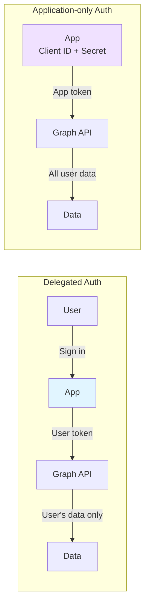

# Authentication Flow - Application-only Authentication Deep Dive

[](../../developer/03-AUTHENTICATION-FLOW.md)
[](03-AUTHENTICATION-FLOW.md)

## 📋 Table of Contents

- [Overview](#overview)
- [Authentication Architecture](#authentication-architecture)
- [TokenCredential Implementation](#tokencredential-implementation)
- [Program.cs Code Walkthrough](#programcs-code-walkthrough)
- [Authentication Flow Details](#authentication-flow-details)
- [Token Lifecycle](#token-lifecycle)
- [Error Handling](#error-handling)
- [Best Practices](#best-practices)

---

## Overview

Sales Support Agent uses **Application-only authentication** (application permissions) to access Microsoft Graph API.

### What is Application-only Authentication

| Auth Type | Description | Use Case |
|-----------|-------------|----------|
| **Delegated** | Access as user's representative | Apps where users sign in |
| **Application-only** | Access with app's own permissions | Background services, Bots |

**Sales Support Agent's Reasons for Selection**:
- ✅ Can operate 24/7 without user interaction
- ✅ Consistent access to multiple users' data
- ✅ Operates non-interactively as Teams bot
- ✅ Scalable (not dependent on number of users)

### Authentication Flow Comparison



---

## Authentication Architecture

### Overall Flow


---

## TokenCredential Implementation

### 1. ClientSecretCredential (Development Environment)

**Implementation in Program.cs**:

```csharp
builder.Services.AddSingleton<TokenCredential>(sp =>
{
    var logger = sp.GetRequiredService<ILogger<Program>>();
    
    if (!m365Settings.IsConfigured)
    {
        logger.LogWarning("⚠️ Microsoft 365 is not configured. Graph API features are disabled.");
        // Return dummy implementation (can still start without credentials)
        return new ClientSecretCredential("dummy-tenant", "dummy-client", "dummy-secret");
    }

    if (m365Settings.UseManagedIdentity)
    {
        // Use Managed Identity (described later)
    }
    else
    {
        logger.LogInformation("🔐 Connecting to Graph API using ClientSecretCredential");
        return new ClientSecretCredential(
            m365Settings.TenantId,
            m365Settings.ClientId,
            m365Settings.ClientSecret,
            new ClientSecretCredentialOptions
            {
                AuthorityHost = AzureAuthorityHosts.AzurePublicCloud,
                Retry =
                {
                    MaxRetries = 3,
                    Delay = TimeSpan.FromSeconds(2),
                    NetworkTimeout = TimeSpan.FromSeconds(30)
                }
            });
    }
});
```

**Element Descriptions**:

| Element | Description |
|---------|-------------|
| **TenantId** | Azure AD tenant ID (organization identifier) |
| **ClientId** | App registration client ID |
| **ClientSecret** | Client secret (password) |
| **AuthorityHost** | Authentication endpoint (AzurePublicCloud = https://login.microsoftonline.com) |
| **Retry.MaxRetries** | Retry count on network errors |
| **Retry.Delay** | Retry interval (exponential backoff) |
| **NetworkTimeout** | HTTP connection timeout |

**Configuration File (appsettings.json)**:

```json
{
  "M365": {
    "TenantId": "your-tenant-id",
    "ClientId": "your-client-id",
    "ClientSecret": "your-client-secret",
    "UserId": "user@company.com",
    "UseManagedIdentity": false,
    "Scopes": [
      "https://graph.microsoft.com/.default"
    ]
  }
}
```

### 2. DefaultAzureCredential (Production - Managed Identity)

**Managed Identity Benefits**:
- ✅ No secret management required (Azure AD auto-manages)
- ✅ No secret rotation needed
- ✅ No Key Vault required (no credentials in code)
- ✅ Enhanced security (zero credential leak risk)

**Production Enablement (Azure App Service)**:

```bash
# System Assigned Managed Identity
az webapp identity assign \
  --name <app-name> \
  --resource-group <resource-group>

# User Assigned Managed Identity
az webapp identity assign \
  --name <app-name> \
  --resource-group <resource-group> \
  --identities /subscriptions/<sub-id>/resourceGroups/<rg>/providers/Microsoft.ManagedIdentity/userAssignedIdentities/<identity-name>
```

---

## Best Practices

### ✅ DO

```csharp
// 1. Use Managed Identity in production
builder.Services.AddSingleton<TokenCredential>(sp =>
{
    return m365Settings.UseManagedIdentity
        ? new DefaultAzureCredential()
        : new ClientSecretCredential(/* ... */);
});

// 2. Implement proper retry logic
var retryPolicy = Policy
    .Handle<ServiceException>(ex => ex.ResponseStatusCode == 429)
    .WaitAndRetryAsync(3, retryAttempt => TimeSpan.FromSeconds(Math.Pow(2, retryAttempt)));

// 3. Log authentication status
logger.LogInformation("🔐 Using {AuthType} for Graph API", 
    useManagedIdentity ? "Managed Identity" : "ClientSecret");
```

### ❌ DON'T

```csharp
// 1. Hard-code credentials
var credential = new ClientSecretCredential(
    "12345678-1234-1234-1234-123456789012",  // BAD
    "abcd1234-...",                           // BAD
    "my-secret-password"                      // BAD - SECURITY RISK
);

// 2. No timeout configuration
var credential = new ClientSecretCredential(tenant, client, secret);
// Missing NetworkTimeout - can hang indefinitely

// 3. Ignore authentication errors
var graphClient = new GraphServiceClient(credential);
// No try-catch for authentication failures
```

---

For complete authentication flow diagrams, token lifecycle management, error handling strategies, and advanced scenarios, please refer to the Japanese version at [../developer/03-AUTHENTICATION-FLOW.md](../../developer/03-AUTHENTICATION-FLOW.md).
