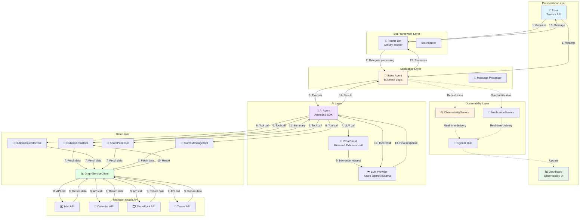
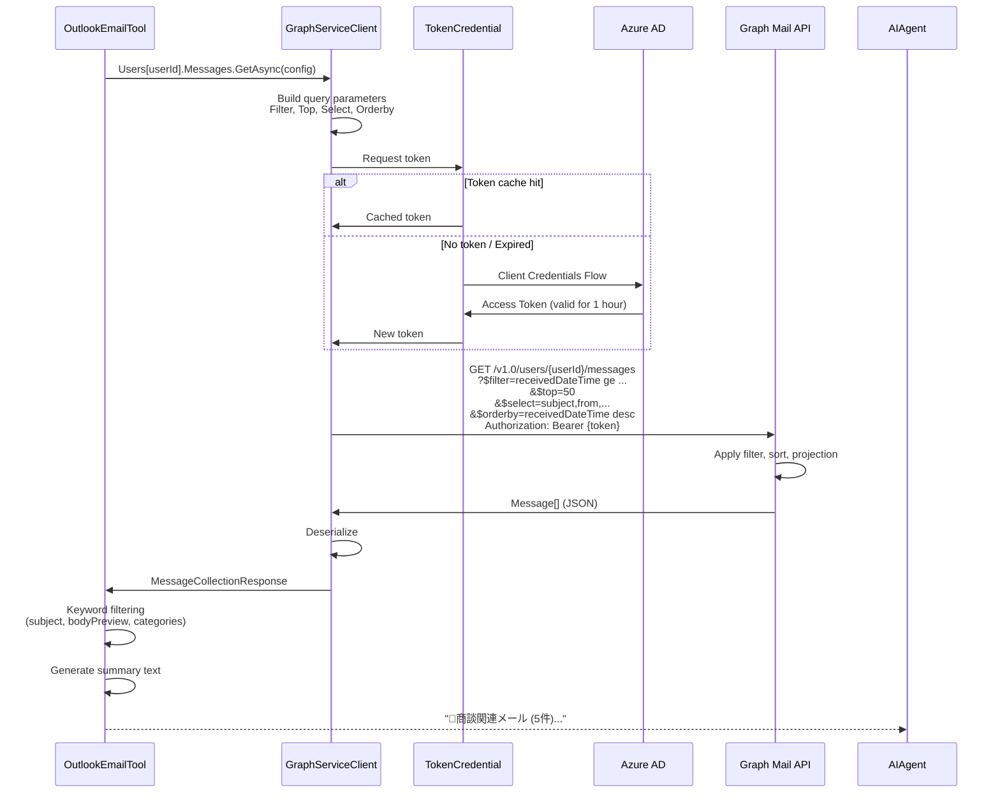
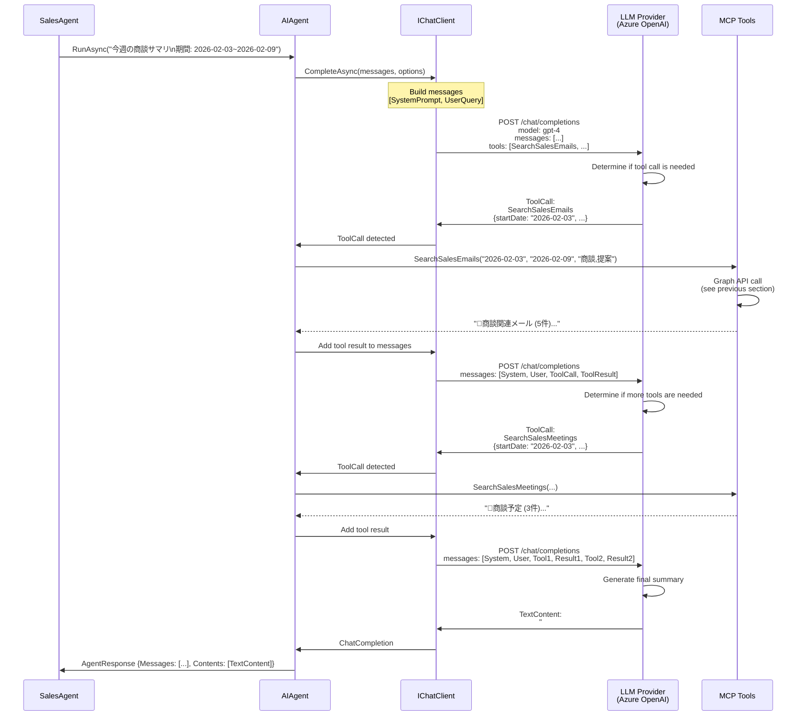
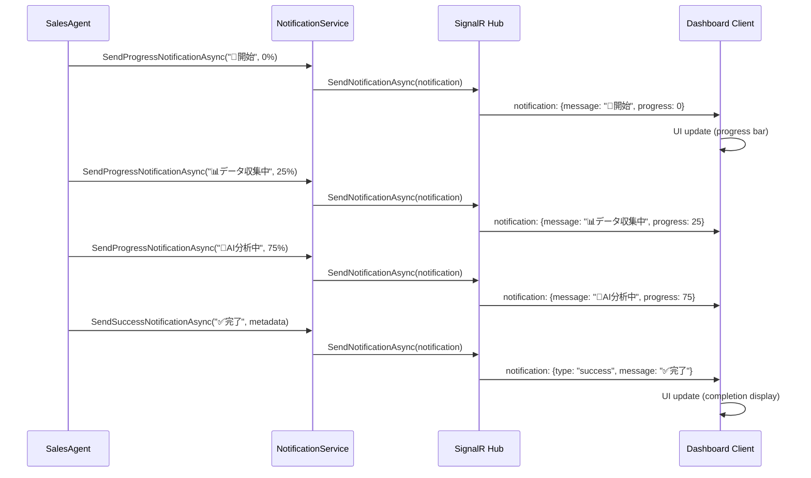
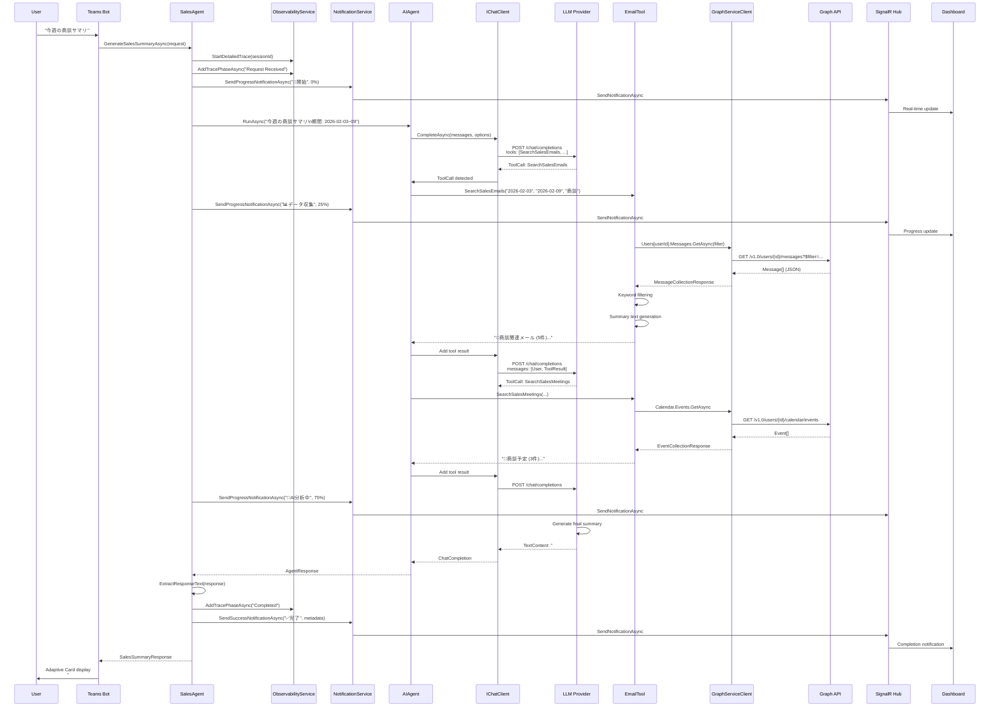
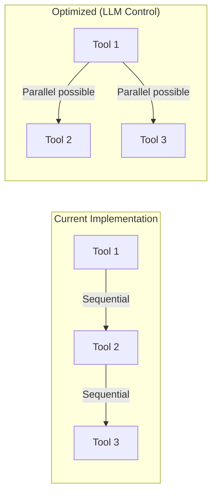

# Data Flow - Graph API → LLM → Response Detailed Guide

[](../../developer/04-DATA-FLOW.md)
[](04-DATA-FLOW.md)

## 📋 Table of Contents

- [Overview](#overview)
- [End-to-End Data Flow](#end-to-end-data-flow)
- [Phase 1: Receiving User Requests](#phase-1-receiving-user-requests)
- [Phase 2: Graph API Data Collection](#phase-2-graph-api-data-collection)
- [Phase 3: LLM Inference and Response Generation](#phase-3-llm-inference-and-response-generation)
- [Phase 4: Response Delivery and Real-Time Notifications](#phase-4-response-delivery-and-real-time-notifications)
- [Detailed Sequence Diagram](#detailed-sequence-diagram)
- [Code Walkthrough](#code-walkthrough)
- [Performance Optimization](#performance-optimization)

---

## Overview

The Sales Support Agent data flow consists of the following four phases:

```
User Request → Graph API Data Collection → LLM Inference → Response Delivery
     ↓                    ↓                      ↓                  ↓
  Teams Bot          MCP Tools              AI Agent          SignalR Hub
                   (Email/Calendar)    (Microsoft.Extensions.AI)  (Dashboard)
```

---

## End-to-End Data Flow

### Overall Architecture



---

## Phase 1: Receiving User Requests

### 1.1 Teams Bot Entry Point

**Bot/TeamsBot.cs**:

```csharp
protected override async Task OnMessageActivityAsync(
    ITurnContext<IMessageActivity> turnContext,
    CancellationToken cancellationToken)
{
    var userMessage = turnContext.Activity.Text;
    
    // Delegate processing to Sales Agent
    var request = new SalesSummaryRequest
    {
        Query = userMessage,
       StartDate = DateTime.Now.AddDays(-7),
        EndDate = DateTime.Now
    };
    
    var response = await _salesAgent.GenerateSalesSummaryAsync(request);
    
    // Return response to user
    await turnContext.SendActivityAsync(
        MessageFactory.Text(response.Response),
        cancellationToken);
}
```

### 1.2 API Endpoint (Direct Call)

**Program.cs**:

```csharp
app.MapPost("/api/sales-summary", async (
    SalesSummaryRequest request,
    SalesAgent salesAgent) =>
{
    return await AgentMetrics.InvokeObservedHttpOperation("agent.sales_summary", async () =>
    {
        var response = await salesAgent.GenerateSalesSummaryAsync(request);
        return Results.Ok(response);
    });
});
```

**Request Example**:

```bash
curl -X POST http://localhost:5000/api/sales-summary \
  -H "Content-Type: application/json" \
  -d '{
    "query": "今週の商談サマリを教えてください",
    "startDate": "2026-02-03",
    "endDate": "2026-02-09"
  }'
```

---

## Phase 2: Graph API Data Collection

### 2.1 Sales Agent Execution Start

**Services/Agent/SalesAgent.cs - GenerateSalesSummaryAsync**:

```csharp
public async Task<SalesSummaryResponse> GenerateSalesSummaryAsync(SalesSummaryRequest request)
{
    var stopwatch = Stopwatch.StartNew();
    var operationId = Guid.NewGuid().ToString();
    
    // Start detailed trace session
    var sessionId = _observabilityService.StartDetailedTrace(
        conversationId: operationId,
        userId: "API-User",
        userQuery: request.Query
    );

    try
    {
        // Phase 1: Request received
        await _observabilityService.AddTracePhaseAsync(
            sessionId,
            "Request Received",
            "商談サマリ生成リクエストを受信しました",
            new { Query = request.Query, StartDate = request.StartDate, EndDate = request.EndDate }
        );
        
        // Notification: Start notification
        await _notificationService.SendProgressNotificationAsync(
            operationId, 
            "🚀 商談サマリ生成を開始しています...", 
            0);
        
        // Set default date range
        var startDate = request.StartDate ?? GetMondayOfCurrentWeek();
        var endDate = request.EndDate ?? GetSundayOfCurrentWeek();

        // Add date range to query
        var enhancedQuery = $"{request.Query}\n\n期間: {startDate:yyyy-MM-dd} ~ {endDate:yyyy-MM-dd}";
        
        // Phase 2: Query preparation
        await _observabilityService.AddTracePhaseAsync(
            sessionId,
            "Query Preparation",
            "日付範囲を含むクエリを準備しました",
            new { EnhancedQuery = enhancedQuery, StartDate = startDate, EndDate = endDate }
        );
        
        // Agent execution (detailed in next section)
        var agentResponse = await _agent.RunAsync(enhancedQuery);
        // ...
    }
    catch (Exception ex)
    {
        // Error handling (described later)
    }
}
```

### 2.2 AI Agent Tool Calling

**Agent Configuration (CreateAgent Method)**:

```csharp
private AIAgent CreateAgent()
{
    var chatClient = _llmProvider.GetChatClient();

    // Register tools
    var tools = new List<AITool>
    {
        AIFunctionFactory.Create(_emailTool.SearchSalesEmails),
        AIFunctionFactory.Create(_calendarTool.SearchSalesMeetings),
        AIFunctionFactory.Create(_sharePointTool.SearchSalesDocuments),
        AIFunctionFactory.Create(_teamsTool.SearchSalesMessages)
    };

    return chatClient.AsAIAgent(
        SystemPrompt,  // Sales support agent system prompt
        "営業支援エージェント",
        tools: tools
    );
}
```

**System Prompt (Important)**:

```csharp
private const string SystemPrompt = @"あなたは営業支援エージェントです。
以下のツールを使用して、Microsoft 365 から商談関連情報を収集し、わかりやすくサマリを作成します。

【利用可能なツール】
1. SearchSalesEmails - Outlook メールから商談関連メールを検索
2. SearchSalesMeetings - Outlook カレンダーから商談予定を検索
3. SearchSalesDocuments - SharePoint から提案書・見積書などを検索
4. SearchSalesMessages - Teams チャネルから商談関連メッセージを検索

【重要な指示】
- ユーザーからの質問に基づいて、適切なツールを選択して情報を収集してください
- 複数のツールを組み合わせて、包括的な商談サマリを作成してください
- 日本語で丁寧に回答してください

【出力フォーマット】
## 📊 サマリー
- 全体概要

## 📧 商談メール
- 重要なメール

## 📅 商談予定
- 今後の予定

## 📁 関連ドキュメント
- 提案書、見積書

## 💡 推奨アクション
- 次のアクション";
```

### 2.3 Graph API Data Retrieval via MCP Tools

#### OutlookEmailTool Implementation

**Services/MCP/McpTools/OutlookEmailTool.cs**:

```csharp
public class OutlookEmailTool
{
    private readonly GraphServiceClient _graphClient;
    private readonly string _userId;

    [Description("商談関連のメールを検索して取得します")]
    public async Task<string> SearchSalesEmails(
        [Description("検索開始日 (yyyy-MM-dd)")] string startDate,
        [Description("検索終了日 (yyyy-MM-dd)")] string endDate,
        [Description("検索キーワード（例: 商談,提案,見積）")] string keywords = "商談,提案,見積,契約")
    {
        try
        {
            var start = DateTime.Parse(startDate);
            var end = DateTime.Parse(endDate).AddDays(1); // Include end date

            // Access specific user's mailbox using Agent Identity
            var messages = await _graphClient.Users[_userId].Messages
                .GetAsync(config =>
                {
                    config.QueryParameters.Filter = 
                        $"receivedDateTime ge {start:yyyy-MM-ddTHH:mm:ssZ} " +
                        $"and receivedDateTime le {end:yyyy-MM-ddTHH:mm:ssZ}";
                    config.QueryParameters.Top = 50;
                    config.QueryParameters.Select = new[] 
                    { 
                        "subject", "from", "receivedDateTime", 
                        "bodyPreview", "hasAttachments", "categories" 
                    };
                    config.QueryParameters.Orderby = new[] { "receivedDateTime desc" };
                });

            if (messages?.Value == null || messages.Value.Count == 0)
            {
                return $"📧 期間 {startDate} ~ {endDate} の商談関連メールは見つかりませんでした。";
            }

            // Filter by keywords
            var keywordList = keywords.Split(',').Select(k => k.Trim()).ToList();
            var filteredMessages = messages.Value
                .Where(m => keywordList.Any(k => 
                    m.Subject?.Contains(k, StringComparison.OrdinalIgnoreCase) == true ||
                    m.BodyPreview?.Contains(k, StringComparison.OrdinalIgnoreCase) == true ||
                    m.Categories?.Any(c => c.Contains(k, StringComparison.OrdinalIgnoreCase)) == true))
                .ToList();

            // Generate summary
            var summary = $"📧 **商談関連メール ({filteredMessages.Count}件)**\n\n";
            foreach (var msg in filteredMessages.Take(10))
            {
                summary += $"- **{msg.Subject}**\n";
                summary += $"  送信者: {msg.From?.EmailAddress?.Name ?? "不明"}\n";
                summary += $"  受信日時: {msg.ReceivedDateTime:yyyy/MM/dd HH:mm}\n";
                summary += $"  添付ファイル: {(msg.HasAttachments == true ? "あり" : "なし")}\n";
                summary += $"  概要: {msg.BodyPreview?.Substring(0, Math.Min(100, msg.BodyPreview.Length))}...\n\n";
            }

            return summary;
        }
        catch (Exception ex)
        {
            return $"❌ メール取得エラー: {ex.Message}";
        }
    }
}
```

**Graph API Call Internal Flow**:



#### OutlookCalendarTool Implementation

**Same pattern**:

```csharp
public async Task<string> SearchSalesMeetings(
    string startDate,
    string endDate,
    string keywords = "商談,提案,ミーティング")
{
    var events = await _graphClient.Users[_userId].Calendar.Events
        .GetAsync(config =>
        {
            config.QueryParameters.Filter = 
                $"start/dateTime ge '{start:yyyy-MM-ddTHH:mm:ss}' " +
                $"and end/dateTime le '{end:yyyy-MM-ddTHH:mm:ss}'";
            config.QueryParameters.Select = new[] 
            { 
                "subject", "start", "end", "attendees", "location", "bodyPreview" 
            };
            config.QueryParameters.Orderby = new[] { "start/dateTime" };
        });
    
    // Filtering and summary generation (same pattern as email)
}
```

---

## Phase 3: LLM Inference and Response Generation

### 3.1 AI Agent Execution Flow



### 3.2 LLM Tool Calling Details

**IChatClient Options Configuration**:

```csharp
var options = new ChatOptions
{
    Temperature = 0.7f,
    MaxTokens = 2000,
    Tools = new List<AITool>
    {
        AIFunctionFactory.Create(_emailTool.SearchSalesEmails),
        AIFunctionFactory.Create(_calendarTool.SearchSalesMeetings),
        // ...
    }
};
```

**Automatic Schema Generation by AIFunctionFactory**:

```csharp
// Method definition
[Description("商談関連のメールを検索して取得します")]
public async Task<string> SearchSalesEmails(
    [Description("検索開始日 (yyyy-MM-dd)")] string startDate,
    [Description("検索終了日 (yyyy-MM-dd)")] string endDate,
    [Description("検索キーワード（例: 商談,提案,見積）")] string keywords = "商談,提案,見積,契約")

// ↓ Automatically generated by AIFunctionFactory.Create ↓

{
  "type": "function",
  "function": {
    "name": "SearchSalesEmails",
    "description": "商談関連のメールを検索して取得します",
    "parameters": {
      "type": "object",
      "properties": {
        "startDate": {
          "type": "string",
          "description": "検索開始日 (yyyy-MM-dd)"
        },
        "endDate": {
          "type": "string",
          "description": "検索終了日 (yyyy-MM-dd)"
        },
        "keywords": {
          "type": "string",
          "description": "検索キーワード（例: 商談,提案,見積）",
          "default": "商談,提案,見積,契約"
        }
      },
      "required": ["startDate", "endDate"]
    }
  }
}
```

### 3.3 Response Text Extraction

**SalesAgent.cs - ExtractResponseText Method**:

```csharp
private string ExtractResponseText(object agentResponse)
{
    try
    {
        dynamic response = agentResponse;
        
        // Agent 365 SDK response structure
        if (agentResponse.GetType().GetProperty("Messages") != null)
        {
            var messages = response.Messages as IEnumerable<object>;
            if (messages != null && messages.Any())
            {
                var lastMessage = messages.LastOrDefault();
                if (lastMessage != null)
                {
                    dynamic message = lastMessage;
                    
                    // Check Contents property
                    if (lastMessage.GetType().GetProperty("Contents") != null)
                    {
                        var contents = message.Contents as IEnumerable<object>;
                        if (contents != null)
                        {
                            var textContents = contents
                                .Where(c => c.GetType().Name.Contains("TextContent"))
                                .ToList();
                            
                            if (textContents.Any())
                            {
                                var texts = textContents.Select(tc => 
                                {
                                    dynamic textContent = tc;
                                    return textContent.Text as string ?? "";
                                }).Where(t => !string.IsNullOrWhiteSpace(t));
                                
                                return string.Join("\n\n", texts).Trim();
                            }
                        }
                    }
                }
            }
        }

        return "応答がありませんでした。";
    }
    catch (Exception ex)
    {
        _logger.LogError(ex, "応答テキスト抽出エラー");
        return $"応答の処理中にエラーが発生しました: {ex.Message}";
    }
}
```

---

## Phase 4: Response Delivery and Real-Time Notifications

### 4.1 Observability Trace Recording

```csharp
// Phase 5: Completion
await _observabilityService.AddTracePhaseAsync(
    sessionId,
    "Summary Generation Completed",
    "商談サマリの生成が完了しました",
    new 
    { 
        TotalDurationMs = stopwatch.ElapsedMilliseconds,
        DataSources = dataSources,
        ResponseLength = responseText?.Length ?? 0
    }
);
```

### 4.2 SignalR Real-Time Notifications

```csharp
// Notification: Completion notification (including data source information)
await _notificationService.SendSuccessNotificationAsync(
    operationId, 
    $"✅ 商談サマリ生成完了！（処理時間: {stopwatch.ElapsedMilliseconds:N0}ms）",
    new 
    { 
        ProcessingTimeMs = stopwatch.ElapsedMilliseconds, 
        DataSourceCount = dataSources.Count,
        DataSources = string.Join(", ", dataSources),
        ResponseLength = responseText?.Length ?? 0
    }
);
```

**SignalR Hub Delivery Flow**:



### 4.3 Final Response Return

```csharp
return new SalesSummaryResponse
{
    Response = responseText ?? "応答がありませんでした。",
    DataSources = dataSources,  // ["Outlook", "Calendar", "SharePoint"]
    ProcessingTimeMs = stopwatch.ElapsedMilliseconds,
    LLMProvider = _llmProvider.ProviderName  // "AzureOpenAI"
};
```

---

## Detailed Sequence Diagram

### Complete End-to-End Sequence



---

## Code Walkthrough

### Typical Execution Trace

```
[00:00.000] ℹ️ Sales summary generation started: 今週の商談サマリを教えてください
[00:00.050] 📝 Detailed trace session started: session-abc123
[00:00.100] 📊 Phase: Request Received
[00:00.150] 📢 Notification sent: 🚀 商談サマリ生成を開始しています... (0%)
[00:00.200] 📝 Query expansion: 今週の商談サマリ\n期間: 2026-02-03 ~ 2026-02-09

[00:00.300] 📊 Phase: Query Preparation
[00:00.350] 🤖 AI Agent execution started
[00:00.400] 📊 Phase: AI Agent Execution Started

[00:00.500] 🔧 LLM: Tool call - SearchSalesEmails
[00:00.550] 📢 Notification sent: 📊 データ収集中（メール、カレンダー）... (25%)
[00:00.600] 🔐 TokenCredential: Using cached token
[00:00.650] 📊 Graph API: GET /users/{id}/messages?$filter=...
[00:01.200] ✅ Graph API: Retrieved 50 messages
[00:01.250] 🔍 Keyword filtering: 5 matches
[00:01.300] 📧 Summary generated: Sales-related emails (5 items)

[00:01.400] 🔧 LLM: Tool call - SearchSalesMeetings
[00:01.450] 📊 Graph API: GET /users/{id}/calendar/events?$filter=...
[00:01.900] ✅ Graph API: Retrieved 10 events
[00:01.950] 🔍 Keyword filtering: 3 matches
[00:02.000] 📅 Summary generated: Sales meetings (3 items)

[00:02.100] 📢 Notification sent: 🤖 AI分析中（サマリ生成処理）... (75%)
[00:02.200] 🤖 LLM: Final summary generation started
[00:03.500] ✅ LLM: Summary generation completed (1200 characters)

[00:03.600] 📊 Phase: AI Response Received (3000ms)
[00:03.650] 📝 Response text extraction completed
[00:03.700] 📊 Phase: Summary Generation Completed
[00:03.750] 📢 Notification sent: ✅ 商談サマリ生成完了！（処理時間: 3750ms）
[00:03.800] ✅ Sales summary generation completed (total: 3800ms)
```

### Data Transformation at Each Phase

| Phase | Input | Processing | Output |
|-------|-------|------------|--------|
| 1. Request | User text message | Parse query, set date range | SalesSummaryRequest |
| 2. Data Collection | Date range + keywords | Graph API call, keyword filtering | Summary text per tool |
| 3. LLM Inference | System prompt + tool results | Multi-turn tool calling | Final summary text |
| 4. Response | Summary text | Trace recording, notification | SalesSummaryResponse |

---

## Performance Optimization

### Data Collection Optimization



### Key Optimization Points

| Item | Current | Optimization |
|------|---------|-------------|
| Graph API Calls | Top=50 per tool | Reduce Top, add Select for projection |
| Token Caching | SDK standard caching | Token pre-acquisition and caching |
| LLM Calls | Multiple round-trips per tool | Batch tool calling |
| Response Size | Full body text | bodyPreview only (reducing token count) |
| Timeout | No setting | Set timeout per tool call |

### Recommended Improvements

1. **Graph API Query Optimization**: Use `$select` to retrieve only required fields
2. **Parallel Execution**: Execute independent tool calls in parallel when possible via the LLM
3. **Response Caching**: Cache frequently executed queries for a certain period
4. **Streaming Response**: Send partial results using SignalR streaming
5. **Token Management**: Pre-acquire tokens and implement smart caching

---

> **Next**: [Dependency Injection](05-DEPENDENCY-INJECTION.md) - Learn how DI container configuration works
