# Data Flow - Graph API → LLM → Response Details

[](../../developer/04-DATA-FLOW.md)
[](04-DATA-FLOW.md)

## 📋 Table of Contents

- [Overview](#overview)
- [End-to-End Data Flow](#end-to-end-data-flow)
- [Phase 1: User Request Reception](#phase-1-user-request-reception)
- [Phase 2: Graph API Data Collection](#phase-2-graph-api-data-collection)
- [Phase 3: LLM Inference and Response Generation](#phase-3-llm-inference-and-response-generation)
- [Phase 4: Response Delivery and Real-time Notifications](#phase-4-response-delivery-and-real-time-notifications)

---

## Overview

Sales Support Agent's data flow consists of 4 phases:

```
User Request → Graph API Data Collection → LLM Inference → Response Delivery
     ↓                    ↓                      ↓                  ↓
  Teams Bot          MCP Tools              AI Agent          SignalR Hub
                   (Email/Calendar)    (Microsoft.Extensions.AI)  (Dashboard)
```

---

## End-to-End Data Flow

### Overall Architecture

```mermaid
graph TB
    subgraph "Presentation Layer"
        User[👤 User<br/>Teams / API]
        Dashboard[📊 Dashboard<br/>Observability UI]
    end
    
    subgraph "Application Layer"
        SalesAgent[💼 Sales Agent<br/>Business Logic]
        AIAgent[🧠 AI Agent<br/>Agent365 SDK]
    end
    
    subgraph "Data Layer"
        EmailTool[📧 OutlookEmailTool]
        CalendarTool[📅 OutlookCalendarTool]
        SharePointTool[📁 SharePointTool]
        GraphClient[📊 GraphServiceClient]
    end
    
    subgraph "Microsoft Graph API"
        Mail[✉️ Mail API]
        Calendar[📆 Calendar API]
        SharePoint[🗂️ SharePoint API]
    end
    
    User -->|1. Request| SalesAgent
    SalesAgent -->|2. Execute| AIAgent
    AIAgent -->|3. Tool call| EmailTool
    EmailTool -->|4. Data fetch| GraphClient
    GraphClient -->|5. API call| Mail
    Mail -->|6. Response| GraphClient
    GraphClient -->|7. Results| EmailTool
    EmailTool -->|8. Summary| AIAgent
    AIAgent -->|9. Final response| SalesAgent
    SalesAgent -->|10. Message| User
    
    style User fill:#e1f5ff
    style SalesAgent fill:#fff4e1
    style AIAgent fill:#f0e1ff
    style GraphClient fill:#e1ffe1
```



---

## Phase 1: User Request Reception

### Teams Bot Entry Point

**Bot/TeamsBot.cs**:

```csharp
protected override async Task OnMessageActivityAsync(
    ITurnContext<IMessageActivity> turnContext,
    CancellationToken cancellationToken)
{
    var userMessage = turnContext.Activity.Text;
    
    // Delegate to Sales Agent
    var request = new SalesSummaryRequest
    {
        Query = userMessage,
        StartDate = DateTime.Now.AddDays(-7),
        EndDate = DateTime.Now
    };
    
    var response = await _salesAgent.GenerateSalesSummaryAsync(request);
    
    // Return response to user
    await turnContext.SendActivityAsync(
        MessageFactory.Text(response.Response),
        cancellationToken);
}
```

### API Endpoint (Direct Call)

**Program.cs**:

```csharp
app.MapPost("/api/sales-summary", async (
    SalesSummaryRequest request,
    SalesAgent salesAgent) =>
{
    var response = await salesAgent.GenerateSalesSummaryAsync(request);
    return Results.Ok(response);
});
```

---

## Phase 2: Graph API Data Collection

### Sales Agent Execution

**Services/Agent/SalesAgent.cs**:

```csharp
public async Task<SalesSummaryResponse> GenerateSalesSummaryAsync(SalesSummaryRequest request)
{
    var stopwatch = Stopwatch.StartNew();
    var operationId = Guid.NewGuid().ToString();
    
    // Start tracing
    var sessionId = _observabilityService.StartDetailedTrace(
        conversationId: operationId,
        userId: "API-User",
        userQuery: request.Query
    );

    // Send start notification
    await _notificationService.SendProgressNotificationAsync(
        operationId, 
        "🚀 Starting sales summary generation...", 
        0);
    
    // Execute AI Agent
    var agentResponse = await _agent.RunAsync(enhancedQuery);
    
    return new SalesSummaryResponse
    {
        Response = agentResponse.Text,
        ProcessingTimeMs = stopwatch.ElapsedMilliseconds
    };
}
```

### AI Agent Tool Invocation

**Agent Configuration**:

```csharp
private AIAgent CreateAgent()
{
    var chatClient = _llmProvider.GetChatClient();

    var tools = new List<AITool>
    {
        AIFunctionFactory.Create(_emailTool.SearchSalesEmails),
        AIFunctionFactory.Create(_calendarTool.SearchSalesMeetings),
        AIFunctionFactory.Create(_sharePointTool.SearchSalesDocuments)
    };

    return chatClient.AsAIAgent(
        SystemPrompt,
        "Sales Support Agent",
        tools: tools
    );
}
```

---

## Phase 3: LLM Inference

### LLM Request Flow


---

## Phase 4: Response Delivery

### Notification Flow

```csharp
// Progress tracking
await _notificationService.SendProgressNotificationAsync(operationId, "📊 Collecting data...", 25);
await _notificationService.SendProgressNotificationAsync(operationId, "🤖 AI analyzing...", 75);
await _notificationService.SendSuccessNotificationAsync(operationId, "✅ Complete!", 100);
```

### Real-time Dashboard Update

**SignalR Hub**:

```csharp
await _hubContext.Clients.All.SendAsync("NotificationUpdate", notification);
await _hubContext.Clients.All.SendAsync("TraceUpdate", traceEvent);
await _hubContext.Clients.All.SendAsync("MetricsUpdate", metrics);
```

---

For complete detailed diagrams, code walkthroughs, performance optimization strategies, and advanced data flow scenarios, please refer to the Japanese version at [../developer/04-DATA-FLOW.md](../../developer/04-DATA-FLOW.md).
