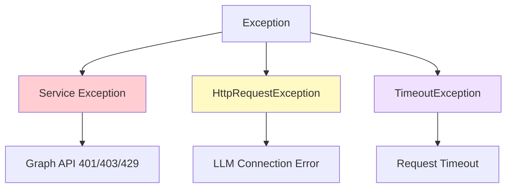

# Error Handling - Exception Management and Resilience

[](../../developer/07-ERROR-HANDLING.md)
[](07-ERROR-HANDLING.md)

## 📋 Key Topics

- [Error Handling Strategy](#error-handling-strategy)
- [Graph API Error Handling](#graph-api-error-handling)
- [LLM Error Handling](#llm-error-handling)
- [Retry Policies](#retry-policies)
- [Error Logging](#error-logging)

---

## Error Handling Strategy

### Exception Hierarchy



---

## Graph API Error Handling

### Pattern: Catch and Transform

```csharp
public async Task<string> SearchSalesEmails(string startDate, string endDate)
{
    try
    {
        var messages = await _graphClient.Users[_userId].Messages.GetAsync(/* config */);
        return FormatResults(messages);
    }
    catch (ServiceException ex) when (ex.ResponseStatusCode == 401)
    {
        _logger.LogError(ex, "Authentication failed for Graph API");
        return "❌ Authentication error - please check credentials";
    }
    catch (ServiceException ex) when (ex.ResponseStatusCode == 403)
    {
        _logger.LogError(ex, "Insufficient permissions for Graph API");
        return "❌ Permission denied - check API permissions";
    }
    catch (ServiceException ex) when (ex.ResponseStatusCode == 429)
    {
        _logger.LogWarning(ex, "Rate limit exceeded");
        return "❌ Rate limit - please try again later";
    }
    catch (ServiceException ex)
    {
        _logger.LogError(ex, "Graph API error: {Code}", ex.ResponseStatusCode);
        return $"❌ Error: {ex.Message}";
    }
}
```

---

## LLM Error Handling

### Pattern: Timeout and Retry

```csharp
public async Task<AgentResponse> RunAsync(string query)
{
    var retryPolicy = Policy
        .Handle<HttpRequestException>()
        .Or<TimeoutException>()
        .WaitAndRetryAsync(
            retryCount: 3,
            sleepDurationProvider: retryAttempt => TimeSpan.FromSeconds(Math.Pow(2, retryAttempt)),
            onRetry: (exception, timeSpan, retryCount, context) =>
            {
                _logger.LogWarning("LLM retry {RetryCount}: {Exception}", retryCount, exception.Message);
            });

    return await retryPolicy.ExecuteAsync(async () =>
    {
        using var cts = new CancellationTokenSource(TimeSpan.FromSeconds(60));
        return await _agent.RunAsync(query, cancellationToken: cts.Token);
    });
}
```

---

## Retry Policies

### Exponential Backoff

```csharp
// Polly retry policy
var retryPolicy = Policy
    .Handle<HttpRequestException>()
    .WaitAndRetryAsync(
        retryCount: 3,
        sleepDurationProvider: attempt => TimeSpan.FromSeconds(Math.Pow(2, attempt)),
        onRetry: (exception, timeSpan, attempt, context) =>
        {
            _logger.LogWarning("Retry {Attempt} after {Delay}ms", attempt, timeSpan.TotalMilliseconds);
        });
```

**Retry Timeline**:
```
Attempt 1: Fail → Wait 2s
Attempt 2: Fail → Wait 4s
Attempt 3: Fail → Wait 8s
Attempt 4: Give up
```

---

## Error Logging

### Structured Logging

```csharp
public async Task<string> SearchSalesEmails(...)
{
    using var activity = _activitySource.StartActivity("SearchSalesEmails");
    
    try
    {
        _logger.LogInformation("Searching emails: {StartDate} to {EndDate}", startDate, endDate);
        var result = await _graphClient.Users[_userId].Messages.GetAsync();
        return result;
    }
    catch (ServiceException ex)
    {
        activity?.SetStatus(ActivityStatusCode.Error, ex.Message);
        activity?.SetTag("error.type", ex.GetType().Name);
        activity?.SetTag("error.code", ex.ResponseStatusCode);
        
        _logger.LogError(ex, 
            "Graph API error - Code: {Code}, Message: {Message}", 
            ex.ResponseStatusCode, 
            ex.Message);
        
        throw;
    }
}
```

---

For complete error handling strategies, custom exception types, global exception filters, and production error monitoring patterns, please refer to the Japanese version at [../developer/07-ERROR-HANDLING.md](../../developer/07-ERROR-HANDLING.md).
