# Conversation Flow Walkthrough

[](../../../developer/13-CODE-WALKTHROUGHS/CONVERSATION-FLOW.md)
[](CONVERSATION-FLOW.md)

## 📋 Overview

This document provides a detailed walkthrough of the complete conversation flow from user message to bot response.

---

## Flow Diagram

```mermaid
sequenceDiagram
    participant User as 👤 User (Teams)
    participant Bot as 🤖 TeamsBot
    participant Agent as 💼 SalesAgent
    participant AI as 🧠 AIAgent
    participant Tools as 🔧 MCP Tools
    participant Graph as 📊 Graph API
    participant LLM as ☁️ LLM Provider
    
    User->>Bot: "Show this week's sales status"
    Bot->>Agent: GenerateSalesSummaryAsync(request)
    Agent->>AI: RunAsync(query)
    AI->>LLM: CompleteAsync(messages)
    LLM->>AI: ToolCall: SearchSalesEmails
    AI->>Tools: SearchSalesEmails(startDate, endDate)
    Tools->>Graph: Users[userId].Messages.GetAsync()
    Graph->>Tools: Email data
    Tools->>AI: Formatted email summary
    AI->>LLM: CompleteAsync(messages + tool result)
    LLM->>AI: Final response
    AI->>Agent: AgentResponse
    Agent->>Bot: SalesSummaryResponse
    Bot->>User: Adaptive Card response
```



---

## Step-by-Step Code Walkthrough

### Step 1: User Sends Message in Teams

User sends message: **"Show this week's sales status"**

### Step 2: TeamsBot Receives Message

**Bot/TeamsBot.cs - OnMessageActivityAsync**:

```csharp
protected override async Task OnMessageActivityAsync(
    ITurnContext<IMessageActivity> turnContext,
    CancellationToken cancellationToken)
{
    var userMessage = turnContext.Activity.Text;  // "Show this week's sales status"
    
    var request = new SalesSummaryRequest
    {
        Query = userMessage,
        StartDate = DateTime.Now.AddDays(-7),
        EndDate = DateTime.Now
    };
    
    var response = await _salesAgent.GenerateSalesSummaryAsync(request);
    
    await turnContext.SendActivityAsync(
        MessageFactory.Text(response.Response),
        cancellationToken);
}
```

### Step 3: SalesAgent Processes Request

**Services/Agent/SalesAgent.cs - GenerateSalesSummaryAsync**:

```csharp
public async Task<SalesSummaryResponse> GenerateSalesSummaryAsync(SalesSummaryRequest request)
{
    var stopwatch = Stopwatch.StartNew();
    var operationId = Guid.NewGuid().ToString();
    
    // Start observability tracking
    var sessionId = _observabilityService.StartDetailedTrace(
        conversationId: operationId,
        userId: "API-User",
        userQuery: request.Query
    );
    
    // Send start notification
    await _notificationService.SendProgressNotificationAsync(
        operationId, 
        "🚀 Starting sales summary generation...", 
        0);
    
    // Execute AI Agent
    var agentResponse = await _agent.RunAsync(request.Query);
    
    stopwatch.Stop();
    
    // Return response
    return new SalesSummaryResponse
    {
        Response = agentResponse.Text,
        ProcessingTimeMs = stopwatch.ElapsedMilliseconds
    };
}
```

### Step 4: AIAgent Executes with Tool Calling

**Agent executes LLM**:

```csharp
var agentResponse = await _agent.RunAsync("Show this week's sales status...");
```

**LLM analyzes query and decides to call tools**:

```json
{
  "tool_calls": [
    {
      "function": "SearchSalesEmails",
      "arguments": {
        "startDate": "2026-02-03",
        "endDate": "2026-02-10",
        "keywords": "sales,deal,proposal"
      }
    },
    {
      "function": "SearchSalesMeetings",
      "arguments": {
        "startDate": "2026-02-03",
        "endDate": "2026-02-10"
      }
    }
  ]
}
```

### Step 5: MCP Tools Execute

**OutlookEmailTool.SearchSalesEmails**:

```csharp
public async Task<string> SearchSalesEmails(string startDate, string endDate, string keywords)
{
    var messages = await _graphClient.Users[_userId].Messages.GetAsync(config =>
    {
        config.QueryParameters.Filter = $"receivedDateTime ge {startDate} and receivedDateTime le {endDate}";
        config.QueryParameters.Top = 50;
        config.QueryParameters.Select = new[] { "subject", "from", "receivedDateTime" };
    });
    
    return FormatEmailResults(messages, keywords);
}
```

### Step 6: Graph API Returns Data

**Email data returned**:

```json
{
  "value": [
    {
      "subject": "Sales proposal for ABC Corp",
      "from": {"emailAddress": {"address": "sales@company.com"}},
      "receivedDateTime": "2026-02-05T10:30:00Z"
    },
    {
      "subject": "Q1 sales targets",
      "from": {"emailAddress": {"address": "manager@company.com"}},
      "receivedDateTime": "2026-02-04T14:00:00Z"
    }
  ]
}
```

### Step 7: Tool Results Returned to LLM

**Formatted tool results**:

```
📧 **Sales Emails (2 found)**
- Sales proposal for ABC Corp (2026-02-05)
- Q1 sales targets (2026-02-04)

📅 **Sales Meetings (1 found)**
- ABC Corp demo (2026-02-06, 14:00-15:00)
```

### Step 8: LLM Generates Final Response

**LLM combines tool results into final response**:

```markdown
## 📊 Sales Summary (Feb 3-10, 2026)

### 📧 Email Activity
- 2 sales-related emails
- Key: Sales proposal for ABC Corp (in progress)

### 📅 Scheduled Meetings
- 1 sales meeting this week
- ABC Corp demo on Feb 6

### 💡 Insights
- Active deal pipeline with ABC Corp
- Q1 targets discussion ongoing
```

### Step 9: Response Sent to User

**TeamsBot sends Adaptive Card**:

```csharp
var adaptiveCard = AdaptiveCardHelper.CreateSalesSummaryCard(agentResponse.Text);
await turnContext.SendActivityAsync(MessageFactory.Attachment(adaptiveCard));
```

---

## Performance Metrics

| Phase | Time | Details |
|-------|------|---------|
| User → Bot | 10ms | Teams message routing |
| Bot → Agent | 50ms | Request processing |
| Agent → AI | 100ms | Agent initialization |
| AI → Tools | 500ms | Graph API calls |
| Tools → LLM | 5000ms | LLM inference |
| LLM → User | 100ms | Response formatting |
| **Total** | **5760ms** | **~6 seconds** |

---

For more detailed conversation flow analysis, error scenarios, and optimization strategies, please refer to the Japanese version at [../developer/13-CODE-WALKTHROUGHS/CONVERSATION-FLOW.md](../../../developer/13-CODE-WALKTHROUGHS/CONVERSATION-FLOW.md).
