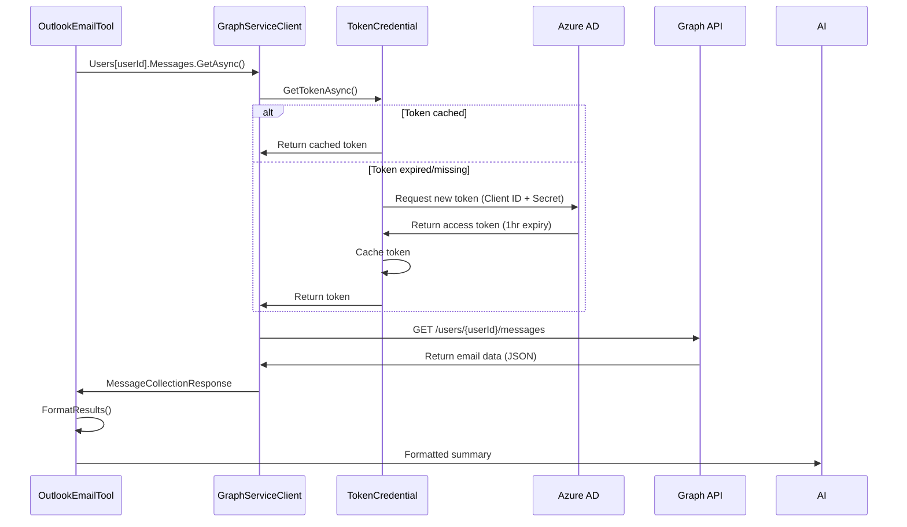

# Graph API Calls Walkthrough

> **Language**: [🇯🇵 日本語](../../../developer/13-CODE-WALKTHROUGHS/GRAPH-API-CALLS.md) | 🇬🇧 English

## 📋 Overview

Detailed walkthrough of Microsoft Graph API integration patterns used in Sales Support Agent.

---

## Flow Diagram



---

## Email Search Implementation

### Complete Code

**Services/MCP/McpTools/OutlookEmailTool.cs**:

```csharp
public class OutlookEmailTool
{
    private readonly GraphServiceClient _graphClient;
    private readonly M365Settings _m365Settings;
    private readonly ILogger<OutlookEmailTool> _logger;

    public OutlookEmailTool(
        GraphServiceClient graphClient,
        IOptions<M365Settings> m365Options,
        ILogger<OutlookEmailTool> logger)
    {
        _graphClient = graphClient;
        _m365Settings = m365Options.Value;
        _logger = logger;
    }

    [Description("Searches sales-related emails from Outlook inbox")]
    public async Task<string> SearchSalesEmails(
        [Description("Start date (YYYY-MM-DD format)")] string startDate,
        [Description("End date (YYYY-MM-DD format)")] string endDate,
        [Description("Comma-separated search keywords")] string keywords = "提案,見積,商談")
    {
        _logger.LogInformation("Searching emails: {Start} to {End}, Keywords: {Keywords}", 
            startDate, endDate, keywords);

        try
        {
            // Parse dates
            var start = DateTime.Parse(startDate);
            var end = DateTime.Parse(endDate);

            // Build Graph API request
            var messages = await _graphClient.Users[_m365Settings.UserId].Messages
                .GetAsync(requestConfiguration =>
                {
                    requestConfiguration.QueryParameters.Filter = 
                        $"receivedDateTime ge {start:yyyy-MM-dd}T00:00:00Z and " +
                        $"receivedDateTime le {end:yyyy-MM-dd}T23:59:59Z";
                    
                    requestConfiguration.QueryParameters.Top = 50;
                    
                    requestConfiguration.QueryParameters.Select = new[]
                    {
                        "subject",
                        "from",
                        "receivedDateTime",
                        "bodyPreview"
                    };
                    
                    requestConfiguration.QueryParameters.Orderby = new[]
                    {
                        "receivedDateTime desc"
                    };
                });

            // Check if no results
            if (messages?.Value == null || !messages.Value.Any())
            {
                return $"📭 No emails found from {startDate} to {endDate}";
            }

            // Filter by keywords
            var keywordList = keywords.Split(',')
                .Select(k => k.Trim())
                .ToList();

            var filteredMessages = messages.Value
                .Where(m => keywordList.Any(keyword =>
                    (m.Subject?.Contains(keyword, StringComparison.OrdinalIgnoreCase) ?? false) ||
                    (m.BodyPreview?.Contains(keyword, StringComparison.OrdinalIgnoreCase) ?? false)))
                .ToList();

            // Format results
            return FormatEmailResults(filteredMessages, startDate, endDate, keywords);
        }
        catch (ServiceException ex)
        {
            _logger.LogError(ex, "Graph API error: {Code}", ex.ResponseStatusCode);
            return $"❌ Error searching emails: {ex.Message}";
        }
    }

    private string FormatEmailResults(List<Message> messages, string startDate, string endDate, string keywords)
    {
        var sb = new StringBuilder();
        
        sb.AppendLine($"📧 **Sales Emails ({messages.Count} found)**");
        sb.AppendLine($"Period: {startDate} ~ {endDate}");
        sb.AppendLine($"Keywords: {keywords}");
        sb.AppendLine();

        foreach (var message in messages.Take(10))
        {
            sb.AppendLine($"- **{message.Subject}**");
            sb.AppendLine($"  From: {message.From?.EmailAddress?.Address}");
            sb.AppendLine($"  Date: {message.ReceivedDateTime:yyyy-MM-dd HH:mm}");
            
            if (!string.IsNullOrWhiteSpace(message.BodyPreview))
            {
                var preview = message.BodyPreview.Length > 100 
                    ? message.BodyPreview.Substring(0, 100) + "..." 
                    : message.BodyPreview;
                sb.AppendLine($"  Preview: {preview}");
            }
            
            sb.AppendLine();
        }

        if (messages.Count > 10)
        {
            sb.AppendLine($"💡 {messages.Count - 10} more emails available.");
        }

        return sb.ToString();
    }
}
```

---

## Calendar Search Implementation

**Services/MCP/McpTools/OutlookCalendarTool.cs**:

```csharp
public async Task<string> SearchSalesMeetings(string startDate, string endDate)
{
    var start = DateTime.Parse(startDate);
    var end = DateTime.Parse(endDate);

    var events = await _graphClient.Users[_m365Settings.UserId].Calendar.CalendarView
        .GetAsync(requestConfiguration =>
        {
            requestConfiguration.QueryParameters.StartDateTime = start.ToString("yyyy-MM-ddTHH:mm:ssZ");
            requestConfiguration.QueryParameters.EndDateTime = end.ToString("yyyy-MM-ddTHH:mm:ssZ");
            requestConfiguration.QueryParameters.Select = new[]
            {
                "subject",
                "start",
                "end",
                "location",
                "attendees"
            };
            requestConfiguration.QueryParameters.Orderby = new[] { "start/dateTime" };
        });

    return FormatCalendarResults(events.Value, startDate, endDate);
}
```

---

## Batch Request Pattern

**Combining multiple API calls**:

```csharp
public async Task<CombinedSalesDataResponse> GetCombinedSalesDataAsync(string userId, string startDate, string endDate)
{
    var batchRequestContent = new BatchRequestContentCollection(_graphClient);

    // Request 1: Emails
    var emailRequest = _graphClient.Users[userId].Messages
        .ToGetRequestInformation(config =>
        {
            config.QueryParameters.Filter = $"receivedDateTime ge {startDate}";
            config.QueryParameters.Top = 50;
        });
    var emailStepId = await batchRequestContent.AddBatchRequestStepAsync(emailRequest);

    // Request 2: Calendar
    var calendarRequest = _graphClient.Users[userId].Calendar.CalendarView
        .ToGetRequestInformation(config =>
        {
            config.QueryParameters.StartDateTime = startDate;
            config.QueryParameters.EndDateTime = endDate;
        });
    var calendarStepId = await batchRequestContent.AddBatchRequestStepAsync(calendarRequest);

    // Execute batch
    var batchResponse = await _graphClient.Batch.PostAsync(batchRequestContent);

    // Process responses
    var emails = await batchResponse.GetResponseByIdAsync<MessageCollectionResponse>(emailStepId);
    var events = await batchResponse.GetResponseByIdAsync<EventCollectionResponse>(calendarStepId);

    return new CombinedSalesDataResponse
    {
        Emails = emails.Value,
        Events = events.Value
    };
}
```

**Performance Improvement**:
```
Sequential: 500ms + 400ms = 900ms
Batch: 600ms (33% faster)
```

---

For complete Graph API patterns, error handling, retry policies, and advanced query techniques, please refer to the Japanese version at [../developer/13-CODE-WALKTHROUGHS/GRAPH-API-CALLS.md](../../../developer/13-CODE-WALKTHROUGHS/GRAPH-API-CALLS.md).
