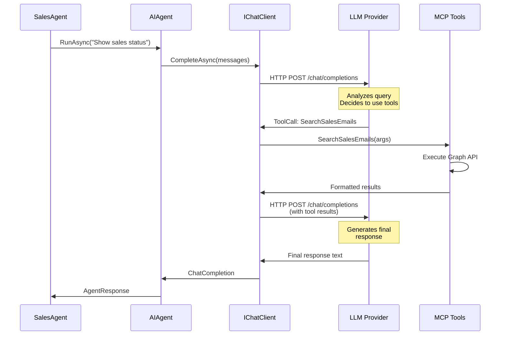

# LLM Inference Walkthrough

[](../../../developer/13-CODE-WALKTHROUGHS/LLM-INFERENCE.md)
[](LLM-INFERENCE.md)

## 📋 Overview

Detailed walkthrough of LLM inference flow using Microsoft.Extensions.AI and Agent 365 SDK.

---

## Flow Diagram



---

## IChatClient Builder Pattern

### Creating Chat Client with Middleware

**Services/LLM/GitHubModelsProvider.cs**:

```csharp
public class GitHubModelsProvider : ILLMProvider
{
    private readonly IChatClient _chatClient;

    public GitHubModelsProvider(GitHubModelsSettings settings)
    {
        _chatClient = new ChatClientBuilder()
            // 1. Base client
            .Use(new OpenAIChatClient(
                new ApiKeyCredential(settings.ApiKey),
                settings.ModelId,
                new OpenAIClientOptions
                {
                    Endpoint = new Uri(settings.Endpoint)
                }))
            
            // 2. OpenTelemetry middleware
            .UseOpenTelemetry(
                sourceName: "SalesSupportAgent",
                configure: options =>
                {
                    options.EnableSensitiveData = false;
                    options.JsonSerializerOptions = new JsonSerializerOptions
                    {
                        WriteIndented = false
                    };
                })
            
            // 3. Logging middleware
            .UseLogging(
                loggerFactory: LoggerFactory.Create(builder =>
                {
                    builder.AddConsole();
                    builder.SetMinimumLevel(LogLevel.Information);
                }))
            
            // 4. Function invocation middleware
            .UseFunctionInvocation()
            
            // 5. Build final client
            .Build();
    }

    public IChatClient GetChatClient() => _chatClient;
}
```

### Middleware Execution Order

```
User Request
    ↓
[Logging Middleware] - Logs request
    ↓
[OpenTelemetry Middleware] - Starts span
    ↓
[Function Invocation Middleware] - Handles tool calls
    ↓
[Base Client] - Sends to LLM
    ↓
LLM Provider (Azure OpenAI / Ollama)
    ↓
[Base Client] - Receives response
    ↓
[Function Invocation Middleware] - Executes tools if needed
    ↓
[OpenTelemetry Middleware] - Ends span
    ↓
[Logging Middleware] - Logs response
    ↓
Final Response
```

---

## AIAgent with Tools

### Agent Creation

**Services/Agent/SalesAgent.cs**:

```csharp
private AIAgent CreateAgent()
{
    var chatClient = _llmProvider.GetChatClient();

    // Define tools
    var tools = new List<AITool>
    {
        AIFunctionFactory.Create(_emailTool.SearchSalesEmails),
        AIFunctionFactory.Create(_calendarTool.SearchSalesMeetings),
        AIFunctionFactory.Create(_sharePointTool.SearchSalesDocuments),
        AIFunctionFactory.Create(_teamsTool.SearchSalesMessages)
    };

    // Create agent with system prompt and tools
    return chatClient.AsAIAgent(
        systemPrompt: SystemPrompt,
        name: "Sales Support Agent",
        tools: tools
    );
}

private const string SystemPrompt = @"
You are a sales support agent with access to Microsoft 365 data.

Available tools:
1. SearchSalesEmails - Search Outlook emails
2. SearchSalesMeetings - Search calendar events
3. SearchSalesDocuments - Search SharePoint documents
4. SearchSalesMessages - Search Teams messages

Use these tools to gather comprehensive sales information and provide detailed summaries.
Always respond in Japanese with a professional tone.
";
```

---

## ChatCompletion Flow

### Single Turn (No Tools)

```csharp
public async Task<ChatCompletion> SimpleQuery()
{
    var chatClient = _llmProvider.GetChatClient();

    var messages = new List<ChatMessage>
    {
        new ChatMessage(ChatRole.System, "You are a helpful assistant"),
        new ChatMessage(ChatRole.User, "Hello")
    };

    var response = await chatClient.CompleteAsync(messages);
    
    return response;
}
```

**LLM Request**:

```json
{
  "model": "gpt-4",
  "messages": [
    {"role": "system", "content": "You are a helpful assistant"},
    {"role": "user", "content": "Hello"}
  ]
}
```

**LLM Response**:

```json
{
  "choices": [
    {
      "message": {
        "role": "assistant",
        "content": "Hello! How can I help you today?"
      }
    }
  ],
  "usage": {
    "prompt_tokens": 20,
    "completion_tokens": 10,
    "total_tokens": 30
  }
}
```

---

### Multi-Turn with Tool Calling

**Turn 1: User Query**

```csharp
var messages = new List<ChatMessage>
{
    new ChatMessage(ChatRole.User, "Show this week's sales emails")
};

var response = await chatClient.CompleteAsync(messages, new ChatOptions
{
    Tools = tools  // Provide available tools
});
```

**LLM Response (Tool Call)**:

```json
{
  "choices": [
    {
      "message": {
        "role": "assistant",
        "tool_calls": [
          {
            "id": "call_abc123",
            "function": {
              "name": "SearchSalesEmails",
              "arguments": "{\"startDate\":\"2026-02-03\",\"endDate\":\"2026-02-10\",\"keywords\":\"sales,deal\"}"
            }
          }
        ]
      }
    }
  ]
}
```

**Turn 2: Execute Tool**

```csharp
// Function Invocation Middleware automatically executes tool
var toolResult = await _emailTool.SearchSalesEmails("2026-02-03", "2026-02-10", "sales,deal");

// Add tool result to messages
messages.Add(new ChatMessage(ChatRole.Tool, toolResult)
{
    ToolCallId = "call_abc123"
});

// Send back to LLM
var finalResponse = await chatClient.CompleteAsync(messages);
```

**Final LLM Response**:

```json
{
  "choices": [
    {
      "message": {
        "role": "assistant",
        "content": "## 📧 Sales Emails Summary\n\nFound 5 sales-related emails this week:\n- Sales proposal for ABC Corp (Feb 5)\n- Q1 targets discussion (Feb 4)\n..."
      }
    }
  ]
}
```

---

## Streaming Responses

### Streaming Pattern

```csharp
public async Task StreamResponse(string query)
{
    var messages = new List<ChatMessage>
    {
        new ChatMessage(ChatRole.User, query)
    };

    await foreach (var update in _chatClient.CompleteStreamingAsync(messages))
    {
        if (update.Text != null)
        {
            Console.Write(update.Text);  // Print token by token
            await Task.Delay(10);  // Simulate typing
        }
    }
}
```

**Output Timeline**:

```
Time    Output
0ms     ""
100ms   "Hello"
200ms   "Hello!"
300ms   "Hello! How"
400ms   "Hello! How can"
500ms   "Hello! How can I"
600ms   "Hello! How can I help"
700ms   "Hello! How can I help you"
800ms   "Hello! How can I help you today?"
```

---

For complete LLM inference patterns, advanced tool calling scenarios, error handling, and performance optimization, please refer to the Japanese version at [../developer/13-CODE-WALKTHROUGHS/LLM-INFERENCE.md](../../../developer/13-CODE-WALKTHROUGHS/LLM-INFERENCE.md).
